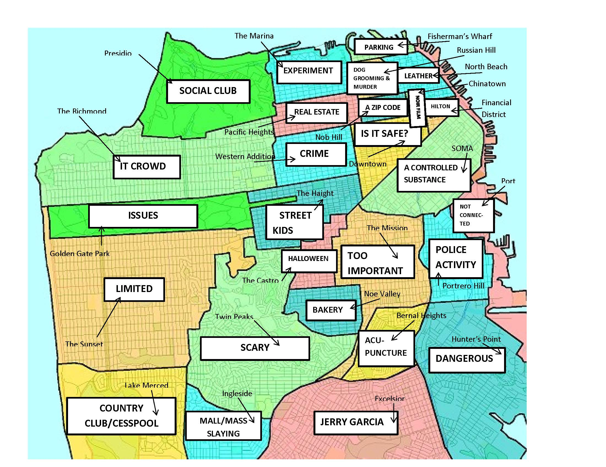

# Capstone Project - The Battle of Neighborhoods

## Introduction
This report is for Capstone Project in Coursera [Applied Data Science Capstone](https://www.coursera.org/learn/applied-data-science-capstone).

## Business Problem
Assume that I want to open a successful Chinese restaurant in a U.S. city.

To achieve this goal, first of all I need to choose a city in U.S. Since it is a Chinese restaurant, a multi-cultural metropolis sounds promising. So I would like to select San Francisco.

The second step is to choose an ideal location of the restaurant in the city. I can leverage the Foursquare location data and machine learning skills to learn which are the most popular areas for Chinese restaurants. 

## Who would be interested in this project?
Someone who also has interest in opening a successful restaurant in a U.S. city.

## Data
Our target is to find the most popular areas for Chinese restaurants in San Francisco.

So the first thing is to divide San Francisco city into certain areas. We can do that based on on-line postal code (ZIP) information.

The second is to get necessary location data in all the areas utilizing Foursquare API. After data cleaning, we can use the data to cluster the areas into different types. Then we pick up the cluster where Chinese restaurants are more popular. 
