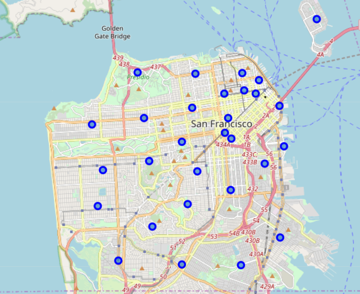
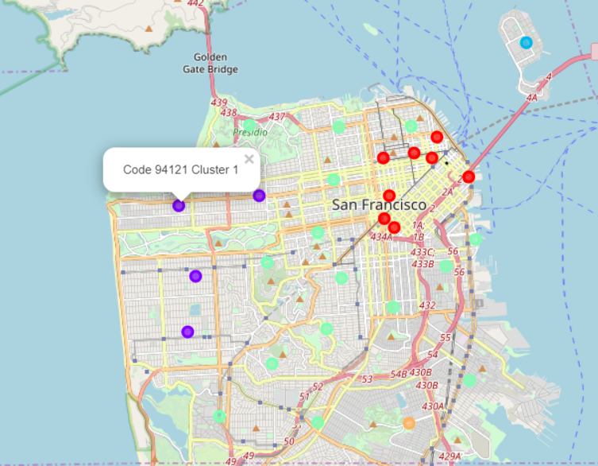

# Capstone Project - The Battle of Neighborhoods | Coursera

## ToC

* [Introduction](#intro)
* [Data](#data)
* [Methodology and Analysis](#analysis)
* [Results and Discussion](#result)
* [Conclusion](#conclusion)

## Introduction <span id="intro"></span>
This report is for Capstone Project in Coursera [Applied Data Science Capstone](https://www.coursera.org/learn/applied-data-science-capstone).

### Business Problem
Assume that we want to open a successful Chinese restaurant in a U.S. city.

To achieve this goal, first of all we need to choose a city in U.S. Since it is a Chinese restaurant, a multi-cultural metropolis sounds promising. So we would like to select San Francisco.


The second step is to choose an ideal location of the restaurant in the city. We can leverage the Foursquare location data and machine learning skills to learn which are the most popular areas for Chinese restaurants. 

### Who would be interested in this project?
Someone who has interest in opening a successful business in a U.S. city.


## Data  <span id="data"></span>

Our target is to find the most popular areas for Chinese restaurants in San Francisco.

So the first thing is to divide San Francisco city into certain areas. We can do that based on on-line postal code (ZIP) information.

The second is to get necessary location data in all the areas utilizing Foursquare API. After data cleaning, we can use the data to cluster the areas into different types. Then we pick up the cluster where Chinese restaurants are more popular. 


## Methodology and Analysis <span id="analysis"></span>

### A Basic View on San Francisco City


```python
import pandas as pd
import numpy as np
```


```python
# get the coordinate of city
from geopy.geocoders import Nominatim # convert an address into latitude and longitude values

city = "San Francisco City"

geolocator = Nominatim(user_agent="city_explorer")
location = geolocator.geocode(city)
latitude = location.latitude
longitude = location.longitude
print('The geograpical coordinate of San Francisco City are {}, {}.'.format(latitude, longitude))
```

    The geograpical coordinate of San Francisco City are 37.7790262, -122.4199061.
    


```python
# get the postal code and coordinate info
#   from united-states.postcode.info
from urllib.request import urlopen
import re

url = "http://united-states.postcode.info/california/san-francisco"
html = urlopen(url).read().decode("utf-8")

# example: California, <a href="/p/94102">94102</a> San Francisco, San Francisco, GPS coordinates: 37.7813,-122.4167
res = re.findall(r'>(\d+)</a>.* GPS coordinates: (.+),(.+)\r', html)
print("Coordinates: ", res[0])
```

    Coordinates:  ('94101', '37.7848', '-122.7278')
    


```python
# create the postal code and coordinate dataframe

hash_sf = {'PostalCode': [], 
           'Latitude': [], 
           'Longitude': []
          }

for row in res:
    hash_sf['PostalCode'].append(int(row[0]))
    hash_sf['Latitude'].append(float(row[1]))
    hash_sf['Longitude'].append(float(row[2]))


column_names = ['PostalCode', 'Latitude', 'Longitude'] 

# instantiate the dataframe
df_sf = pd.DataFrame(columns=column_names)
df_sf = pd.DataFrame(hash_sf)
df_sf.head()
```


<div>
<style scoped>
    .dataframe tbody tr th:only-of-type {
        vertical-align: middle;
    }

    .dataframe tbody tr th {
        vertical-align: top;
    }

    .dataframe thead th {
        text-align: right;
    }
</style>
<table border="1" class="dataframe">
  <thead>
    <tr style="text-align: right;">
      <th></th>
      <th>PostalCode</th>
      <th>Latitude</th>
      <th>Longitude</th>
    </tr>
  </thead>
  <tbody>
    <tr>
      <th>0</th>
      <td>94101</td>
      <td>37.7848</td>
      <td>-122.7278</td>
    </tr>
    <tr>
      <th>1</th>
      <td>94102</td>
      <td>37.7813</td>
      <td>-122.4167</td>
    </tr>
    <tr>
      <th>2</th>
      <td>94103</td>
      <td>37.7725</td>
      <td>-122.4147</td>
    </tr>
    <tr>
      <th>3</th>
      <td>94104</td>
      <td>37.7915</td>
      <td>-122.4018</td>
    </tr>
    <tr>
      <th>4</th>
      <td>94105</td>
      <td>37.7864</td>
      <td>-122.3892</td>
    </tr>
  </tbody>
</table>
</div>


```python
# remove abnormal postal codes
# in the dataframe, multiple codes share the same coodinate: [37.7848, -122.7278]
# in addition, this location is in the gulf
# so we remove these abnormal codes

df_sf = df_sf[df_sf['Longitude']!=-122.7278].reset_index(drop=True)
df_sf
```


<div>
<style scoped>
    .dataframe tbody tr th:only-of-type {
        vertical-align: middle;
    }

    .dataframe tbody tr th {
        vertical-align: top;
    }

    .dataframe thead th {
        text-align: right;
    }
</style>
<table border="1" class="dataframe">
  <thead>
    <tr style="text-align: right;">
      <th></th>
      <th>PostalCode</th>
      <th>Latitude</th>
      <th>Longitude</th>
    </tr>
  </thead>
  <tbody>
    <tr>
      <th>0</th>
      <td>94102</td>
      <td>37.7813</td>
      <td>-122.4167</td>
    </tr>
    <tr>
      <th>1</th>
      <td>94103</td>
      <td>37.7725</td>
      <td>-122.4147</td>
    </tr>
    <tr>
      <th>2</th>
      <td>94104</td>
      <td>37.7915</td>
      <td>-122.4018</td>
    </tr>
    <tr>
      <th>3</th>
      <td>94105</td>
      <td>37.7864</td>
      <td>-122.3892</td>
    </tr>
    <tr>
      <th>4</th>
      <td>94107</td>
      <td>37.7621</td>
      <td>-122.3971</td>
    </tr>
    <tr>
      <th>5</th>
      <td>94108</td>
      <td>37.7929</td>
      <td>-122.4079</td>
    </tr>
    <tr>
      <th>6</th>
      <td>94109</td>
      <td>37.7917</td>
      <td>-122.4186</td>
    </tr>
    <tr>
      <th>7</th>
      <td>94110</td>
      <td>37.7509</td>
      <td>-122.4153</td>
    </tr>
    <tr>
      <th>8</th>
      <td>94111</td>
      <td>37.7974</td>
      <td>-122.4001</td>
    </tr>
    <tr>
      <th>9</th>
      <td>94112</td>
      <td>37.7195</td>
      <td>-122.4411</td>
    </tr>
    <tr>
      <th>10</th>
      <td>94114</td>
      <td>37.7587</td>
      <td>-122.4330</td>
    </tr>
    <tr>
      <th>11</th>
      <td>94115</td>
      <td>37.7856</td>
      <td>-122.4358</td>
    </tr>
    <tr>
      <th>12</th>
      <td>94116</td>
      <td>37.7441</td>
      <td>-122.4863</td>
    </tr>
    <tr>
      <th>13</th>
      <td>94117</td>
      <td>37.7712</td>
      <td>-122.4413</td>
    </tr>
    <tr>
      <th>14</th>
      <td>94118</td>
      <td>37.7812</td>
      <td>-122.4614</td>
    </tr>
    <tr>
      <th>15</th>
      <td>94121</td>
      <td>37.7786</td>
      <td>-122.4892</td>
    </tr>
    <tr>
      <th>16</th>
      <td>94122</td>
      <td>37.7593</td>
      <td>-122.4836</td>
    </tr>
    <tr>
      <th>17</th>
      <td>94123</td>
      <td>37.7999</td>
      <td>-122.4342</td>
    </tr>
    <tr>
      <th>18</th>
      <td>94124</td>
      <td>37.7309</td>
      <td>-122.3886</td>
    </tr>
    <tr>
      <th>19</th>
      <td>94127</td>
      <td>37.7354</td>
      <td>-122.4571</td>
    </tr>
    <tr>
      <th>20</th>
      <td>94128</td>
      <td>37.6216</td>
      <td>-122.3929</td>
    </tr>
    <tr>
      <th>21</th>
      <td>94129</td>
      <td>37.8005</td>
      <td>-122.4650</td>
    </tr>
    <tr>
      <th>22</th>
      <td>94130</td>
      <td>37.8231</td>
      <td>-122.3693</td>
    </tr>
    <tr>
      <th>23</th>
      <td>94131</td>
      <td>37.7450</td>
      <td>-122.4383</td>
    </tr>
    <tr>
      <th>24</th>
      <td>94132</td>
      <td>37.7211</td>
      <td>-122.4754</td>
    </tr>
    <tr>
      <th>25</th>
      <td>94133</td>
      <td>37.8002</td>
      <td>-122.4091</td>
    </tr>
    <tr>
      <th>26</th>
      <td>94134</td>
      <td>37.7190</td>
      <td>-122.4096</td>
    </tr>
    <tr>
      <th>27</th>
      <td>94143</td>
      <td>37.7631</td>
      <td>-122.4586</td>
    </tr>
    <tr>
      <th>28</th>
      <td>94158</td>
      <td>37.7694</td>
      <td>-122.3867</td>
    </tr>
    <tr>
      <th>29</th>
      <td>94199</td>
      <td>37.7750</td>
      <td>-122.4183</td>
    </tr>
  </tbody>
</table>
</div>


```python
# render the map for areas marked by postal code
import folium

map_sf = folium.Map(location=[latitude, longitude], zoom_start=12)

# add markers to map
for lat, lng, pcode in zip(df_sf['Latitude'], df_sf['Longitude'], df_sf['PostalCode']):
    label = '{}'.format(pcode)
    label = folium.Popup(label, parse_html=True)
    folium.CircleMarker(
        [lat, lng],
        radius=5,
        popup=label,
        color='blue',
        fill=True,
        fill_color='#3186cc',
        fill_opacity=0.7,
        parse_html=False).add_to(map_sf)
    
map_sf
```


<div style="width:100%;"><div style="position:relative;width:100%;height:0;padding-bottom:60%;"><iframe src="data:text/html;charset=utf-8;base64,PCFET0NUWVBFIGh0bWw+CjxoZWFkPiAgICAKICAgIDxtZXRhIGh0dHAtZXF1aXY9ImNvbnRlbnQtdHlwZSIgY29udGVudD0idGV4dC9odG1sOyBjaGFyc2V0PVVURi04IiAvPgogICAgPHNjcmlwdD5MX1BSRUZFUl9DQU5WQVMgPSBmYWxzZTsgTF9OT19UT1VDSCA9IGZhbHNlOyBMX0RJU0FCTEVfM0QgPSBmYWxzZTs8L3NjcmlwdD4KICAgIDxzY3JpcHQgc3JjPSJodHRwczovL2Nkbi5qc2RlbGl2ci5uZXQvbnBtL2xlYWZsZXRAMS4yLjAvZGlzdC9sZWFmbGV0LmpzIj48L3NjcmlwdD4KICAgIDxzY3JpcHQgc3JjPSJodHRwczovL2FqYXguZ29vZ2xlYXBpcy5jb20vYWpheC9saWJzL2pxdWVyeS8xLjExLjEvanF1ZXJ5Lm1pbi5qcyI+PC9zY3JpcHQ+CiAgICA8c2NyaXB0IHNyYz0iaHR0cHM6Ly9tYXhjZG4uYm9vdHN0cmFwY2RuLmNvbS9ib290c3RyYXAvMy4yLjAvanMvYm9vdHN0cmFwLm1pbi5qcyI+PC9zY3JpcHQ+CiAgICA8c2NyaXB0IHNyYz0iaHR0cHM6Ly9jZG5qcy5jbG91ZGZsYXJlLmNvbS9hamF4L2xpYnMvTGVhZmxldC5hd2Vzb21lLW1hcmtlcnMvMi4wLjIvbGVhZmxldC5hd2Vzb21lLW1hcmtlcnMuanMiPjwvc2NyaXB0PgogICAgPGxpbmsgcmVsPSJzdHlsZXNoZWV0IiBocmVmPSJodHRwczovL2Nkbi5qc2RlbGl2ci5uZXQvbnBtL2xlYWZsZXRAMS4yLjAvZGlzdC9sZWFmbGV0LmNzcyIvPgogICAgPGxpbmsgcmVsPSJzdHlsZXNoZWV0IiBocmVmPSJodHRwczovL21heGNkbi5ib290c3RyYXBjZG4uY29tL2Jvb3RzdHJhcC8zLjIuMC9jc3MvYm9vdHN0cmFwLm1pbi5jc3MiLz4KICAgIDxsaW5rIHJlbD0ic3R5bGVzaGVldCIgaHJlZj0iaHR0cHM6Ly9tYXhjZG4uYm9vdHN0cmFwY2RuLmNvbS9ib290c3RyYXAvMy4yLjAvY3NzL2Jvb3RzdHJhcC10aGVtZS5taW4uY3NzIi8+CiAgICA8bGluayByZWw9InN0eWxlc2hlZXQiIGhyZWY9Imh0dHBzOi8vbWF4Y2RuLmJvb3RzdHJhcGNkbi5jb20vZm9udC1hd2Vzb21lLzQuNi4zL2Nzcy9mb250LWF3ZXNvbWUubWluLmNzcyIvPgogICAgPGxpbmsgcmVsPSJzdHlsZXNoZWV0IiBocmVmPSJodHRwczovL2NkbmpzLmNsb3VkZmxhcmUuY29tL2FqYXgvbGlicy9MZWFmbGV0LmF3ZXNvbWUtbWFya2Vycy8yLjAuMi9sZWFmbGV0LmF3ZXNvbWUtbWFya2Vycy5jc3MiLz4KICAgIDxsaW5rIHJlbD0ic3R5bGVzaGVldCIgaHJlZj0iaHR0cHM6Ly9yYXdnaXQuY29tL3B5dGhvbi12aXN1YWxpemF0aW9uL2ZvbGl1bS9tYXN0ZXIvZm9saXVtL3RlbXBsYXRlcy9sZWFmbGV0LmF3ZXNvbWUucm90YXRlLmNzcyIvPgogICAgPHN0eWxlPmh0bWwsIGJvZHkge3dpZHRoOiAxMDAlO2hlaWdodDogMTAwJTttYXJnaW46IDA7cGFkZGluZzogMDt9PC9zdHlsZT4KICAgIDxzdHlsZT4jbWFwIHtwb3NpdGlvbjphYnNvbHV0ZTt0b3A6MDtib3R0b206MDtyaWdodDowO2xlZnQ6MDt9PC9zdHlsZT4KICAgIAogICAgICAgICAgICA8c3R5bGU+ICNtYXBfODU1NGJhZjIxYWFiNDg5OGI5ZjViYzlkZDA4ZjdjMDAgewogICAgICAgICAgICAgICAgcG9zaXRpb24gOiByZWxhdGl2ZTsKICAgICAgICAgICAgICAgIHdpZHRoIDogMTAwLjAlOwogICAgICAgICAgICAgICAgaGVpZ2h0OiAxMDAuMCU7CiAgICAgICAgICAgICAgICBsZWZ0OiAwLjAlOwogICAgICAgICAgICAgICAgdG9wOiAwLjAlOwogICAgICAgICAgICAgICAgfQogICAgICAgICAgICA8L3N0eWxlPgogICAgICAgIAo8L2hlYWQ+Cjxib2R5PiAgICAKICAgIAogICAgICAgICAgICA8ZGl2IGNsYXNzPSJmb2xpdW0tbWFwIiBpZD0ibWFwXzg1NTRiYWYyMWFhYjQ4OThiOWY1YmM5ZGQwOGY3YzAwIiA+PC9kaXY+CiAgICAgICAgCjwvYm9keT4KPHNjcmlwdD4gICAgCiAgICAKCiAgICAgICAgICAgIAogICAgICAgICAgICAgICAgdmFyIGJvdW5kcyA9IG51bGw7CiAgICAgICAgICAgIAoKICAgICAgICAgICAgdmFyIG1hcF84NTU0YmFmMjFhYWI0ODk4YjlmNWJjOWRkMDhmN2MwMCA9IEwubWFwKAogICAgICAgICAgICAgICAgICAgICAgICAgICAgICAgICAgJ21hcF84NTU0YmFmMjFhYWI0ODk4YjlmNWJjOWRkMDhmN2MwMCcsCiAgICAgICAgICAgICAgICAgICAgICAgICAgICAgICAgICB7Y2VudGVyOiBbMzcuNzc5MDI2MiwtMTIyLjQxOTkwNjFdLAogICAgICAgICAgICAgICAgICAgICAgICAgICAgICAgICAgem9vbTogMTIsCiAgICAgICAgICAgICAgICAgICAgICAgICAgICAgICAgICBtYXhCb3VuZHM6IGJvdW5kcywKICAgICAgICAgICAgICAgICAgICAgICAgICAgICAgICAgIGxheWVyczogW10sCiAgICAgICAgICAgICAgICAgICAgICAgICAgICAgICAgICB3b3JsZENvcHlKdW1wOiBmYWxzZSwKICAgICAgICAgICAgICAgICAgICAgICAgICAgICAgICAgIGNyczogTC5DUlMuRVBTRzM4NTcKICAgICAgICAgICAgICAgICAgICAgICAgICAgICAgICAgfSk7CiAgICAgICAgICAgIAogICAgICAgIAogICAgCiAgICAgICAgICAgIHZhciB0aWxlX2xheWVyX2JlZDgzYTIwNDEzZjQ4NTE5NmVkYzZlM2QwNTAwM2RhID0gTC50aWxlTGF5ZXIoCiAgICAgICAgICAgICAgICAnaHR0cHM6Ly97c30udGlsZS5vcGVuc3RyZWV0bWFwLm9yZy97en0ve3h9L3t5fS5wbmcnLAogICAgICAgICAgICAgICAgewogICJhdHRyaWJ1dGlvbiI6IG51bGwsCiAgImRldGVjdFJldGluYSI6IGZhbHNlLAogICJtYXhab29tIjogMTgsCiAgIm1pblpvb20iOiAxLAogICJub1dyYXAiOiBmYWxzZSwKICAic3ViZG9tYWlucyI6ICJhYmMiCn0KICAgICAgICAgICAgICAgICkuYWRkVG8obWFwXzg1NTRiYWYyMWFhYjQ4OThiOWY1YmM5ZGQwOGY3YzAwKTsKICAgICAgICAKICAgIAogICAgICAgICAgICB2YXIgY2lyY2xlX21hcmtlcl9jYTk3YmM0NmQwMmM0OWE3ODA1MDZhMDIwNmRkNTVlOCA9IEwuY2lyY2xlTWFya2VyKAogICAgICAgICAgICAgICAgWzM3Ljc4MTMsLTEyMi40MTY3XSwKICAgICAgICAgICAgICAgIHsKICAiYnViYmxpbmdNb3VzZUV2ZW50cyI6IHRydWUsCiAgImNvbG9yIjogImJsdWUiLAogICJkYXNoQXJyYXkiOiBudWxsLAogICJkYXNoT2Zmc2V0IjogbnVsbCwKICAiZmlsbCI6IHRydWUsCiAgImZpbGxDb2xvciI6ICIjMzE4NmNjIiwKICAiZmlsbE9wYWNpdHkiOiAwLjcsCiAgImZpbGxSdWxlIjogImV2ZW5vZGQiLAogICJsaW5lQ2FwIjogInJvdW5kIiwKICAibGluZUpvaW4iOiAicm91bmQiLAogICJvcGFjaXR5IjogMS4wLAogICJyYWRpdXMiOiA1LAogICJzdHJva2UiOiB0cnVlLAogICJ3ZWlnaHQiOiAzCn0KICAgICAgICAgICAgICAgICkuYWRkVG8obWFwXzg1NTRiYWYyMWFhYjQ4OThiOWY1YmM5ZGQwOGY3YzAwKTsKICAgICAgICAgICAgCiAgICAKICAgICAgICAgICAgdmFyIHBvcHVwXzE2Y2ZmZDE2ZTJlMjQ4NGRhODM2MDNjZTljZjk5OTBiID0gTC5wb3B1cCh7bWF4V2lkdGg6ICczMDAnfSk7CgogICAgICAgICAgICAKICAgICAgICAgICAgICAgIHZhciBodG1sXzY0NmM2YTRlZDQwZjQ5ODlhNGQyNzY0YzdkN2UxNzZlID0gJCgnPGRpdiBpZD0iaHRtbF82NDZjNmE0ZWQ0MGY0OTg5YTRkMjc2NGM3ZDdlMTc2ZSIgc3R5bGU9IndpZHRoOiAxMDAuMCU7IGhlaWdodDogMTAwLjAlOyI+OTQxMDI8L2Rpdj4nKVswXTsKICAgICAgICAgICAgICAgIHBvcHVwXzE2Y2ZmZDE2ZTJlMjQ4NGRhODM2MDNjZTljZjk5OTBiLnNldENvbnRlbnQoaHRtbF82NDZjNmE0ZWQ0MGY0OTg5YTRkMjc2NGM3ZDdlMTc2ZSk7CiAgICAgICAgICAgIAoKICAgICAgICAgICAgY2lyY2xlX21hcmtlcl9jYTk3YmM0NmQwMmM0OWE3ODA1MDZhMDIwNmRkNTVlOC5iaW5kUG9wdXAocG9wdXBfMTZjZmZkMTZlMmUyNDg0ZGE4MzYwM2NlOWNmOTk5MGIpOwoKICAgICAgICAgICAgCiAgICAgICAgCiAgICAKICAgICAgICAgICAgdmFyIGNpcmNsZV9tYXJrZXJfMmQyMjc0YmU1NDBiNDc0NWEwNTYzNDgxMWVjOTc3YjkgPSBMLmNpcmNsZU1hcmtlcigKICAgICAgICAgICAgICAgIFszNy43NzI1LC0xMjIuNDE0N10sCiAgICAgICAgICAgICAgICB7CiAgImJ1YmJsaW5nTW91c2VFdmVudHMiOiB0cnVlLAogICJjb2xvciI6ICJibHVlIiwKICAiZGFzaEFycmF5IjogbnVsbCwKICAiZGFzaE9mZnNldCI6IG51bGwsCiAgImZpbGwiOiB0cnVlLAogICJmaWxsQ29sb3IiOiAiIzMxODZjYyIsCiAgImZpbGxPcGFjaXR5IjogMC43LAogICJmaWxsUnVsZSI6ICJldmVub2RkIiwKICAibGluZUNhcCI6ICJyb3VuZCIsCiAgImxpbmVKb2luIjogInJvdW5kIiwKICAib3BhY2l0eSI6IDEuMCwKICAicmFkaXVzIjogNSwKICAic3Ryb2tlIjogdHJ1ZSwKICAid2VpZ2h0IjogMwp9CiAgICAgICAgICAgICAgICApLmFkZFRvKG1hcF84NTU0YmFmMjFhYWI0ODk4YjlmNWJjOWRkMDhmN2MwMCk7CiAgICAgICAgICAgIAogICAgCiAgICAgICAgICAgIHZhciBwb3B1cF9jYTY4Mjk4N2ZmMjM0NDI0OTBhZmMzY2UwNzQzMjJmYSA9IEwucG9wdXAoe21heFdpZHRoOiAnMzAwJ30pOwoKICAgICAgICAgICAgCiAgICAgICAgICAgICAgICB2YXIgaHRtbF9hZDkzZWM2ZmUzZTg0OWJlODE2NzhmNWJlYWM0NDc4ZiA9ICQoJzxkaXYgaWQ9Imh0bWxfYWQ5M2VjNmZlM2U4NDliZTgxNjc4ZjViZWFjNDQ3OGYiIHN0eWxlPSJ3aWR0aDogMTAwLjAlOyBoZWlnaHQ6IDEwMC4wJTsiPjk0MTAzPC9kaXY+JylbMF07CiAgICAgICAgICAgICAgICBwb3B1cF9jYTY4Mjk4N2ZmMjM0NDI0OTBhZmMzY2UwNzQzMjJmYS5zZXRDb250ZW50KGh0bWxfYWQ5M2VjNmZlM2U4NDliZTgxNjc4ZjViZWFjNDQ3OGYpOwogICAgICAgICAgICAKCiAgICAgICAgICAgIGNpcmNsZV9tYXJrZXJfMmQyMjc0YmU1NDBiNDc0NWEwNTYzNDgxMWVjOTc3YjkuYmluZFBvcHVwKHBvcHVwX2NhNjgyOTg3ZmYyMzQ0MjQ5MGFmYzNjZTA3NDMyMmZhKTsKCiAgICAgICAgICAgIAogICAgICAgIAogICAgCiAgICAgICAgICAgIHZhciBjaXJjbGVfbWFya2VyX2YyZTQ1MjIwYWIxMjRiYjFhOWY4NmY2Njk1MGQwODkyID0gTC5jaXJjbGVNYXJrZXIoCiAgICAgICAgICAgICAgICBbMzcuNzkxNSwtMTIyLjQwMThdLAogICAgICAgICAgICAgICAgewogICJidWJibGluZ01vdXNlRXZlbnRzIjogdHJ1ZSwKICAiY29sb3IiOiAiYmx1ZSIsCiAgImRhc2hBcnJheSI6IG51bGwsCiAgImRhc2hPZmZzZXQiOiBudWxsLAogICJmaWxsIjogdHJ1ZSwKICAiZmlsbENvbG9yIjogIiMzMTg2Y2MiLAogICJmaWxsT3BhY2l0eSI6IDAuNywKICAiZmlsbFJ1bGUiOiAiZXZlbm9kZCIsCiAgImxpbmVDYXAiOiAicm91bmQiLAogICJsaW5lSm9pbiI6ICJyb3VuZCIsCiAgIm9wYWNpdHkiOiAxLjAsCiAgInJhZGl1cyI6IDUsCiAgInN0cm9rZSI6IHRydWUsCiAgIndlaWdodCI6IDMKfQogICAgICAgICAgICAgICAgKS5hZGRUbyhtYXBfODU1NGJhZjIxYWFiNDg5OGI5ZjViYzlkZDA4ZjdjMDApOwogICAgICAgICAgICAKICAgIAogICAgICAgICAgICB2YXIgcG9wdXBfYjk3MjAwZGZiZjhjNDc4NzgxYzhhZWMwYzcwNmQzMGQgPSBMLnBvcHVwKHttYXhXaWR0aDogJzMwMCd9KTsKCiAgICAgICAgICAgIAogICAgICAgICAgICAgICAgdmFyIGh0bWxfNGQ4Y2IxY2I5YThjNDM1N2FiZGE0MjcwMDc2MDU5MzcgPSAkKCc8ZGl2IGlkPSJodG1sXzRkOGNiMWNiOWE4YzQzNTdhYmRhNDI3MDA3NjA1OTM3IiBzdHlsZT0id2lkdGg6IDEwMC4wJTsgaGVpZ2h0OiAxMDAuMCU7Ij45NDEwNDwvZGl2PicpWzBdOwogICAgICAgICAgICAgICAgcG9wdXBfYjk3MjAwZGZiZjhjNDc4NzgxYzhhZWMwYzcwNmQzMGQuc2V0Q29udGVudChodG1sXzRkOGNiMWNiOWE4YzQzNTdhYmRhNDI3MDA3NjA1OTM3KTsKICAgICAgICAgICAgCgogICAgICAgICAgICBjaXJjbGVfbWFya2VyX2YyZTQ1MjIwYWIxMjRiYjFhOWY4NmY2Njk1MGQwODkyLmJpbmRQb3B1cChwb3B1cF9iOTcyMDBkZmJmOGM0Nzg3ODFjOGFlYzBjNzA2ZDMwZCk7CgogICAgICAgICAgICAKICAgICAgICAKICAgIAogICAgICAgICAgICB2YXIgY2lyY2xlX21hcmtlcl85M2ZhMGUxMjYxZGU0MzY5YjA4OTdlNmZjMTg1Y2Q4MiA9IEwuY2lyY2xlTWFya2VyKAogICAgICAgICAgICAgICAgWzM3Ljc4NjQsLTEyMi4zODkyXSwKICAgICAgICAgICAgICAgIHsKICAiYnViYmxpbmdNb3VzZUV2ZW50cyI6IHRydWUsCiAgImNvbG9yIjogImJsdWUiLAogICJkYXNoQXJyYXkiOiBudWxsLAogICJkYXNoT2Zmc2V0IjogbnVsbCwKICAiZmlsbCI6IHRydWUsCiAgImZpbGxDb2xvciI6ICIjMzE4NmNjIiwKICAiZmlsbE9wYWNpdHkiOiAwLjcsCiAgImZpbGxSdWxlIjogImV2ZW5vZGQiLAogICJsaW5lQ2FwIjogInJvdW5kIiwKICAibGluZUpvaW4iOiAicm91bmQiLAogICJvcGFjaXR5IjogMS4wLAogICJyYWRpdXMiOiA1LAogICJzdHJva2UiOiB0cnVlLAogICJ3ZWlnaHQiOiAzCn0KICAgICAgICAgICAgICAgICkuYWRkVG8obWFwXzg1NTRiYWYyMWFhYjQ4OThiOWY1YmM5ZGQwOGY3YzAwKTsKICAgICAgICAgICAgCiAgICAKICAgICAgICAgICAgdmFyIHBvcHVwXzllOGJiMGI3ZGNhZTQ3NDY5ODI4MjFiYjhjNGFkNmNlID0gTC5wb3B1cCh7bWF4V2lkdGg6ICczMDAnfSk7CgogICAgICAgICAgICAKICAgICAgICAgICAgICAgIHZhciBodG1sX2VjYzRmMzNlMWM2YjRkZjJhOTRlN2QzNWQyZDljNmU4ID0gJCgnPGRpdiBpZD0iaHRtbF9lY2M0ZjMzZTFjNmI0ZGYyYTk0ZTdkMzVkMmQ5YzZlOCIgc3R5bGU9IndpZHRoOiAxMDAuMCU7IGhlaWdodDogMTAwLjAlOyI+OTQxMDU8L2Rpdj4nKVswXTsKICAgICAgICAgICAgICAgIHBvcHVwXzllOGJiMGI3ZGNhZTQ3NDY5ODI4MjFiYjhjNGFkNmNlLnNldENvbnRlbnQoaHRtbF9lY2M0ZjMzZTFjNmI0ZGYyYTk0ZTdkMzVkMmQ5YzZlOCk7CiAgICAgICAgICAgIAoKICAgICAgICAgICAgY2lyY2xlX21hcmtlcl85M2ZhMGUxMjYxZGU0MzY5YjA4OTdlNmZjMTg1Y2Q4Mi5iaW5kUG9wdXAocG9wdXBfOWU4YmIwYjdkY2FlNDc0Njk4MjgyMWJiOGM0YWQ2Y2UpOwoKICAgICAgICAgICAgCiAgICAgICAgCiAgICAKICAgICAgICAgICAgdmFyIGNpcmNsZV9tYXJrZXJfZmU0NDEzNzU5NjM4NDhhYjgxNmQ1OWRiZGQ3Mzc4OGMgPSBMLmNpcmNsZU1hcmtlcigKICAgICAgICAgICAgICAgIFszNy43NjIxLC0xMjIuMzk3MV0sCiAgICAgICAgICAgICAgICB7CiAgImJ1YmJsaW5nTW91c2VFdmVudHMiOiB0cnVlLAogICJjb2xvciI6ICJibHVlIiwKICAiZGFzaEFycmF5IjogbnVsbCwKICAiZGFzaE9mZnNldCI6IG51bGwsCiAgImZpbGwiOiB0cnVlLAogICJmaWxsQ29sb3IiOiAiIzMxODZjYyIsCiAgImZpbGxPcGFjaXR5IjogMC43LAogICJmaWxsUnVsZSI6ICJldmVub2RkIiwKICAibGluZUNhcCI6ICJyb3VuZCIsCiAgImxpbmVKb2luIjogInJvdW5kIiwKICAib3BhY2l0eSI6IDEuMCwKICAicmFkaXVzIjogNSwKICAic3Ryb2tlIjogdHJ1ZSwKICAid2VpZ2h0IjogMwp9CiAgICAgICAgICAgICAgICApLmFkZFRvKG1hcF84NTU0YmFmMjFhYWI0ODk4YjlmNWJjOWRkMDhmN2MwMCk7CiAgICAgICAgICAgIAogICAgCiAgICAgICAgICAgIHZhciBwb3B1cF9lNjM0MTNlMjUzMjM0MDZmYTIyMmQ4MTEzODYwYzRkYSA9IEwucG9wdXAoe21heFdpZHRoOiAnMzAwJ30pOwoKICAgICAgICAgICAgCiAgICAgICAgICAgICAgICB2YXIgaHRtbF8zYjUyZjVmNGVmZDE0MGFkYmIyYzhmZjBhNDA1NDU2NCA9ICQoJzxkaXYgaWQ9Imh0bWxfM2I1MmY1ZjRlZmQxNDBhZGJiMmM4ZmYwYTQwNTQ1NjQiIHN0eWxlPSJ3aWR0aDogMTAwLjAlOyBoZWlnaHQ6IDEwMC4wJTsiPjk0MTA3PC9kaXY+JylbMF07CiAgICAgICAgICAgICAgICBwb3B1cF9lNjM0MTNlMjUzMjM0MDZmYTIyMmQ4MTEzODYwYzRkYS5zZXRDb250ZW50KGh0bWxfM2I1MmY1ZjRlZmQxNDBhZGJiMmM4ZmYwYTQwNTQ1NjQpOwogICAgICAgICAgICAKCiAgICAgICAgICAgIGNpcmNsZV9tYXJrZXJfZmU0NDEzNzU5NjM4NDhhYjgxNmQ1OWRiZGQ3Mzc4OGMuYmluZFBvcHVwKHBvcHVwX2U2MzQxM2UyNTMyMzQwNmZhMjIyZDgxMTM4NjBjNGRhKTsKCiAgICAgICAgICAgIAogICAgICAgIAogICAgCiAgICAgICAgICAgIHZhciBjaXJjbGVfbWFya2VyXzk5NDEwOTEwMTkyMTQ2NmVhMDljODQyZmMwMDgyNmU2ID0gTC5jaXJjbGVNYXJrZXIoCiAgICAgICAgICAgICAgICBbMzcuNzkyOSwtMTIyLjQwNzldLAogICAgICAgICAgICAgICAgewogICJidWJibGluZ01vdXNlRXZlbnRzIjogdHJ1ZSwKICAiY29sb3IiOiAiYmx1ZSIsCiAgImRhc2hBcnJheSI6IG51bGwsCiAgImRhc2hPZmZzZXQiOiBudWxsLAogICJmaWxsIjogdHJ1ZSwKICAiZmlsbENvbG9yIjogIiMzMTg2Y2MiLAogICJmaWxsT3BhY2l0eSI6IDAuNywKICAiZmlsbFJ1bGUiOiAiZXZlbm9kZCIsCiAgImxpbmVDYXAiOiAicm91bmQiLAogICJsaW5lSm9pbiI6ICJyb3VuZCIsCiAgIm9wYWNpdHkiOiAxLjAsCiAgInJhZGl1cyI6IDUsCiAgInN0cm9rZSI6IHRydWUsCiAgIndlaWdodCI6IDMKfQogICAgICAgICAgICAgICAgKS5hZGRUbyhtYXBfODU1NGJhZjIxYWFiNDg5OGI5ZjViYzlkZDA4ZjdjMDApOwogICAgICAgICAgICAKICAgIAogICAgICAgICAgICB2YXIgcG9wdXBfOGVlNjllNmM0YzEzNDgxMjkxMWNhNDEyYmFlNGU1OWYgPSBMLnBvcHVwKHttYXhXaWR0aDogJzMwMCd9KTsKCiAgICAgICAgICAgIAogICAgICAgICAgICAgICAgdmFyIGh0bWxfMjA5NjE0MzQyZmRjNDc3NWI2NmMwOThlNjc5Y2VlYWIgPSAkKCc8ZGl2IGlkPSJodG1sXzIwOTYxNDM0MmZkYzQ3NzViNjZjMDk4ZTY3OWNlZWFiIiBzdHlsZT0id2lkdGg6IDEwMC4wJTsgaGVpZ2h0OiAxMDAuMCU7Ij45NDEwODwvZGl2PicpWzBdOwogICAgICAgICAgICAgICAgcG9wdXBfOGVlNjllNmM0YzEzNDgxMjkxMWNhNDEyYmFlNGU1OWYuc2V0Q29udGVudChodG1sXzIwOTYxNDM0MmZkYzQ3NzViNjZjMDk4ZTY3OWNlZWFiKTsKICAgICAgICAgICAgCgogICAgICAgICAgICBjaXJjbGVfbWFya2VyXzk5NDEwOTEwMTkyMTQ2NmVhMDljODQyZmMwMDgyNmU2LmJpbmRQb3B1cChwb3B1cF84ZWU2OWU2YzRjMTM0ODEyOTExY2E0MTJiYWU0ZTU5Zik7CgogICAgICAgICAgICAKICAgICAgICAKICAgIAogICAgICAgICAgICB2YXIgY2lyY2xlX21hcmtlcl9hMDkyMDY3N2YzOWM0OWY2YjUxZTY2NzFjM2E5NjIyOSA9IEwuY2lyY2xlTWFya2VyKAogICAgICAgICAgICAgICAgWzM3Ljc5MTcsLTEyMi40MTg2XSwKICAgICAgICAgICAgICAgIHsKICAiYnViYmxpbmdNb3VzZUV2ZW50cyI6IHRydWUsCiAgImNvbG9yIjogImJsdWUiLAogICJkYXNoQXJyYXkiOiBudWxsLAogICJkYXNoT2Zmc2V0IjogbnVsbCwKICAiZmlsbCI6IHRydWUsCiAgImZpbGxDb2xvciI6ICIjMzE4NmNjIiwKICAiZmlsbE9wYWNpdHkiOiAwLjcsCiAgImZpbGxSdWxlIjogImV2ZW5vZGQiLAogICJsaW5lQ2FwIjogInJvdW5kIiwKICAibGluZUpvaW4iOiAicm91bmQiLAogICJvcGFjaXR5IjogMS4wLAogICJyYWRpdXMiOiA1LAogICJzdHJva2UiOiB0cnVlLAogICJ3ZWlnaHQiOiAzCn0KICAgICAgICAgICAgICAgICkuYWRkVG8obWFwXzg1NTRiYWYyMWFhYjQ4OThiOWY1YmM5ZGQwOGY3YzAwKTsKICAgICAgICAgICAgCiAgICAKICAgICAgICAgICAgdmFyIHBvcHVwX2U2MTllOTg5NjhlNzRhYWRiZmQ4NDI1ZTU1NmU3NTc4ID0gTC5wb3B1cCh7bWF4V2lkdGg6ICczMDAnfSk7CgogICAgICAgICAgICAKICAgICAgICAgICAgICAgIHZhciBodG1sX2ZhMTYwMzcyMTFjZTRjYTZhNjA2YTZlMTg4NWM5MjBmID0gJCgnPGRpdiBpZD0iaHRtbF9mYTE2MDM3MjExY2U0Y2E2YTYwNmE2ZTE4ODVjOTIwZiIgc3R5bGU9IndpZHRoOiAxMDAuMCU7IGhlaWdodDogMTAwLjAlOyI+OTQxMDk8L2Rpdj4nKVswXTsKICAgICAgICAgICAgICAgIHBvcHVwX2U2MTllOTg5NjhlNzRhYWRiZmQ4NDI1ZTU1NmU3NTc4LnNldENvbnRlbnQoaHRtbF9mYTE2MDM3MjExY2U0Y2E2YTYwNmE2ZTE4ODVjOTIwZik7CiAgICAgICAgICAgIAoKICAgICAgICAgICAgY2lyY2xlX21hcmtlcl9hMDkyMDY3N2YzOWM0OWY2YjUxZTY2NzFjM2E5NjIyOS5iaW5kUG9wdXAocG9wdXBfZTYxOWU5ODk2OGU3NGFhZGJmZDg0MjVlNTU2ZTc1NzgpOwoKICAgICAgICAgICAgCiAgICAgICAgCiAgICAKICAgICAgICAgICAgdmFyIGNpcmNsZV9tYXJrZXJfMWFkMmY4OGVjYzhiNDA1NTk1YmM3NDc5YjEzODhhMTMgPSBMLmNpcmNsZU1hcmtlcigKICAgICAgICAgICAgICAgIFszNy43NTA5LC0xMjIuNDE1M10sCiAgICAgICAgICAgICAgICB7CiAgImJ1YmJsaW5nTW91c2VFdmVudHMiOiB0cnVlLAogICJjb2xvciI6ICJibHVlIiwKICAiZGFzaEFycmF5IjogbnVsbCwKICAiZGFzaE9mZnNldCI6IG51bGwsCiAgImZpbGwiOiB0cnVlLAogICJmaWxsQ29sb3IiOiAiIzMxODZjYyIsCiAgImZpbGxPcGFjaXR5IjogMC43LAogICJmaWxsUnVsZSI6ICJldmVub2RkIiwKICAibGluZUNhcCI6ICJyb3VuZCIsCiAgImxpbmVKb2luIjogInJvdW5kIiwKICAib3BhY2l0eSI6IDEuMCwKICAicmFkaXVzIjogNSwKICAic3Ryb2tlIjogdHJ1ZSwKICAid2VpZ2h0IjogMwp9CiAgICAgICAgICAgICAgICApLmFkZFRvKG1hcF84NTU0YmFmMjFhYWI0ODk4YjlmNWJjOWRkMDhmN2MwMCk7CiAgICAgICAgICAgIAogICAgCiAgICAgICAgICAgIHZhciBwb3B1cF8xOTY4YWE2ZTIyMDU0MmRhODA2ZDUyNmYwZTkyZDMyMiA9IEwucG9wdXAoe21heFdpZHRoOiAnMzAwJ30pOwoKICAgICAgICAgICAgCiAgICAgICAgICAgICAgICB2YXIgaHRtbF9iY2I0Yzg4MTFjMzE0MDlmYjIxNmM5ZTJmNTlkYThmMiA9ICQoJzxkaXYgaWQ9Imh0bWxfYmNiNGM4ODExYzMxNDA5ZmIyMTZjOWUyZjU5ZGE4ZjIiIHN0eWxlPSJ3aWR0aDogMTAwLjAlOyBoZWlnaHQ6IDEwMC4wJTsiPjk0MTEwPC9kaXY+JylbMF07CiAgICAgICAgICAgICAgICBwb3B1cF8xOTY4YWE2ZTIyMDU0MmRhODA2ZDUyNmYwZTkyZDMyMi5zZXRDb250ZW50KGh0bWxfYmNiNGM4ODExYzMxNDA5ZmIyMTZjOWUyZjU5ZGE4ZjIpOwogICAgICAgICAgICAKCiAgICAgICAgICAgIGNpcmNsZV9tYXJrZXJfMWFkMmY4OGVjYzhiNDA1NTk1YmM3NDc5YjEzODhhMTMuYmluZFBvcHVwKHBvcHVwXzE5NjhhYTZlMjIwNTQyZGE4MDZkNTI2ZjBlOTJkMzIyKTsKCiAgICAgICAgICAgIAogICAgICAgIAogICAgCiAgICAgICAgICAgIHZhciBjaXJjbGVfbWFya2VyXzgzYWNjNDAyYWNmOTRlYTY4ZTA4ODM1ZjI1YTRmMTBmID0gTC5jaXJjbGVNYXJrZXIoCiAgICAgICAgICAgICAgICBbMzcuNzk3NCwtMTIyLjQwMDFdLAogICAgICAgICAgICAgICAgewogICJidWJibGluZ01vdXNlRXZlbnRzIjogdHJ1ZSwKICAiY29sb3IiOiAiYmx1ZSIsCiAgImRhc2hBcnJheSI6IG51bGwsCiAgImRhc2hPZmZzZXQiOiBudWxsLAogICJmaWxsIjogdHJ1ZSwKICAiZmlsbENvbG9yIjogIiMzMTg2Y2MiLAogICJmaWxsT3BhY2l0eSI6IDAuNywKICAiZmlsbFJ1bGUiOiAiZXZlbm9kZCIsCiAgImxpbmVDYXAiOiAicm91bmQiLAogICJsaW5lSm9pbiI6ICJyb3VuZCIsCiAgIm9wYWNpdHkiOiAxLjAsCiAgInJhZGl1cyI6IDUsCiAgInN0cm9rZSI6IHRydWUsCiAgIndlaWdodCI6IDMKfQogICAgICAgICAgICAgICAgKS5hZGRUbyhtYXBfODU1NGJhZjIxYWFiNDg5OGI5ZjViYzlkZDA4ZjdjMDApOwogICAgICAgICAgICAKICAgIAogICAgICAgICAgICB2YXIgcG9wdXBfMjllMDRiMTM1ZmRmNGZmM2I3OTNlYjUxMWEwYTlkMTQgPSBMLnBvcHVwKHttYXhXaWR0aDogJzMwMCd9KTsKCiAgICAgICAgICAgIAogICAgICAgICAgICAgICAgdmFyIGh0bWxfNmRkYjUyMzJhYTVmNDIyMWIwMDUxYjU2NThlZDdjZDQgPSAkKCc8ZGl2IGlkPSJodG1sXzZkZGI1MjMyYWE1ZjQyMjFiMDA1MWI1NjU4ZWQ3Y2Q0IiBzdHlsZT0id2lkdGg6IDEwMC4wJTsgaGVpZ2h0OiAxMDAuMCU7Ij45NDExMTwvZGl2PicpWzBdOwogICAgICAgICAgICAgICAgcG9wdXBfMjllMDRiMTM1ZmRmNGZmM2I3OTNlYjUxMWEwYTlkMTQuc2V0Q29udGVudChodG1sXzZkZGI1MjMyYWE1ZjQyMjFiMDA1MWI1NjU4ZWQ3Y2Q0KTsKICAgICAgICAgICAgCgogICAgICAgICAgICBjaXJjbGVfbWFya2VyXzgzYWNjNDAyYWNmOTRlYTY4ZTA4ODM1ZjI1YTRmMTBmLmJpbmRQb3B1cChwb3B1cF8yOWUwNGIxMzVmZGY0ZmYzYjc5M2ViNTExYTBhOWQxNCk7CgogICAgICAgICAgICAKICAgICAgICAKICAgIAogICAgICAgICAgICB2YXIgY2lyY2xlX21hcmtlcl9jOGJkYTE4ZjE5ODY0MzA5YTcwOWMxYWNmMDg2YjViOCA9IEwuY2lyY2xlTWFya2VyKAogICAgICAgICAgICAgICAgWzM3LjcxOTUsLTEyMi40NDExXSwKICAgICAgICAgICAgICAgIHsKICAiYnViYmxpbmdNb3VzZUV2ZW50cyI6IHRydWUsCiAgImNvbG9yIjogImJsdWUiLAogICJkYXNoQXJyYXkiOiBudWxsLAogICJkYXNoT2Zmc2V0IjogbnVsbCwKICAiZmlsbCI6IHRydWUsCiAgImZpbGxDb2xvciI6ICIjMzE4NmNjIiwKICAiZmlsbE9wYWNpdHkiOiAwLjcsCiAgImZpbGxSdWxlIjogImV2ZW5vZGQiLAogICJsaW5lQ2FwIjogInJvdW5kIiwKICAibGluZUpvaW4iOiAicm91bmQiLAogICJvcGFjaXR5IjogMS4wLAogICJyYWRpdXMiOiA1LAogICJzdHJva2UiOiB0cnVlLAogICJ3ZWlnaHQiOiAzCn0KICAgICAgICAgICAgICAgICkuYWRkVG8obWFwXzg1NTRiYWYyMWFhYjQ4OThiOWY1YmM5ZGQwOGY3YzAwKTsKICAgICAgICAgICAgCiAgICAKICAgICAgICAgICAgdmFyIHBvcHVwXzBjODM2ZWEzZDM4ODQ5OGY5NjExNDQzMzhjZTZmZjVkID0gTC5wb3B1cCh7bWF4V2lkdGg6ICczMDAnfSk7CgogICAgICAgICAgICAKICAgICAgICAgICAgICAgIHZhciBodG1sXzY3NWE4OTk0MDNjZDRlMTdiMmVmMTMwNGRmY2JlMTRlID0gJCgnPGRpdiBpZD0iaHRtbF82NzVhODk5NDAzY2Q0ZTE3YjJlZjEzMDRkZmNiZTE0ZSIgc3R5bGU9IndpZHRoOiAxMDAuMCU7IGhlaWdodDogMTAwLjAlOyI+OTQxMTI8L2Rpdj4nKVswXTsKICAgICAgICAgICAgICAgIHBvcHVwXzBjODM2ZWEzZDM4ODQ5OGY5NjExNDQzMzhjZTZmZjVkLnNldENvbnRlbnQoaHRtbF82NzVhODk5NDAzY2Q0ZTE3YjJlZjEzMDRkZmNiZTE0ZSk7CiAgICAgICAgICAgIAoKICAgICAgICAgICAgY2lyY2xlX21hcmtlcl9jOGJkYTE4ZjE5ODY0MzA5YTcwOWMxYWNmMDg2YjViOC5iaW5kUG9wdXAocG9wdXBfMGM4MzZlYTNkMzg4NDk4Zjk2MTE0NDMzOGNlNmZmNWQpOwoKICAgICAgICAgICAgCiAgICAgICAgCiAgICAKICAgICAgICAgICAgdmFyIGNpcmNsZV9tYXJrZXJfMDc1NjlhZTk4Zjc4NGRjMjhlYzQ4NDVmNTYyMWRmMzcgPSBMLmNpcmNsZU1hcmtlcigKICAgICAgICAgICAgICAgIFszNy43NTg3LC0xMjIuNDMzXSwKICAgICAgICAgICAgICAgIHsKICAiYnViYmxpbmdNb3VzZUV2ZW50cyI6IHRydWUsCiAgImNvbG9yIjogImJsdWUiLAogICJkYXNoQXJyYXkiOiBudWxsLAogICJkYXNoT2Zmc2V0IjogbnVsbCwKICAiZmlsbCI6IHRydWUsCiAgImZpbGxDb2xvciI6ICIjMzE4NmNjIiwKICAiZmlsbE9wYWNpdHkiOiAwLjcsCiAgImZpbGxSdWxlIjogImV2ZW5vZGQiLAogICJsaW5lQ2FwIjogInJvdW5kIiwKICAibGluZUpvaW4iOiAicm91bmQiLAogICJvcGFjaXR5IjogMS4wLAogICJyYWRpdXMiOiA1LAogICJzdHJva2UiOiB0cnVlLAogICJ3ZWlnaHQiOiAzCn0KICAgICAgICAgICAgICAgICkuYWRkVG8obWFwXzg1NTRiYWYyMWFhYjQ4OThiOWY1YmM5ZGQwOGY3YzAwKTsKICAgICAgICAgICAgCiAgICAKICAgICAgICAgICAgdmFyIHBvcHVwX2VjZTEyY2M2NWRhMTRhNTE5ZjA5ODg1MGQ5ZDlhNTVmID0gTC5wb3B1cCh7bWF4V2lkdGg6ICczMDAnfSk7CgogICAgICAgICAgICAKICAgICAgICAgICAgICAgIHZhciBodG1sXzEzZmU5ZDhhM2Q5NTQ1NjY4OGM0YTUzZTg5YjFkMDk4ID0gJCgnPGRpdiBpZD0iaHRtbF8xM2ZlOWQ4YTNkOTU0NTY2ODhjNGE1M2U4OWIxZDA5OCIgc3R5bGU9IndpZHRoOiAxMDAuMCU7IGhlaWdodDogMTAwLjAlOyI+OTQxMTQ8L2Rpdj4nKVswXTsKICAgICAgICAgICAgICAgIHBvcHVwX2VjZTEyY2M2NWRhMTRhNTE5ZjA5ODg1MGQ5ZDlhNTVmLnNldENvbnRlbnQoaHRtbF8xM2ZlOWQ4YTNkOTU0NTY2ODhjNGE1M2U4OWIxZDA5OCk7CiAgICAgICAgICAgIAoKICAgICAgICAgICAgY2lyY2xlX21hcmtlcl8wNzU2OWFlOThmNzg0ZGMyOGVjNDg0NWY1NjIxZGYzNy5iaW5kUG9wdXAocG9wdXBfZWNlMTJjYzY1ZGExNGE1MTlmMDk4ODUwZDlkOWE1NWYpOwoKICAgICAgICAgICAgCiAgICAgICAgCiAgICAKICAgICAgICAgICAgdmFyIGNpcmNsZV9tYXJrZXJfOGZlMjI1ODNjNzRmNDA5Mzk5ZjAzOWIzYTJhYjBjYWUgPSBMLmNpcmNsZU1hcmtlcigKICAgICAgICAgICAgICAgIFszNy43ODU2LC0xMjIuNDM1OF0sCiAgICAgICAgICAgICAgICB7CiAgImJ1YmJsaW5nTW91c2VFdmVudHMiOiB0cnVlLAogICJjb2xvciI6ICJibHVlIiwKICAiZGFzaEFycmF5IjogbnVsbCwKICAiZGFzaE9mZnNldCI6IG51bGwsCiAgImZpbGwiOiB0cnVlLAogICJmaWxsQ29sb3IiOiAiIzMxODZjYyIsCiAgImZpbGxPcGFjaXR5IjogMC43LAogICJmaWxsUnVsZSI6ICJldmVub2RkIiwKICAibGluZUNhcCI6ICJyb3VuZCIsCiAgImxpbmVKb2luIjogInJvdW5kIiwKICAib3BhY2l0eSI6IDEuMCwKICAicmFkaXVzIjogNSwKICAic3Ryb2tlIjogdHJ1ZSwKICAid2VpZ2h0IjogMwp9CiAgICAgICAgICAgICAgICApLmFkZFRvKG1hcF84NTU0YmFmMjFhYWI0ODk4YjlmNWJjOWRkMDhmN2MwMCk7CiAgICAgICAgICAgIAogICAgCiAgICAgICAgICAgIHZhciBwb3B1cF8zMGEyNGI5MTcxZjE0OTg2YWUxYzU1NDAzOTc3YTkzNiA9IEwucG9wdXAoe21heFdpZHRoOiAnMzAwJ30pOwoKICAgICAgICAgICAgCiAgICAgICAgICAgICAgICB2YXIgaHRtbF82MzZkODg3ODlkYmU0ZGYzYjQ3ODI2MmE0OTA1YzlkYSA9ICQoJzxkaXYgaWQ9Imh0bWxfNjM2ZDg4Nzg5ZGJlNGRmM2I0NzgyNjJhNDkwNWM5ZGEiIHN0eWxlPSJ3aWR0aDogMTAwLjAlOyBoZWlnaHQ6IDEwMC4wJTsiPjk0MTE1PC9kaXY+JylbMF07CiAgICAgICAgICAgICAgICBwb3B1cF8zMGEyNGI5MTcxZjE0OTg2YWUxYzU1NDAzOTc3YTkzNi5zZXRDb250ZW50KGh0bWxfNjM2ZDg4Nzg5ZGJlNGRmM2I0NzgyNjJhNDkwNWM5ZGEpOwogICAgICAgICAgICAKCiAgICAgICAgICAgIGNpcmNsZV9tYXJrZXJfOGZlMjI1ODNjNzRmNDA5Mzk5ZjAzOWIzYTJhYjBjYWUuYmluZFBvcHVwKHBvcHVwXzMwYTI0YjkxNzFmMTQ5ODZhZTFjNTU0MDM5NzdhOTM2KTsKCiAgICAgICAgICAgIAogICAgICAgIAogICAgCiAgICAgICAgICAgIHZhciBjaXJjbGVfbWFya2VyXzg1MmZkZDY3ZWFkMjRlMjViNmZjNWNlYmQ5MmQyMDg2ID0gTC5jaXJjbGVNYXJrZXIoCiAgICAgICAgICAgICAgICBbMzcuNzQ0MSwtMTIyLjQ4NjNdLAogICAgICAgICAgICAgICAgewogICJidWJibGluZ01vdXNlRXZlbnRzIjogdHJ1ZSwKICAiY29sb3IiOiAiYmx1ZSIsCiAgImRhc2hBcnJheSI6IG51bGwsCiAgImRhc2hPZmZzZXQiOiBudWxsLAogICJmaWxsIjogdHJ1ZSwKICAiZmlsbENvbG9yIjogIiMzMTg2Y2MiLAogICJmaWxsT3BhY2l0eSI6IDAuNywKICAiZmlsbFJ1bGUiOiAiZXZlbm9kZCIsCiAgImxpbmVDYXAiOiAicm91bmQiLAogICJsaW5lSm9pbiI6ICJyb3VuZCIsCiAgIm9wYWNpdHkiOiAxLjAsCiAgInJhZGl1cyI6IDUsCiAgInN0cm9rZSI6IHRydWUsCiAgIndlaWdodCI6IDMKfQogICAgICAgICAgICAgICAgKS5hZGRUbyhtYXBfODU1NGJhZjIxYWFiNDg5OGI5ZjViYzlkZDA4ZjdjMDApOwogICAgICAgICAgICAKICAgIAogICAgICAgICAgICB2YXIgcG9wdXBfYTU0NGYzMWU3MzM3NDgzZWI1ODNlZTZhNjgxNGI2NzAgPSBMLnBvcHVwKHttYXhXaWR0aDogJzMwMCd9KTsKCiAgICAgICAgICAgIAogICAgICAgICAgICAgICAgdmFyIGh0bWxfZDdmNDVlNTE1Mjc3NDRiMjhiMTkzYTg3MTI3N2VlZDkgPSAkKCc8ZGl2IGlkPSJodG1sX2Q3ZjQ1ZTUxNTI3NzQ0YjI4YjE5M2E4NzEyNzdlZWQ5IiBzdHlsZT0id2lkdGg6IDEwMC4wJTsgaGVpZ2h0OiAxMDAuMCU7Ij45NDExNjwvZGl2PicpWzBdOwogICAgICAgICAgICAgICAgcG9wdXBfYTU0NGYzMWU3MzM3NDgzZWI1ODNlZTZhNjgxNGI2NzAuc2V0Q29udGVudChodG1sX2Q3ZjQ1ZTUxNTI3NzQ0YjI4YjE5M2E4NzEyNzdlZWQ5KTsKICAgICAgICAgICAgCgogICAgICAgICAgICBjaXJjbGVfbWFya2VyXzg1MmZkZDY3ZWFkMjRlMjViNmZjNWNlYmQ5MmQyMDg2LmJpbmRQb3B1cChwb3B1cF9hNTQ0ZjMxZTczMzc0ODNlYjU4M2VlNmE2ODE0YjY3MCk7CgogICAgICAgICAgICAKICAgICAgICAKICAgIAogICAgICAgICAgICB2YXIgY2lyY2xlX21hcmtlcl8zYjVmMmY5NjEyZGE0ZTI3YWVmYjE1ZDljMGI5YzAzNiA9IEwuY2lyY2xlTWFya2VyKAogICAgICAgICAgICAgICAgWzM3Ljc3MTIsLTEyMi40NDEzXSwKICAgICAgICAgICAgICAgIHsKICAiYnViYmxpbmdNb3VzZUV2ZW50cyI6IHRydWUsCiAgImNvbG9yIjogImJsdWUiLAogICJkYXNoQXJyYXkiOiBudWxsLAogICJkYXNoT2Zmc2V0IjogbnVsbCwKICAiZmlsbCI6IHRydWUsCiAgImZpbGxDb2xvciI6ICIjMzE4NmNjIiwKICAiZmlsbE9wYWNpdHkiOiAwLjcsCiAgImZpbGxSdWxlIjogImV2ZW5vZGQiLAogICJsaW5lQ2FwIjogInJvdW5kIiwKICAibGluZUpvaW4iOiAicm91bmQiLAogICJvcGFjaXR5IjogMS4wLAogICJyYWRpdXMiOiA1LAogICJzdHJva2UiOiB0cnVlLAogICJ3ZWlnaHQiOiAzCn0KICAgICAgICAgICAgICAgICkuYWRkVG8obWFwXzg1NTRiYWYyMWFhYjQ4OThiOWY1YmM5ZGQwOGY3YzAwKTsKICAgICAgICAgICAgCiAgICAKICAgICAgICAgICAgdmFyIHBvcHVwX2Y1NTRlODgyMGI3OTRjMDA4ZmE5MWQ5MzllOTczMTEyID0gTC5wb3B1cCh7bWF4V2lkdGg6ICczMDAnfSk7CgogICAgICAgICAgICAKICAgICAgICAgICAgICAgIHZhciBodG1sX2ZlZTU2YWU2N2M4OTQ2YTdhMThkMjE3ZmRkYjQyZjVmID0gJCgnPGRpdiBpZD0iaHRtbF9mZWU1NmFlNjdjODk0NmE3YTE4ZDIxN2ZkZGI0MmY1ZiIgc3R5bGU9IndpZHRoOiAxMDAuMCU7IGhlaWdodDogMTAwLjAlOyI+OTQxMTc8L2Rpdj4nKVswXTsKICAgICAgICAgICAgICAgIHBvcHVwX2Y1NTRlODgyMGI3OTRjMDA4ZmE5MWQ5MzllOTczMTEyLnNldENvbnRlbnQoaHRtbF9mZWU1NmFlNjdjODk0NmE3YTE4ZDIxN2ZkZGI0MmY1Zik7CiAgICAgICAgICAgIAoKICAgICAgICAgICAgY2lyY2xlX21hcmtlcl8zYjVmMmY5NjEyZGE0ZTI3YWVmYjE1ZDljMGI5YzAzNi5iaW5kUG9wdXAocG9wdXBfZjU1NGU4ODIwYjc5NGMwMDhmYTkxZDkzOWU5NzMxMTIpOwoKICAgICAgICAgICAgCiAgICAgICAgCiAgICAKICAgICAgICAgICAgdmFyIGNpcmNsZV9tYXJrZXJfY2QzYzgxNzljNGUzNDNmNDg5MzZlOWVlYzc3ZjcwODUgPSBMLmNpcmNsZU1hcmtlcigKICAgICAgICAgICAgICAgIFszNy43ODEyLC0xMjIuNDYxNF0sCiAgICAgICAgICAgICAgICB7CiAgImJ1YmJsaW5nTW91c2VFdmVudHMiOiB0cnVlLAogICJjb2xvciI6ICJibHVlIiwKICAiZGFzaEFycmF5IjogbnVsbCwKICAiZGFzaE9mZnNldCI6IG51bGwsCiAgImZpbGwiOiB0cnVlLAogICJmaWxsQ29sb3IiOiAiIzMxODZjYyIsCiAgImZpbGxPcGFjaXR5IjogMC43LAogICJmaWxsUnVsZSI6ICJldmVub2RkIiwKICAibGluZUNhcCI6ICJyb3VuZCIsCiAgImxpbmVKb2luIjogInJvdW5kIiwKICAib3BhY2l0eSI6IDEuMCwKICAicmFkaXVzIjogNSwKICAic3Ryb2tlIjogdHJ1ZSwKICAid2VpZ2h0IjogMwp9CiAgICAgICAgICAgICAgICApLmFkZFRvKG1hcF84NTU0YmFmMjFhYWI0ODk4YjlmNWJjOWRkMDhmN2MwMCk7CiAgICAgICAgICAgIAogICAgCiAgICAgICAgICAgIHZhciBwb3B1cF9kOTA2MWQ1ZDZmYmI0NGQ4YjM5ZjI2ZGZkNzhlOWZiYyA9IEwucG9wdXAoe21heFdpZHRoOiAnMzAwJ30pOwoKICAgICAgICAgICAgCiAgICAgICAgICAgICAgICB2YXIgaHRtbF82YjNkODhiZjQ3Njk0NGY5ODM3MDFkYWI5NWE0ZWEyZSA9ICQoJzxkaXYgaWQ9Imh0bWxfNmIzZDg4YmY0NzY5NDRmOTgzNzAxZGFiOTVhNGVhMmUiIHN0eWxlPSJ3aWR0aDogMTAwLjAlOyBoZWlnaHQ6IDEwMC4wJTsiPjk0MTE4PC9kaXY+JylbMF07CiAgICAgICAgICAgICAgICBwb3B1cF9kOTA2MWQ1ZDZmYmI0NGQ4YjM5ZjI2ZGZkNzhlOWZiYy5zZXRDb250ZW50KGh0bWxfNmIzZDg4YmY0NzY5NDRmOTgzNzAxZGFiOTVhNGVhMmUpOwogICAgICAgICAgICAKCiAgICAgICAgICAgIGNpcmNsZV9tYXJrZXJfY2QzYzgxNzljNGUzNDNmNDg5MzZlOWVlYzc3ZjcwODUuYmluZFBvcHVwKHBvcHVwX2Q5MDYxZDVkNmZiYjQ0ZDhiMzlmMjZkZmQ3OGU5ZmJjKTsKCiAgICAgICAgICAgIAogICAgICAgIAogICAgCiAgICAgICAgICAgIHZhciBjaXJjbGVfbWFya2VyXzE5YjZhYTZlMWQyODRlMGNhOTliOGQ1MWRhNzg4YzAxID0gTC5jaXJjbGVNYXJrZXIoCiAgICAgICAgICAgICAgICBbMzcuNzc4NiwtMTIyLjQ4OTJdLAogICAgICAgICAgICAgICAgewogICJidWJibGluZ01vdXNlRXZlbnRzIjogdHJ1ZSwKICAiY29sb3IiOiAiYmx1ZSIsCiAgImRhc2hBcnJheSI6IG51bGwsCiAgImRhc2hPZmZzZXQiOiBudWxsLAogICJmaWxsIjogdHJ1ZSwKICAiZmlsbENvbG9yIjogIiMzMTg2Y2MiLAogICJmaWxsT3BhY2l0eSI6IDAuNywKICAiZmlsbFJ1bGUiOiAiZXZlbm9kZCIsCiAgImxpbmVDYXAiOiAicm91bmQiLAogICJsaW5lSm9pbiI6ICJyb3VuZCIsCiAgIm9wYWNpdHkiOiAxLjAsCiAgInJhZGl1cyI6IDUsCiAgInN0cm9rZSI6IHRydWUsCiAgIndlaWdodCI6IDMKfQogICAgICAgICAgICAgICAgKS5hZGRUbyhtYXBfODU1NGJhZjIxYWFiNDg5OGI5ZjViYzlkZDA4ZjdjMDApOwogICAgICAgICAgICAKICAgIAogICAgICAgICAgICB2YXIgcG9wdXBfOWFhNjM2MDJiZTI4NDU2YzhjY2VmZmE3Y2Q1M2JkYmEgPSBMLnBvcHVwKHttYXhXaWR0aDogJzMwMCd9KTsKCiAgICAgICAgICAgIAogICAgICAgICAgICAgICAgdmFyIGh0bWxfYTUxNzdiNTNmMWFjNGNkNWFlNzE4MzU4OTQ4ZTcxZTUgPSAkKCc8ZGl2IGlkPSJodG1sX2E1MTc3YjUzZjFhYzRjZDVhZTcxODM1ODk0OGU3MWU1IiBzdHlsZT0id2lkdGg6IDEwMC4wJTsgaGVpZ2h0OiAxMDAuMCU7Ij45NDEyMTwvZGl2PicpWzBdOwogICAgICAgICAgICAgICAgcG9wdXBfOWFhNjM2MDJiZTI4NDU2YzhjY2VmZmE3Y2Q1M2JkYmEuc2V0Q29udGVudChodG1sX2E1MTc3YjUzZjFhYzRjZDVhZTcxODM1ODk0OGU3MWU1KTsKICAgICAgICAgICAgCgogICAgICAgICAgICBjaXJjbGVfbWFya2VyXzE5YjZhYTZlMWQyODRlMGNhOTliOGQ1MWRhNzg4YzAxLmJpbmRQb3B1cChwb3B1cF85YWE2MzYwMmJlMjg0NTZjOGNjZWZmYTdjZDUzYmRiYSk7CgogICAgICAgICAgICAKICAgICAgICAKICAgIAogICAgICAgICAgICB2YXIgY2lyY2xlX21hcmtlcl82Y2NkMzQzMTBlYzk0MDVhOTRlYmMzYmQ1ODgyZmUyMyA9IEwuY2lyY2xlTWFya2VyKAogICAgICAgICAgICAgICAgWzM3Ljc1OTMsLTEyMi40ODM2XSwKICAgICAgICAgICAgICAgIHsKICAiYnViYmxpbmdNb3VzZUV2ZW50cyI6IHRydWUsCiAgImNvbG9yIjogImJsdWUiLAogICJkYXNoQXJyYXkiOiBudWxsLAogICJkYXNoT2Zmc2V0IjogbnVsbCwKICAiZmlsbCI6IHRydWUsCiAgImZpbGxDb2xvciI6ICIjMzE4NmNjIiwKICAiZmlsbE9wYWNpdHkiOiAwLjcsCiAgImZpbGxSdWxlIjogImV2ZW5vZGQiLAogICJsaW5lQ2FwIjogInJvdW5kIiwKICAibGluZUpvaW4iOiAicm91bmQiLAogICJvcGFjaXR5IjogMS4wLAogICJyYWRpdXMiOiA1LAogICJzdHJva2UiOiB0cnVlLAogICJ3ZWlnaHQiOiAzCn0KICAgICAgICAgICAgICAgICkuYWRkVG8obWFwXzg1NTRiYWYyMWFhYjQ4OThiOWY1YmM5ZGQwOGY3YzAwKTsKICAgICAgICAgICAgCiAgICAKICAgICAgICAgICAgdmFyIHBvcHVwXzFjYjc4YzU2MDA2NTRiZWQ4N2YxNjU2YWU3MzVkMGE3ID0gTC5wb3B1cCh7bWF4V2lkdGg6ICczMDAnfSk7CgogICAgICAgICAgICAKICAgICAgICAgICAgICAgIHZhciBodG1sXzViYzYzNTdlMzNhZDQwZTc4ZjM5YWNlZGVlM2FhZTEzID0gJCgnPGRpdiBpZD0iaHRtbF81YmM2MzU3ZTMzYWQ0MGU3OGYzOWFjZWRlZTNhYWUxMyIgc3R5bGU9IndpZHRoOiAxMDAuMCU7IGhlaWdodDogMTAwLjAlOyI+OTQxMjI8L2Rpdj4nKVswXTsKICAgICAgICAgICAgICAgIHBvcHVwXzFjYjc4YzU2MDA2NTRiZWQ4N2YxNjU2YWU3MzVkMGE3LnNldENvbnRlbnQoaHRtbF81YmM2MzU3ZTMzYWQ0MGU3OGYzOWFjZWRlZTNhYWUxMyk7CiAgICAgICAgICAgIAoKICAgICAgICAgICAgY2lyY2xlX21hcmtlcl82Y2NkMzQzMTBlYzk0MDVhOTRlYmMzYmQ1ODgyZmUyMy5iaW5kUG9wdXAocG9wdXBfMWNiNzhjNTYwMDY1NGJlZDg3ZjE2NTZhZTczNWQwYTcpOwoKICAgICAgICAgICAgCiAgICAgICAgCiAgICAKICAgICAgICAgICAgdmFyIGNpcmNsZV9tYXJrZXJfYTcxMDMzNWY4NGNmNGJkZGFkMDA5ZWYxYzI0ZTg2MWUgPSBMLmNpcmNsZU1hcmtlcigKICAgICAgICAgICAgICAgIFszNy43OTk5LC0xMjIuNDM0Ml0sCiAgICAgICAgICAgICAgICB7CiAgImJ1YmJsaW5nTW91c2VFdmVudHMiOiB0cnVlLAogICJjb2xvciI6ICJibHVlIiwKICAiZGFzaEFycmF5IjogbnVsbCwKICAiZGFzaE9mZnNldCI6IG51bGwsCiAgImZpbGwiOiB0cnVlLAogICJmaWxsQ29sb3IiOiAiIzMxODZjYyIsCiAgImZpbGxPcGFjaXR5IjogMC43LAogICJmaWxsUnVsZSI6ICJldmVub2RkIiwKICAibGluZUNhcCI6ICJyb3VuZCIsCiAgImxpbmVKb2luIjogInJvdW5kIiwKICAib3BhY2l0eSI6IDEuMCwKICAicmFkaXVzIjogNSwKICAic3Ryb2tlIjogdHJ1ZSwKICAid2VpZ2h0IjogMwp9CiAgICAgICAgICAgICAgICApLmFkZFRvKG1hcF84NTU0YmFmMjFhYWI0ODk4YjlmNWJjOWRkMDhmN2MwMCk7CiAgICAgICAgICAgIAogICAgCiAgICAgICAgICAgIHZhciBwb3B1cF8yNWQ5YjNhNDQwZjA0Zjk4ODlmODBiZjZlYzQ2ZjM3MiA9IEwucG9wdXAoe21heFdpZHRoOiAnMzAwJ30pOwoKICAgICAgICAgICAgCiAgICAgICAgICAgICAgICB2YXIgaHRtbF8yYzcyNGYwYjJiMDI0NmE2OWM3YjdhNzAwMjFkNzY1NCA9ICQoJzxkaXYgaWQ9Imh0bWxfMmM3MjRmMGIyYjAyNDZhNjljN2I3YTcwMDIxZDc2NTQiIHN0eWxlPSJ3aWR0aDogMTAwLjAlOyBoZWlnaHQ6IDEwMC4wJTsiPjk0MTIzPC9kaXY+JylbMF07CiAgICAgICAgICAgICAgICBwb3B1cF8yNWQ5YjNhNDQwZjA0Zjk4ODlmODBiZjZlYzQ2ZjM3Mi5zZXRDb250ZW50KGh0bWxfMmM3MjRmMGIyYjAyNDZhNjljN2I3YTcwMDIxZDc2NTQpOwogICAgICAgICAgICAKCiAgICAgICAgICAgIGNpcmNsZV9tYXJrZXJfYTcxMDMzNWY4NGNmNGJkZGFkMDA5ZWYxYzI0ZTg2MWUuYmluZFBvcHVwKHBvcHVwXzI1ZDliM2E0NDBmMDRmOTg4OWY4MGJmNmVjNDZmMzcyKTsKCiAgICAgICAgICAgIAogICAgICAgIAogICAgCiAgICAgICAgICAgIHZhciBjaXJjbGVfbWFya2VyX2NlOTAyNDFlZmUwNTRlMDdiMjEyYTE3MGY1NzVlNzY1ID0gTC5jaXJjbGVNYXJrZXIoCiAgICAgICAgICAgICAgICBbMzcuNzMwOSwtMTIyLjM4ODZdLAogICAgICAgICAgICAgICAgewogICJidWJibGluZ01vdXNlRXZlbnRzIjogdHJ1ZSwKICAiY29sb3IiOiAiYmx1ZSIsCiAgImRhc2hBcnJheSI6IG51bGwsCiAgImRhc2hPZmZzZXQiOiBudWxsLAogICJmaWxsIjogdHJ1ZSwKICAiZmlsbENvbG9yIjogIiMzMTg2Y2MiLAogICJmaWxsT3BhY2l0eSI6IDAuNywKICAiZmlsbFJ1bGUiOiAiZXZlbm9kZCIsCiAgImxpbmVDYXAiOiAicm91bmQiLAogICJsaW5lSm9pbiI6ICJyb3VuZCIsCiAgIm9wYWNpdHkiOiAxLjAsCiAgInJhZGl1cyI6IDUsCiAgInN0cm9rZSI6IHRydWUsCiAgIndlaWdodCI6IDMKfQogICAgICAgICAgICAgICAgKS5hZGRUbyhtYXBfODU1NGJhZjIxYWFiNDg5OGI5ZjViYzlkZDA4ZjdjMDApOwogICAgICAgICAgICAKICAgIAogICAgICAgICAgICB2YXIgcG9wdXBfNGE1ZmM5ZDRiNjZlNGQ4NDk5YWE4Y2M5MGI3YWFiZmQgPSBMLnBvcHVwKHttYXhXaWR0aDogJzMwMCd9KTsKCiAgICAgICAgICAgIAogICAgICAgICAgICAgICAgdmFyIGh0bWxfZTYxOGFjZDkwMGVkNDBjZGJjYTViNTRlNWMwZjlkOWQgPSAkKCc8ZGl2IGlkPSJodG1sX2U2MThhY2Q5MDBlZDQwY2RiY2E1YjU0ZTVjMGY5ZDlkIiBzdHlsZT0id2lkdGg6IDEwMC4wJTsgaGVpZ2h0OiAxMDAuMCU7Ij45NDEyNDwvZGl2PicpWzBdOwogICAgICAgICAgICAgICAgcG9wdXBfNGE1ZmM5ZDRiNjZlNGQ4NDk5YWE4Y2M5MGI3YWFiZmQuc2V0Q29udGVudChodG1sX2U2MThhY2Q5MDBlZDQwY2RiY2E1YjU0ZTVjMGY5ZDlkKTsKICAgICAgICAgICAgCgogICAgICAgICAgICBjaXJjbGVfbWFya2VyX2NlOTAyNDFlZmUwNTRlMDdiMjEyYTE3MGY1NzVlNzY1LmJpbmRQb3B1cChwb3B1cF80YTVmYzlkNGI2NmU0ZDg0OTlhYThjYzkwYjdhYWJmZCk7CgogICAgICAgICAgICAKICAgICAgICAKICAgIAogICAgICAgICAgICB2YXIgY2lyY2xlX21hcmtlcl8yMjg2NDdmODFkNjk0MDBkYTVhYjg2Nzg2ZWRlNWVjYiA9IEwuY2lyY2xlTWFya2VyKAogICAgICAgICAgICAgICAgWzM3LjczNTQsLTEyMi40NTcxXSwKICAgICAgICAgICAgICAgIHsKICAiYnViYmxpbmdNb3VzZUV2ZW50cyI6IHRydWUsCiAgImNvbG9yIjogImJsdWUiLAogICJkYXNoQXJyYXkiOiBudWxsLAogICJkYXNoT2Zmc2V0IjogbnVsbCwKICAiZmlsbCI6IHRydWUsCiAgImZpbGxDb2xvciI6ICIjMzE4NmNjIiwKICAiZmlsbE9wYWNpdHkiOiAwLjcsCiAgImZpbGxSdWxlIjogImV2ZW5vZGQiLAogICJsaW5lQ2FwIjogInJvdW5kIiwKICAibGluZUpvaW4iOiAicm91bmQiLAogICJvcGFjaXR5IjogMS4wLAogICJyYWRpdXMiOiA1LAogICJzdHJva2UiOiB0cnVlLAogICJ3ZWlnaHQiOiAzCn0KICAgICAgICAgICAgICAgICkuYWRkVG8obWFwXzg1NTRiYWYyMWFhYjQ4OThiOWY1YmM5ZGQwOGY3YzAwKTsKICAgICAgICAgICAgCiAgICAKICAgICAgICAgICAgdmFyIHBvcHVwX2I4MGRhYjE0MWMzMjQ5MzE5Mzg2NDFlM2MwZGZlMGM5ID0gTC5wb3B1cCh7bWF4V2lkdGg6ICczMDAnfSk7CgogICAgICAgICAgICAKICAgICAgICAgICAgICAgIHZhciBodG1sX2ExMDQwZTlmZmEwODRkMDViNWRiZGM0ZjdlOTlhOTI0ID0gJCgnPGRpdiBpZD0iaHRtbF9hMTA0MGU5ZmZhMDg0ZDA1YjVkYmRjNGY3ZTk5YTkyNCIgc3R5bGU9IndpZHRoOiAxMDAuMCU7IGhlaWdodDogMTAwLjAlOyI+OTQxMjc8L2Rpdj4nKVswXTsKICAgICAgICAgICAgICAgIHBvcHVwX2I4MGRhYjE0MWMzMjQ5MzE5Mzg2NDFlM2MwZGZlMGM5LnNldENvbnRlbnQoaHRtbF9hMTA0MGU5ZmZhMDg0ZDA1YjVkYmRjNGY3ZTk5YTkyNCk7CiAgICAgICAgICAgIAoKICAgICAgICAgICAgY2lyY2xlX21hcmtlcl8yMjg2NDdmODFkNjk0MDBkYTVhYjg2Nzg2ZWRlNWVjYi5iaW5kUG9wdXAocG9wdXBfYjgwZGFiMTQxYzMyNDkzMTkzODY0MWUzYzBkZmUwYzkpOwoKICAgICAgICAgICAgCiAgICAgICAgCiAgICAKICAgICAgICAgICAgdmFyIGNpcmNsZV9tYXJrZXJfYmUxYzUwMTA0ZTRhNDg3YTk5M2YyZDM0ZDdhMDhmMmMgPSBMLmNpcmNsZU1hcmtlcigKICAgICAgICAgICAgICAgIFszNy42MjE2LC0xMjIuMzkyOV0sCiAgICAgICAgICAgICAgICB7CiAgImJ1YmJsaW5nTW91c2VFdmVudHMiOiB0cnVlLAogICJjb2xvciI6ICJibHVlIiwKICAiZGFzaEFycmF5IjogbnVsbCwKICAiZGFzaE9mZnNldCI6IG51bGwsCiAgImZpbGwiOiB0cnVlLAogICJmaWxsQ29sb3IiOiAiIzMxODZjYyIsCiAgImZpbGxPcGFjaXR5IjogMC43LAogICJmaWxsUnVsZSI6ICJldmVub2RkIiwKICAibGluZUNhcCI6ICJyb3VuZCIsCiAgImxpbmVKb2luIjogInJvdW5kIiwKICAib3BhY2l0eSI6IDEuMCwKICAicmFkaXVzIjogNSwKICAic3Ryb2tlIjogdHJ1ZSwKICAid2VpZ2h0IjogMwp9CiAgICAgICAgICAgICAgICApLmFkZFRvKG1hcF84NTU0YmFmMjFhYWI0ODk4YjlmNWJjOWRkMDhmN2MwMCk7CiAgICAgICAgICAgIAogICAgCiAgICAgICAgICAgIHZhciBwb3B1cF9jNjVhNDYwNTVlOWM0YmM4ODdhMjI3ZWE4YjlmZjZhNiA9IEwucG9wdXAoe21heFdpZHRoOiAnMzAwJ30pOwoKICAgICAgICAgICAgCiAgICAgICAgICAgICAgICB2YXIgaHRtbF83YWNjODk1MDZkOTY0ZGU2OTQ2YzNkYzA1NDBkNzAyYiA9ICQoJzxkaXYgaWQ9Imh0bWxfN2FjYzg5NTA2ZDk2NGRlNjk0NmMzZGMwNTQwZDcwMmIiIHN0eWxlPSJ3aWR0aDogMTAwLjAlOyBoZWlnaHQ6IDEwMC4wJTsiPjk0MTI4PC9kaXY+JylbMF07CiAgICAgICAgICAgICAgICBwb3B1cF9jNjVhNDYwNTVlOWM0YmM4ODdhMjI3ZWE4YjlmZjZhNi5zZXRDb250ZW50KGh0bWxfN2FjYzg5NTA2ZDk2NGRlNjk0NmMzZGMwNTQwZDcwMmIpOwogICAgICAgICAgICAKCiAgICAgICAgICAgIGNpcmNsZV9tYXJrZXJfYmUxYzUwMTA0ZTRhNDg3YTk5M2YyZDM0ZDdhMDhmMmMuYmluZFBvcHVwKHBvcHVwX2M2NWE0NjA1NWU5YzRiYzg4N2EyMjdlYThiOWZmNmE2KTsKCiAgICAgICAgICAgIAogICAgICAgIAogICAgCiAgICAgICAgICAgIHZhciBjaXJjbGVfbWFya2VyXzJmNjZiNDhjMzI3NjQ5MjhiOTAzNzJlNWRkNDEwYmU0ID0gTC5jaXJjbGVNYXJrZXIoCiAgICAgICAgICAgICAgICBbMzcuODAwNSwtMTIyLjQ2NV0sCiAgICAgICAgICAgICAgICB7CiAgImJ1YmJsaW5nTW91c2VFdmVudHMiOiB0cnVlLAogICJjb2xvciI6ICJibHVlIiwKICAiZGFzaEFycmF5IjogbnVsbCwKICAiZGFzaE9mZnNldCI6IG51bGwsCiAgImZpbGwiOiB0cnVlLAogICJmaWxsQ29sb3IiOiAiIzMxODZjYyIsCiAgImZpbGxPcGFjaXR5IjogMC43LAogICJmaWxsUnVsZSI6ICJldmVub2RkIiwKICAibGluZUNhcCI6ICJyb3VuZCIsCiAgImxpbmVKb2luIjogInJvdW5kIiwKICAib3BhY2l0eSI6IDEuMCwKICAicmFkaXVzIjogNSwKICAic3Ryb2tlIjogdHJ1ZSwKICAid2VpZ2h0IjogMwp9CiAgICAgICAgICAgICAgICApLmFkZFRvKG1hcF84NTU0YmFmMjFhYWI0ODk4YjlmNWJjOWRkMDhmN2MwMCk7CiAgICAgICAgICAgIAogICAgCiAgICAgICAgICAgIHZhciBwb3B1cF9mNWVkZTcyYzVhMzk0ODJhYWMwYzc1NzgzYjA1MGE1MyA9IEwucG9wdXAoe21heFdpZHRoOiAnMzAwJ30pOwoKICAgICAgICAgICAgCiAgICAgICAgICAgICAgICB2YXIgaHRtbF81YmU0YTg3ZmY0ZjE0ODIzYjY3MDRkMWQ1MTg0OGFmNCA9ICQoJzxkaXYgaWQ9Imh0bWxfNWJlNGE4N2ZmNGYxNDgyM2I2NzA0ZDFkNTE4NDhhZjQiIHN0eWxlPSJ3aWR0aDogMTAwLjAlOyBoZWlnaHQ6IDEwMC4wJTsiPjk0MTI5PC9kaXY+JylbMF07CiAgICAgICAgICAgICAgICBwb3B1cF9mNWVkZTcyYzVhMzk0ODJhYWMwYzc1NzgzYjA1MGE1My5zZXRDb250ZW50KGh0bWxfNWJlNGE4N2ZmNGYxNDgyM2I2NzA0ZDFkNTE4NDhhZjQpOwogICAgICAgICAgICAKCiAgICAgICAgICAgIGNpcmNsZV9tYXJrZXJfMmY2NmI0OGMzMjc2NDkyOGI5MDM3MmU1ZGQ0MTBiZTQuYmluZFBvcHVwKHBvcHVwX2Y1ZWRlNzJjNWEzOTQ4MmFhYzBjNzU3ODNiMDUwYTUzKTsKCiAgICAgICAgICAgIAogICAgICAgIAogICAgCiAgICAgICAgICAgIHZhciBjaXJjbGVfbWFya2VyX2Q0NjYxMzNlZjlkNTQxMzhiZmNlYWY2MDlhYTQ2ZmI1ID0gTC5jaXJjbGVNYXJrZXIoCiAgICAgICAgICAgICAgICBbMzcuODIzMSwtMTIyLjM2OTNdLAogICAgICAgICAgICAgICAgewogICJidWJibGluZ01vdXNlRXZlbnRzIjogdHJ1ZSwKICAiY29sb3IiOiAiYmx1ZSIsCiAgImRhc2hBcnJheSI6IG51bGwsCiAgImRhc2hPZmZzZXQiOiBudWxsLAogICJmaWxsIjogdHJ1ZSwKICAiZmlsbENvbG9yIjogIiMzMTg2Y2MiLAogICJmaWxsT3BhY2l0eSI6IDAuNywKICAiZmlsbFJ1bGUiOiAiZXZlbm9kZCIsCiAgImxpbmVDYXAiOiAicm91bmQiLAogICJsaW5lSm9pbiI6ICJyb3VuZCIsCiAgIm9wYWNpdHkiOiAxLjAsCiAgInJhZGl1cyI6IDUsCiAgInN0cm9rZSI6IHRydWUsCiAgIndlaWdodCI6IDMKfQogICAgICAgICAgICAgICAgKS5hZGRUbyhtYXBfODU1NGJhZjIxYWFiNDg5OGI5ZjViYzlkZDA4ZjdjMDApOwogICAgICAgICAgICAKICAgIAogICAgICAgICAgICB2YXIgcG9wdXBfZTdjZjg3ZjVhZWFlNDVjNmE1YTI5MjBjZDI0YjEyZTMgPSBMLnBvcHVwKHttYXhXaWR0aDogJzMwMCd9KTsKCiAgICAgICAgICAgIAogICAgICAgICAgICAgICAgdmFyIGh0bWxfMjA1OGMyNjA1ODI0NDE3N2E5YTdhNGU5ZTFkYjNlODMgPSAkKCc8ZGl2IGlkPSJodG1sXzIwNThjMjYwNTgyNDQxNzdhOWE3YTRlOWUxZGIzZTgzIiBzdHlsZT0id2lkdGg6IDEwMC4wJTsgaGVpZ2h0OiAxMDAuMCU7Ij45NDEzMDwvZGl2PicpWzBdOwogICAgICAgICAgICAgICAgcG9wdXBfZTdjZjg3ZjVhZWFlNDVjNmE1YTI5MjBjZDI0YjEyZTMuc2V0Q29udGVudChodG1sXzIwNThjMjYwNTgyNDQxNzdhOWE3YTRlOWUxZGIzZTgzKTsKICAgICAgICAgICAgCgogICAgICAgICAgICBjaXJjbGVfbWFya2VyX2Q0NjYxMzNlZjlkNTQxMzhiZmNlYWY2MDlhYTQ2ZmI1LmJpbmRQb3B1cChwb3B1cF9lN2NmODdmNWFlYWU0NWM2YTVhMjkyMGNkMjRiMTJlMyk7CgogICAgICAgICAgICAKICAgICAgICAKICAgIAogICAgICAgICAgICB2YXIgY2lyY2xlX21hcmtlcl8zOGI3ZGUyMmI2M2Y0YmFjOTVlNzQ0NWY5MWYwMjg2ZiA9IEwuY2lyY2xlTWFya2VyKAogICAgICAgICAgICAgICAgWzM3Ljc0NSwtMTIyLjQzODNdLAogICAgICAgICAgICAgICAgewogICJidWJibGluZ01vdXNlRXZlbnRzIjogdHJ1ZSwKICAiY29sb3IiOiAiYmx1ZSIsCiAgImRhc2hBcnJheSI6IG51bGwsCiAgImRhc2hPZmZzZXQiOiBudWxsLAogICJmaWxsIjogdHJ1ZSwKICAiZmlsbENvbG9yIjogIiMzMTg2Y2MiLAogICJmaWxsT3BhY2l0eSI6IDAuNywKICAiZmlsbFJ1bGUiOiAiZXZlbm9kZCIsCiAgImxpbmVDYXAiOiAicm91bmQiLAogICJsaW5lSm9pbiI6ICJyb3VuZCIsCiAgIm9wYWNpdHkiOiAxLjAsCiAgInJhZGl1cyI6IDUsCiAgInN0cm9rZSI6IHRydWUsCiAgIndlaWdodCI6IDMKfQogICAgICAgICAgICAgICAgKS5hZGRUbyhtYXBfODU1NGJhZjIxYWFiNDg5OGI5ZjViYzlkZDA4ZjdjMDApOwogICAgICAgICAgICAKICAgIAogICAgICAgICAgICB2YXIgcG9wdXBfNmI0NTY5YTEwOWMwNGFiNWE2ZTc4ZWVkNTc3NjgxYTUgPSBMLnBvcHVwKHttYXhXaWR0aDogJzMwMCd9KTsKCiAgICAgICAgICAgIAogICAgICAgICAgICAgICAgdmFyIGh0bWxfOGZmMjZjZDc1Y2FkNDI4NGJkZjBjZTIyYWM4YjdjYWUgPSAkKCc8ZGl2IGlkPSJodG1sXzhmZjI2Y2Q3NWNhZDQyODRiZGYwY2UyMmFjOGI3Y2FlIiBzdHlsZT0id2lkdGg6IDEwMC4wJTsgaGVpZ2h0OiAxMDAuMCU7Ij45NDEzMTwvZGl2PicpWzBdOwogICAgICAgICAgICAgICAgcG9wdXBfNmI0NTY5YTEwOWMwNGFiNWE2ZTc4ZWVkNTc3NjgxYTUuc2V0Q29udGVudChodG1sXzhmZjI2Y2Q3NWNhZDQyODRiZGYwY2UyMmFjOGI3Y2FlKTsKICAgICAgICAgICAgCgogICAgICAgICAgICBjaXJjbGVfbWFya2VyXzM4YjdkZTIyYjYzZjRiYWM5NWU3NDQ1ZjkxZjAyODZmLmJpbmRQb3B1cChwb3B1cF82YjQ1NjlhMTA5YzA0YWI1YTZlNzhlZWQ1Nzc2ODFhNSk7CgogICAgICAgICAgICAKICAgICAgICAKICAgIAogICAgICAgICAgICB2YXIgY2lyY2xlX21hcmtlcl83YjQ5MWViYjNhYzk0ZTFiYTgwNWYxZGUwYmEwZmFiOCA9IEwuY2lyY2xlTWFya2VyKAogICAgICAgICAgICAgICAgWzM3LjcyMTEsLTEyMi40NzU0XSwKICAgICAgICAgICAgICAgIHsKICAiYnViYmxpbmdNb3VzZUV2ZW50cyI6IHRydWUsCiAgImNvbG9yIjogImJsdWUiLAogICJkYXNoQXJyYXkiOiBudWxsLAogICJkYXNoT2Zmc2V0IjogbnVsbCwKICAiZmlsbCI6IHRydWUsCiAgImZpbGxDb2xvciI6ICIjMzE4NmNjIiwKICAiZmlsbE9wYWNpdHkiOiAwLjcsCiAgImZpbGxSdWxlIjogImV2ZW5vZGQiLAogICJsaW5lQ2FwIjogInJvdW5kIiwKICAibGluZUpvaW4iOiAicm91bmQiLAogICJvcGFjaXR5IjogMS4wLAogICJyYWRpdXMiOiA1LAogICJzdHJva2UiOiB0cnVlLAogICJ3ZWlnaHQiOiAzCn0KICAgICAgICAgICAgICAgICkuYWRkVG8obWFwXzg1NTRiYWYyMWFhYjQ4OThiOWY1YmM5ZGQwOGY3YzAwKTsKICAgICAgICAgICAgCiAgICAKICAgICAgICAgICAgdmFyIHBvcHVwXzM4Mjk2MjExZTYwNzQ3ZTI5Y2YwOTE3OGZiZmI0ZmQ2ID0gTC5wb3B1cCh7bWF4V2lkdGg6ICczMDAnfSk7CgogICAgICAgICAgICAKICAgICAgICAgICAgICAgIHZhciBodG1sX2JhNzE3ZDgwNjA3YzRjNzA5ODA3OGE3MmY0ZGVjYTMzID0gJCgnPGRpdiBpZD0iaHRtbF9iYTcxN2Q4MDYwN2M0YzcwOTgwNzhhNzJmNGRlY2EzMyIgc3R5bGU9IndpZHRoOiAxMDAuMCU7IGhlaWdodDogMTAwLjAlOyI+OTQxMzI8L2Rpdj4nKVswXTsKICAgICAgICAgICAgICAgIHBvcHVwXzM4Mjk2MjExZTYwNzQ3ZTI5Y2YwOTE3OGZiZmI0ZmQ2LnNldENvbnRlbnQoaHRtbF9iYTcxN2Q4MDYwN2M0YzcwOTgwNzhhNzJmNGRlY2EzMyk7CiAgICAgICAgICAgIAoKICAgICAgICAgICAgY2lyY2xlX21hcmtlcl83YjQ5MWViYjNhYzk0ZTFiYTgwNWYxZGUwYmEwZmFiOC5iaW5kUG9wdXAocG9wdXBfMzgyOTYyMTFlNjA3NDdlMjljZjA5MTc4ZmJmYjRmZDYpOwoKICAgICAgICAgICAgCiAgICAgICAgCiAgICAKICAgICAgICAgICAgdmFyIGNpcmNsZV9tYXJrZXJfNGE1MTA2ZDZmNzI4NGExYjg0Yzg2YTQ4MjQ5Yjg5MDcgPSBMLmNpcmNsZU1hcmtlcigKICAgICAgICAgICAgICAgIFszNy44MDAyLC0xMjIuNDA5MV0sCiAgICAgICAgICAgICAgICB7CiAgImJ1YmJsaW5nTW91c2VFdmVudHMiOiB0cnVlLAogICJjb2xvciI6ICJibHVlIiwKICAiZGFzaEFycmF5IjogbnVsbCwKICAiZGFzaE9mZnNldCI6IG51bGwsCiAgImZpbGwiOiB0cnVlLAogICJmaWxsQ29sb3IiOiAiIzMxODZjYyIsCiAgImZpbGxPcGFjaXR5IjogMC43LAogICJmaWxsUnVsZSI6ICJldmVub2RkIiwKICAibGluZUNhcCI6ICJyb3VuZCIsCiAgImxpbmVKb2luIjogInJvdW5kIiwKICAib3BhY2l0eSI6IDEuMCwKICAicmFkaXVzIjogNSwKICAic3Ryb2tlIjogdHJ1ZSwKICAid2VpZ2h0IjogMwp9CiAgICAgICAgICAgICAgICApLmFkZFRvKG1hcF84NTU0YmFmMjFhYWI0ODk4YjlmNWJjOWRkMDhmN2MwMCk7CiAgICAgICAgICAgIAogICAgCiAgICAgICAgICAgIHZhciBwb3B1cF9lMGU2ZmZhMTE2NDI0YWVlOThmZWVlYTdlNmU5MjA2OSA9IEwucG9wdXAoe21heFdpZHRoOiAnMzAwJ30pOwoKICAgICAgICAgICAgCiAgICAgICAgICAgICAgICB2YXIgaHRtbF9kODc4MDE1MjQ0YTY0NThiODgyZmE1NGUzNDcyZmUxMSA9ICQoJzxkaXYgaWQ9Imh0bWxfZDg3ODAxNTI0NGE2NDU4Yjg4MmZhNTRlMzQ3MmZlMTEiIHN0eWxlPSJ3aWR0aDogMTAwLjAlOyBoZWlnaHQ6IDEwMC4wJTsiPjk0MTMzPC9kaXY+JylbMF07CiAgICAgICAgICAgICAgICBwb3B1cF9lMGU2ZmZhMTE2NDI0YWVlOThmZWVlYTdlNmU5MjA2OS5zZXRDb250ZW50KGh0bWxfZDg3ODAxNTI0NGE2NDU4Yjg4MmZhNTRlMzQ3MmZlMTEpOwogICAgICAgICAgICAKCiAgICAgICAgICAgIGNpcmNsZV9tYXJrZXJfNGE1MTA2ZDZmNzI4NGExYjg0Yzg2YTQ4MjQ5Yjg5MDcuYmluZFBvcHVwKHBvcHVwX2UwZTZmZmExMTY0MjRhZWU5OGZlZWVhN2U2ZTkyMDY5KTsKCiAgICAgICAgICAgIAogICAgICAgIAogICAgCiAgICAgICAgICAgIHZhciBjaXJjbGVfbWFya2VyX2FkNTc5YmNmNzAyNDRhM2M5OTE5NmY2MzRjNDZiZWZiID0gTC5jaXJjbGVNYXJrZXIoCiAgICAgICAgICAgICAgICBbMzcuNzE5LC0xMjIuNDA5Nl0sCiAgICAgICAgICAgICAgICB7CiAgImJ1YmJsaW5nTW91c2VFdmVudHMiOiB0cnVlLAogICJjb2xvciI6ICJibHVlIiwKICAiZGFzaEFycmF5IjogbnVsbCwKICAiZGFzaE9mZnNldCI6IG51bGwsCiAgImZpbGwiOiB0cnVlLAogICJmaWxsQ29sb3IiOiAiIzMxODZjYyIsCiAgImZpbGxPcGFjaXR5IjogMC43LAogICJmaWxsUnVsZSI6ICJldmVub2RkIiwKICAibGluZUNhcCI6ICJyb3VuZCIsCiAgImxpbmVKb2luIjogInJvdW5kIiwKICAib3BhY2l0eSI6IDEuMCwKICAicmFkaXVzIjogNSwKICAic3Ryb2tlIjogdHJ1ZSwKICAid2VpZ2h0IjogMwp9CiAgICAgICAgICAgICAgICApLmFkZFRvKG1hcF84NTU0YmFmMjFhYWI0ODk4YjlmNWJjOWRkMDhmN2MwMCk7CiAgICAgICAgICAgIAogICAgCiAgICAgICAgICAgIHZhciBwb3B1cF81ODBkY2I0YmFjNzU0OWYxYmFlNjhmM2JmY2Y2ODFlYiA9IEwucG9wdXAoe21heFdpZHRoOiAnMzAwJ30pOwoKICAgICAgICAgICAgCiAgICAgICAgICAgICAgICB2YXIgaHRtbF9lMWE5NDQ0NmU2MTA0ZDJjYWM1N2ZmNDBjZTYxMDczNyA9ICQoJzxkaXYgaWQ9Imh0bWxfZTFhOTQ0NDZlNjEwNGQyY2FjNTdmZjQwY2U2MTA3MzciIHN0eWxlPSJ3aWR0aDogMTAwLjAlOyBoZWlnaHQ6IDEwMC4wJTsiPjk0MTM0PC9kaXY+JylbMF07CiAgICAgICAgICAgICAgICBwb3B1cF81ODBkY2I0YmFjNzU0OWYxYmFlNjhmM2JmY2Y2ODFlYi5zZXRDb250ZW50KGh0bWxfZTFhOTQ0NDZlNjEwNGQyY2FjNTdmZjQwY2U2MTA3MzcpOwogICAgICAgICAgICAKCiAgICAgICAgICAgIGNpcmNsZV9tYXJrZXJfYWQ1NzliY2Y3MDI0NGEzYzk5MTk2ZjYzNGM0NmJlZmIuYmluZFBvcHVwKHBvcHVwXzU4MGRjYjRiYWM3NTQ5ZjFiYWU2OGYzYmZjZjY4MWViKTsKCiAgICAgICAgICAgIAogICAgICAgIAogICAgCiAgICAgICAgICAgIHZhciBjaXJjbGVfbWFya2VyX2MyMTUzNzQ3NDQ4NTQ1OTdhMGRmMGU4ZmE4ZWUxZTY1ID0gTC5jaXJjbGVNYXJrZXIoCiAgICAgICAgICAgICAgICBbMzcuNzYzMSwtMTIyLjQ1ODZdLAogICAgICAgICAgICAgICAgewogICJidWJibGluZ01vdXNlRXZlbnRzIjogdHJ1ZSwKICAiY29sb3IiOiAiYmx1ZSIsCiAgImRhc2hBcnJheSI6IG51bGwsCiAgImRhc2hPZmZzZXQiOiBudWxsLAogICJmaWxsIjogdHJ1ZSwKICAiZmlsbENvbG9yIjogIiMzMTg2Y2MiLAogICJmaWxsT3BhY2l0eSI6IDAuNywKICAiZmlsbFJ1bGUiOiAiZXZlbm9kZCIsCiAgImxpbmVDYXAiOiAicm91bmQiLAogICJsaW5lSm9pbiI6ICJyb3VuZCIsCiAgIm9wYWNpdHkiOiAxLjAsCiAgInJhZGl1cyI6IDUsCiAgInN0cm9rZSI6IHRydWUsCiAgIndlaWdodCI6IDMKfQogICAgICAgICAgICAgICAgKS5hZGRUbyhtYXBfODU1NGJhZjIxYWFiNDg5OGI5ZjViYzlkZDA4ZjdjMDApOwogICAgICAgICAgICAKICAgIAogICAgICAgICAgICB2YXIgcG9wdXBfYTg2N2RmYWU2ODkwNGM1N2I1YTY3MGUxYTU0MGMwYjggPSBMLnBvcHVwKHttYXhXaWR0aDogJzMwMCd9KTsKCiAgICAgICAgICAgIAogICAgICAgICAgICAgICAgdmFyIGh0bWxfZWY0OWQwNWQ3NTIwNGEyNWJmMzEwMWU0NTE4ZDI1ZTUgPSAkKCc8ZGl2IGlkPSJodG1sX2VmNDlkMDVkNzUyMDRhMjViZjMxMDFlNDUxOGQyNWU1IiBzdHlsZT0id2lkdGg6IDEwMC4wJTsgaGVpZ2h0OiAxMDAuMCU7Ij45NDE0MzwvZGl2PicpWzBdOwogICAgICAgICAgICAgICAgcG9wdXBfYTg2N2RmYWU2ODkwNGM1N2I1YTY3MGUxYTU0MGMwYjguc2V0Q29udGVudChodG1sX2VmNDlkMDVkNzUyMDRhMjViZjMxMDFlNDUxOGQyNWU1KTsKICAgICAgICAgICAgCgogICAgICAgICAgICBjaXJjbGVfbWFya2VyX2MyMTUzNzQ3NDQ4NTQ1OTdhMGRmMGU4ZmE4ZWUxZTY1LmJpbmRQb3B1cChwb3B1cF9hODY3ZGZhZTY4OTA0YzU3YjVhNjcwZTFhNTQwYzBiOCk7CgogICAgICAgICAgICAKICAgICAgICAKICAgIAogICAgICAgICAgICB2YXIgY2lyY2xlX21hcmtlcl8wMWJjNTkwMDIzOWU0MGM3ODMwOGVjODI5ZTU1ZTcxNiA9IEwuY2lyY2xlTWFya2VyKAogICAgICAgICAgICAgICAgWzM3Ljc2OTQsLTEyMi4zODY3XSwKICAgICAgICAgICAgICAgIHsKICAiYnViYmxpbmdNb3VzZUV2ZW50cyI6IHRydWUsCiAgImNvbG9yIjogImJsdWUiLAogICJkYXNoQXJyYXkiOiBudWxsLAogICJkYXNoT2Zmc2V0IjogbnVsbCwKICAiZmlsbCI6IHRydWUsCiAgImZpbGxDb2xvciI6ICIjMzE4NmNjIiwKICAiZmlsbE9wYWNpdHkiOiAwLjcsCiAgImZpbGxSdWxlIjogImV2ZW5vZGQiLAogICJsaW5lQ2FwIjogInJvdW5kIiwKICAibGluZUpvaW4iOiAicm91bmQiLAogICJvcGFjaXR5IjogMS4wLAogICJyYWRpdXMiOiA1LAogICJzdHJva2UiOiB0cnVlLAogICJ3ZWlnaHQiOiAzCn0KICAgICAgICAgICAgICAgICkuYWRkVG8obWFwXzg1NTRiYWYyMWFhYjQ4OThiOWY1YmM5ZGQwOGY3YzAwKTsKICAgICAgICAgICAgCiAgICAKICAgICAgICAgICAgdmFyIHBvcHVwXzJlMWM2YTQxM2ZhNjQxMmFiZmMwMzJjYTExZTdkYzcwID0gTC5wb3B1cCh7bWF4V2lkdGg6ICczMDAnfSk7CgogICAgICAgICAgICAKICAgICAgICAgICAgICAgIHZhciBodG1sXzJlYTNlOTRhOWYyZDQ3YmViOTBlYjQyNDRkOTMxMjA2ID0gJCgnPGRpdiBpZD0iaHRtbF8yZWEzZTk0YTlmMmQ0N2JlYjkwZWI0MjQ0ZDkzMTIwNiIgc3R5bGU9IndpZHRoOiAxMDAuMCU7IGhlaWdodDogMTAwLjAlOyI+OTQxNTg8L2Rpdj4nKVswXTsKICAgICAgICAgICAgICAgIHBvcHVwXzJlMWM2YTQxM2ZhNjQxMmFiZmMwMzJjYTExZTdkYzcwLnNldENvbnRlbnQoaHRtbF8yZWEzZTk0YTlmMmQ0N2JlYjkwZWI0MjQ0ZDkzMTIwNik7CiAgICAgICAgICAgIAoKICAgICAgICAgICAgY2lyY2xlX21hcmtlcl8wMWJjNTkwMDIzOWU0MGM3ODMwOGVjODI5ZTU1ZTcxNi5iaW5kUG9wdXAocG9wdXBfMmUxYzZhNDEzZmE2NDEyYWJmYzAzMmNhMTFlN2RjNzApOwoKICAgICAgICAgICAgCiAgICAgICAgCiAgICAKICAgICAgICAgICAgdmFyIGNpcmNsZV9tYXJrZXJfZDVjMTI1YTg3YmNjNDEzMjgzMmE0YmZmZGRlOGRjNzkgPSBMLmNpcmNsZU1hcmtlcigKICAgICAgICAgICAgICAgIFszNy43NzUsLTEyMi40MTgzXSwKICAgICAgICAgICAgICAgIHsKICAiYnViYmxpbmdNb3VzZUV2ZW50cyI6IHRydWUsCiAgImNvbG9yIjogImJsdWUiLAogICJkYXNoQXJyYXkiOiBudWxsLAogICJkYXNoT2Zmc2V0IjogbnVsbCwKICAiZmlsbCI6IHRydWUsCiAgImZpbGxDb2xvciI6ICIjMzE4NmNjIiwKICAiZmlsbE9wYWNpdHkiOiAwLjcsCiAgImZpbGxSdWxlIjogImV2ZW5vZGQiLAogICJsaW5lQ2FwIjogInJvdW5kIiwKICAibGluZUpvaW4iOiAicm91bmQiLAogICJvcGFjaXR5IjogMS4wLAogICJyYWRpdXMiOiA1LAogICJzdHJva2UiOiB0cnVlLAogICJ3ZWlnaHQiOiAzCn0KICAgICAgICAgICAgICAgICkuYWRkVG8obWFwXzg1NTRiYWYyMWFhYjQ4OThiOWY1YmM5ZGQwOGY3YzAwKTsKICAgICAgICAgICAgCiAgICAKICAgICAgICAgICAgdmFyIHBvcHVwX2ZmOWMwNWYzNzk3MTQxYzQ5MjJiMWE2NTJlNGJmN2Q5ID0gTC5wb3B1cCh7bWF4V2lkdGg6ICczMDAnfSk7CgogICAgICAgICAgICAKICAgICAgICAgICAgICAgIHZhciBodG1sX2RiNDNkYmEzMDc2ZjRkNTJhNGEwNmRjNDJmNTJlMmNlID0gJCgnPGRpdiBpZD0iaHRtbF9kYjQzZGJhMzA3NmY0ZDUyYTRhMDZkYzQyZjUyZTJjZSIgc3R5bGU9IndpZHRoOiAxMDAuMCU7IGhlaWdodDogMTAwLjAlOyI+OTQxOTk8L2Rpdj4nKVswXTsKICAgICAgICAgICAgICAgIHBvcHVwX2ZmOWMwNWYzNzk3MTQxYzQ5MjJiMWE2NTJlNGJmN2Q5LnNldENvbnRlbnQoaHRtbF9kYjQzZGJhMzA3NmY0ZDUyYTRhMDZkYzQyZjUyZTJjZSk7CiAgICAgICAgICAgIAoKICAgICAgICAgICAgY2lyY2xlX21hcmtlcl9kNWMxMjVhODdiY2M0MTMyODMyYTRiZmZkZGU4ZGM3OS5iaW5kUG9wdXAocG9wdXBfZmY5YzA1ZjM3OTcxNDFjNDkyMmIxYTY1MmU0YmY3ZDkpOwoKICAgICAgICAgICAgCiAgICAgICAgCjwvc2NyaXB0Pg==" style="position:absolute;width:100%;height:100%;left:0;top:0;border:none !important;" allowfullscreen webkitallowfullscreen mozallowfullscreen></iframe></div></div>


In case the rendered map is not shown, please see this snapshot.  


### Request Data Using Foursquare API


```python
# define foursqure info
CLIENT_ID = 'DTM4ERJ5PLBBUI13LZJO44E0Z2XV1MMXNSZ4WFXDI2S0CXWR' # your Foursquare ID
CLIENT_SECRET = 'ONQOLBNCXJKP3OF51AWOD1RZC4GYFQRGOFMGZIVEHJKE4X5P' # your Foursquare Secret
VERSION = '20180605' # Foursquare API version
```


```python
# define API request parameters and function
import requests # library to handle requests

LIMIT = 100
radius = 1000

def getNearbyVenues(codes, latitudes, longitudes, radius=500):
    
    venues_list=[]
    for code, lat, lng in zip(codes, latitudes, longitudes):
        print(code)
            
        # create the API request URL
        url = 'https://api.foursquare.com/v2/venues/explore?&client_id={}&client_secret={}&v={}&ll={},{}&radius={}&limit={}'.format(
            CLIENT_ID, 
            CLIENT_SECRET, 
            VERSION, 
            lat, 
            lng, 
            radius, 
            LIMIT)
            
        # make the GET request
        results = requests.get(url).json()["response"]['groups'][0]['items']
        
        # return only relevant information for each nearby venue
        venues_list.append([(
            code, 
            lat, 
            lng, 
            v['venue']['name'], 
            v['venue']['location']['lat'], 
            v['venue']['location']['lng'],  
            v['venue']['categories'][0]['name']) for v in results])

    nearby_venues = pd.DataFrame([item for venue_list in venues_list for item in venue_list])
    nearby_venues.columns = ['PostalCode', 
                  'PostalCode Latitude', 
                  'PostalCode Longitude', 
                  'Venue', 
                  'Venue Latitude', 
                  'Venue Longitude', 
                  'Venue Category']
    
    return(nearby_venues)
```


```python
# API request
sf_venues = getNearbyVenues(df_sf['PostalCode'],
                            df_sf['Latitude'], 
                            df_sf['Longitude'],
                            radius)
sf_venues.head()
```

    94102
    94103
    94104
    94105
    94107
    94108
    94109
    94110
    94111
    94112
    94114
    94115
    94116
    94117
    94118
    94121
    94122
    94123
    94124
    94127
    94128
    94129
    94130
    94131
    94132
    94133
    94134
    94143
    94158
    94199
    


<div>
<style scoped>
    .dataframe tbody tr th:only-of-type {
        vertical-align: middle;
    }

    .dataframe tbody tr th {
        vertical-align: top;
    }

    .dataframe thead th {
        text-align: right;
    }
</style>
<table border="1" class="dataframe">
  <thead>
    <tr style="text-align: right;">
      <th></th>
      <th>PostalCode</th>
      <th>PostalCode Latitude</th>
      <th>PostalCode Longitude</th>
      <th>Venue</th>
      <th>Venue Latitude</th>
      <th>Venue Longitude</th>
      <th>Venue Category</th>
    </tr>
  </thead>
  <tbody>
    <tr>
      <th>0</th>
      <td>94102</td>
      <td>37.7813</td>
      <td>-122.4167</td>
      <td>Asian Art Museum</td>
      <td>37.780178</td>
      <td>-122.416505</td>
      <td>Art Museum</td>
    </tr>
    <tr>
      <th>1</th>
      <td>94102</td>
      <td>37.7813</td>
      <td>-122.4167</td>
      <td>Philz Coffee</td>
      <td>37.781433</td>
      <td>-122.417073</td>
      <td>Coffee Shop</td>
    </tr>
    <tr>
      <th>2</th>
      <td>94102</td>
      <td>37.7813</td>
      <td>-122.4167</td>
      <td>Ales Unlimited: Beer Basement</td>
      <td>37.782751</td>
      <td>-122.415656</td>
      <td>Beer Bar</td>
    </tr>
    <tr>
      <th>3</th>
      <td>94102</td>
      <td>37.7813</td>
      <td>-122.4167</td>
      <td>Saigon Sandwich</td>
      <td>37.783084</td>
      <td>-122.417650</td>
      <td>Sandwich Place</td>
    </tr>
    <tr>
      <th>4</th>
      <td>94102</td>
      <td>37.7813</td>
      <td>-122.4167</td>
      <td>Whitechapel</td>
      <td>37.782230</td>
      <td>-122.418884</td>
      <td>Cocktail Bar</td>
    </tr>
  </tbody>
</table>
</div>


```python
# save the dataframe
csv_file = "sf_venues.csv"
sf_venues.to_csv(csv_file)
```


```python
# restore the dataframe
csv_file = "sf_venues.csv"
sf_venues = pd.read_csv(csv_file)

print(sf_venues.shape)
sf_venues.head()
```

    (2573, 8)
    


<div>
<style scoped>
    .dataframe tbody tr th:only-of-type {
        vertical-align: middle;
    }

    .dataframe tbody tr th {
        vertical-align: top;
    }

    .dataframe thead th {
        text-align: right;
    }
</style>
<table border="1" class="dataframe">
  <thead>
    <tr style="text-align: right;">
      <th></th>
      <th>Unnamed: 0</th>
      <th>PostalCode</th>
      <th>PostalCode Latitude</th>
      <th>PostalCode Longitude</th>
      <th>Venue</th>
      <th>Venue Latitude</th>
      <th>Venue Longitude</th>
      <th>Venue Category</th>
    </tr>
  </thead>
  <tbody>
    <tr>
      <th>0</th>
      <td>0</td>
      <td>94102</td>
      <td>37.7813</td>
      <td>-122.4167</td>
      <td>Asian Art Museum</td>
      <td>37.780178</td>
      <td>-122.416505</td>
      <td>Art Museum</td>
    </tr>
    <tr>
      <th>1</th>
      <td>1</td>
      <td>94102</td>
      <td>37.7813</td>
      <td>-122.4167</td>
      <td>Philz Coffee</td>
      <td>37.781433</td>
      <td>-122.417073</td>
      <td>Coffee Shop</td>
    </tr>
    <tr>
      <th>2</th>
      <td>2</td>
      <td>94102</td>
      <td>37.7813</td>
      <td>-122.4167</td>
      <td>Ales Unlimited: Beer Basement</td>
      <td>37.782751</td>
      <td>-122.415656</td>
      <td>Beer Bar</td>
    </tr>
    <tr>
      <th>3</th>
      <td>3</td>
      <td>94102</td>
      <td>37.7813</td>
      <td>-122.4167</td>
      <td>Saigon Sandwich</td>
      <td>37.783084</td>
      <td>-122.417650</td>
      <td>Sandwich Place</td>
    </tr>
    <tr>
      <th>4</th>
      <td>4</td>
      <td>94102</td>
      <td>37.7813</td>
      <td>-122.4167</td>
      <td>Whitechapel</td>
      <td>37.782230</td>
      <td>-122.418884</td>
      <td>Cocktail Bar</td>
    </tr>
  </tbody>
</table>
</div>


### Data Analysis


```python
# one hot encoding
sf_onehot = pd.get_dummies(sf_venues[['Venue Category']], prefix="", prefix_sep="")

# add code column back to dataframe
sf_onehot['PostalCode'] = sf_venues['PostalCode'] 

# move code column to the first column
fixed_columns = [sf_onehot.columns[-1]] + list(sf_onehot.columns[:-1])
sf_onehot = sf_onehot[fixed_columns]

print(sf_onehot.shape)
sf_onehot.head()
```

    (2573, 323)
    


<div>
<style scoped>
    .dataframe tbody tr th:only-of-type {
        vertical-align: middle;
    }

    .dataframe tbody tr th {
        vertical-align: top;
    }

    .dataframe thead th {
        text-align: right;
    }
</style>
<table border="1" class="dataframe">
  <thead>
    <tr style="text-align: right;">
      <th></th>
      <th>PostalCode</th>
      <th>Acai House</th>
      <th>Accessories Store</th>
      <th>Afghan Restaurant</th>
      <th>African Restaurant</th>
      <th>Airport</th>
      <th>Airport Lounge</th>
      <th>Airport Service</th>
      <th>Alternative Healer</th>
      <th>American Restaurant</th>
      <th>...</th>
      <th>Video Store</th>
      <th>Vietnamese Restaurant</th>
      <th>Vineyard</th>
      <th>Wagashi Place</th>
      <th>Whisky Bar</th>
      <th>Wine Bar</th>
      <th>Wine Shop</th>
      <th>Wings Joint</th>
      <th>Women's Store</th>
      <th>Yoga Studio</th>
    </tr>
  </thead>
  <tbody>
    <tr>
      <th>0</th>
      <td>94102</td>
      <td>0</td>
      <td>0</td>
      <td>0</td>
      <td>0</td>
      <td>0</td>
      <td>0</td>
      <td>0</td>
      <td>0</td>
      <td>0</td>
      <td>...</td>
      <td>0</td>
      <td>0</td>
      <td>0</td>
      <td>0</td>
      <td>0</td>
      <td>0</td>
      <td>0</td>
      <td>0</td>
      <td>0</td>
      <td>0</td>
    </tr>
    <tr>
      <th>1</th>
      <td>94102</td>
      <td>0</td>
      <td>0</td>
      <td>0</td>
      <td>0</td>
      <td>0</td>
      <td>0</td>
      <td>0</td>
      <td>0</td>
      <td>0</td>
      <td>...</td>
      <td>0</td>
      <td>0</td>
      <td>0</td>
      <td>0</td>
      <td>0</td>
      <td>0</td>
      <td>0</td>
      <td>0</td>
      <td>0</td>
      <td>0</td>
    </tr>
    <tr>
      <th>2</th>
      <td>94102</td>
      <td>0</td>
      <td>0</td>
      <td>0</td>
      <td>0</td>
      <td>0</td>
      <td>0</td>
      <td>0</td>
      <td>0</td>
      <td>0</td>
      <td>...</td>
      <td>0</td>
      <td>0</td>
      <td>0</td>
      <td>0</td>
      <td>0</td>
      <td>0</td>
      <td>0</td>
      <td>0</td>
      <td>0</td>
      <td>0</td>
    </tr>
    <tr>
      <th>3</th>
      <td>94102</td>
      <td>0</td>
      <td>0</td>
      <td>0</td>
      <td>0</td>
      <td>0</td>
      <td>0</td>
      <td>0</td>
      <td>0</td>
      <td>0</td>
      <td>...</td>
      <td>0</td>
      <td>0</td>
      <td>0</td>
      <td>0</td>
      <td>0</td>
      <td>0</td>
      <td>0</td>
      <td>0</td>
      <td>0</td>
      <td>0</td>
    </tr>
    <tr>
      <th>4</th>
      <td>94102</td>
      <td>0</td>
      <td>0</td>
      <td>0</td>
      <td>0</td>
      <td>0</td>
      <td>0</td>
      <td>0</td>
      <td>0</td>
      <td>0</td>
      <td>...</td>
      <td>0</td>
      <td>0</td>
      <td>0</td>
      <td>0</td>
      <td>0</td>
      <td>0</td>
      <td>0</td>
      <td>0</td>
      <td>0</td>
      <td>0</td>
    </tr>
  </tbody>
</table>
<p>5 rows × 323 columns</p>
</div>


```python
# group by postal code
sf_grouped = sf_onehot.groupby('PostalCode').mean().reset_index()

sf_grouped
```


<div>
<style scoped>
    .dataframe tbody tr th:only-of-type {
        vertical-align: middle;
    }

    .dataframe tbody tr th {
        vertical-align: top;
    }

    .dataframe thead th {
        text-align: right;
    }
</style>
<table border="1" class="dataframe">
  <thead>
    <tr style="text-align: right;">
      <th></th>
      <th>PostalCode</th>
      <th>Acai House</th>
      <th>Accessories Store</th>
      <th>Afghan Restaurant</th>
      <th>African Restaurant</th>
      <th>Airport</th>
      <th>Airport Lounge</th>
      <th>Airport Service</th>
      <th>Alternative Healer</th>
      <th>American Restaurant</th>
      <th>...</th>
      <th>Video Store</th>
      <th>Vietnamese Restaurant</th>
      <th>Vineyard</th>
      <th>Wagashi Place</th>
      <th>Whisky Bar</th>
      <th>Wine Bar</th>
      <th>Wine Shop</th>
      <th>Wings Joint</th>
      <th>Women's Store</th>
      <th>Yoga Studio</th>
    </tr>
  </thead>
  <tbody>
    <tr>
      <th>0</th>
      <td>94102</td>
      <td>0.00</td>
      <td>0.000000</td>
      <td>0.01</td>
      <td>0.000000</td>
      <td>0.000000</td>
      <td>0.00000</td>
      <td>0.00000</td>
      <td>0.00</td>
      <td>0.000000</td>
      <td>...</td>
      <td>0.0000</td>
      <td>0.040000</td>
      <td>0.00</td>
      <td>0.00</td>
      <td>0.00</td>
      <td>0.020000</td>
      <td>0.0000</td>
      <td>0.00</td>
      <td>0.0000</td>
      <td>0.000000</td>
    </tr>
    <tr>
      <th>1</th>
      <td>94103</td>
      <td>0.00</td>
      <td>0.000000</td>
      <td>0.00</td>
      <td>0.000000</td>
      <td>0.000000</td>
      <td>0.00000</td>
      <td>0.00000</td>
      <td>0.00</td>
      <td>0.000000</td>
      <td>...</td>
      <td>0.0000</td>
      <td>0.000000</td>
      <td>0.00</td>
      <td>0.00</td>
      <td>0.01</td>
      <td>0.030000</td>
      <td>0.0000</td>
      <td>0.00</td>
      <td>0.0000</td>
      <td>0.000000</td>
    </tr>
    <tr>
      <th>2</th>
      <td>94104</td>
      <td>0.01</td>
      <td>0.010000</td>
      <td>0.00</td>
      <td>0.000000</td>
      <td>0.000000</td>
      <td>0.00000</td>
      <td>0.00000</td>
      <td>0.00</td>
      <td>0.020000</td>
      <td>...</td>
      <td>0.0000</td>
      <td>0.010000</td>
      <td>0.00</td>
      <td>0.01</td>
      <td>0.00</td>
      <td>0.020000</td>
      <td>0.0100</td>
      <td>0.00</td>
      <td>0.0000</td>
      <td>0.010000</td>
    </tr>
    <tr>
      <th>3</th>
      <td>94105</td>
      <td>0.00</td>
      <td>0.000000</td>
      <td>0.00</td>
      <td>0.000000</td>
      <td>0.000000</td>
      <td>0.00000</td>
      <td>0.00000</td>
      <td>0.01</td>
      <td>0.020000</td>
      <td>...</td>
      <td>0.0000</td>
      <td>0.010000</td>
      <td>0.01</td>
      <td>0.00</td>
      <td>0.00</td>
      <td>0.000000</td>
      <td>0.0000</td>
      <td>0.00</td>
      <td>0.0000</td>
      <td>0.010000</td>
    </tr>
    <tr>
      <th>4</th>
      <td>94107</td>
      <td>0.00</td>
      <td>0.000000</td>
      <td>0.00</td>
      <td>0.000000</td>
      <td>0.000000</td>
      <td>0.00000</td>
      <td>0.00000</td>
      <td>0.00</td>
      <td>0.020000</td>
      <td>...</td>
      <td>0.0000</td>
      <td>0.010000</td>
      <td>0.00</td>
      <td>0.00</td>
      <td>0.00</td>
      <td>0.020000</td>
      <td>0.0200</td>
      <td>0.00</td>
      <td>0.0000</td>
      <td>0.020000</td>
    </tr>
    <tr>
      <th>5</th>
      <td>94108</td>
      <td>0.00</td>
      <td>0.010000</td>
      <td>0.00</td>
      <td>0.000000</td>
      <td>0.000000</td>
      <td>0.00000</td>
      <td>0.00000</td>
      <td>0.00</td>
      <td>0.010000</td>
      <td>...</td>
      <td>0.0000</td>
      <td>0.010000</td>
      <td>0.00</td>
      <td>0.00</td>
      <td>0.00</td>
      <td>0.020000</td>
      <td>0.0000</td>
      <td>0.00</td>
      <td>0.0000</td>
      <td>0.010000</td>
    </tr>
    <tr>
      <th>6</th>
      <td>94109</td>
      <td>0.00</td>
      <td>0.000000</td>
      <td>0.00</td>
      <td>0.010000</td>
      <td>0.000000</td>
      <td>0.00000</td>
      <td>0.00000</td>
      <td>0.00</td>
      <td>0.030000</td>
      <td>...</td>
      <td>0.0000</td>
      <td>0.040000</td>
      <td>0.00</td>
      <td>0.00</td>
      <td>0.00</td>
      <td>0.030000</td>
      <td>0.0100</td>
      <td>0.01</td>
      <td>0.0000</td>
      <td>0.020000</td>
    </tr>
    <tr>
      <th>7</th>
      <td>94110</td>
      <td>0.00</td>
      <td>0.000000</td>
      <td>0.00</td>
      <td>0.000000</td>
      <td>0.000000</td>
      <td>0.00000</td>
      <td>0.00000</td>
      <td>0.00</td>
      <td>0.020000</td>
      <td>...</td>
      <td>0.0000</td>
      <td>0.000000</td>
      <td>0.00</td>
      <td>0.00</td>
      <td>0.00</td>
      <td>0.000000</td>
      <td>0.0000</td>
      <td>0.00</td>
      <td>0.0000</td>
      <td>0.010000</td>
    </tr>
    <tr>
      <th>8</th>
      <td>94111</td>
      <td>0.01</td>
      <td>0.000000</td>
      <td>0.00</td>
      <td>0.000000</td>
      <td>0.000000</td>
      <td>0.00000</td>
      <td>0.00000</td>
      <td>0.00</td>
      <td>0.010000</td>
      <td>...</td>
      <td>0.0000</td>
      <td>0.020000</td>
      <td>0.00</td>
      <td>0.00</td>
      <td>0.01</td>
      <td>0.040000</td>
      <td>0.0100</td>
      <td>0.00</td>
      <td>0.0000</td>
      <td>0.000000</td>
    </tr>
    <tr>
      <th>9</th>
      <td>94112</td>
      <td>0.00</td>
      <td>0.000000</td>
      <td>0.00</td>
      <td>0.000000</td>
      <td>0.000000</td>
      <td>0.00000</td>
      <td>0.00000</td>
      <td>0.00</td>
      <td>0.011364</td>
      <td>...</td>
      <td>0.0000</td>
      <td>0.034091</td>
      <td>0.00</td>
      <td>0.00</td>
      <td>0.00</td>
      <td>0.000000</td>
      <td>0.0000</td>
      <td>0.00</td>
      <td>0.0000</td>
      <td>0.000000</td>
    </tr>
    <tr>
      <th>10</th>
      <td>94114</td>
      <td>0.00</td>
      <td>0.000000</td>
      <td>0.00</td>
      <td>0.000000</td>
      <td>0.000000</td>
      <td>0.00000</td>
      <td>0.00000</td>
      <td>0.00</td>
      <td>0.010000</td>
      <td>...</td>
      <td>0.0000</td>
      <td>0.000000</td>
      <td>0.00</td>
      <td>0.00</td>
      <td>0.00</td>
      <td>0.020000</td>
      <td>0.0100</td>
      <td>0.00</td>
      <td>0.0000</td>
      <td>0.010000</td>
    </tr>
    <tr>
      <th>11</th>
      <td>94115</td>
      <td>0.00</td>
      <td>0.000000</td>
      <td>0.00</td>
      <td>0.000000</td>
      <td>0.000000</td>
      <td>0.00000</td>
      <td>0.00000</td>
      <td>0.00</td>
      <td>0.010000</td>
      <td>...</td>
      <td>0.0000</td>
      <td>0.010000</td>
      <td>0.00</td>
      <td>0.00</td>
      <td>0.00</td>
      <td>0.010000</td>
      <td>0.0000</td>
      <td>0.00</td>
      <td>0.0000</td>
      <td>0.020000</td>
    </tr>
    <tr>
      <th>12</th>
      <td>94116</td>
      <td>0.00</td>
      <td>0.000000</td>
      <td>0.00</td>
      <td>0.000000</td>
      <td>0.000000</td>
      <td>0.00000</td>
      <td>0.00000</td>
      <td>0.00</td>
      <td>0.012346</td>
      <td>...</td>
      <td>0.0000</td>
      <td>0.012346</td>
      <td>0.00</td>
      <td>0.00</td>
      <td>0.00</td>
      <td>0.000000</td>
      <td>0.0000</td>
      <td>0.00</td>
      <td>0.0000</td>
      <td>0.000000</td>
    </tr>
    <tr>
      <th>13</th>
      <td>94117</td>
      <td>0.00</td>
      <td>0.020000</td>
      <td>0.00</td>
      <td>0.000000</td>
      <td>0.000000</td>
      <td>0.00000</td>
      <td>0.00000</td>
      <td>0.00</td>
      <td>0.000000</td>
      <td>...</td>
      <td>0.0000</td>
      <td>0.010000</td>
      <td>0.00</td>
      <td>0.00</td>
      <td>0.00</td>
      <td>0.010000</td>
      <td>0.0000</td>
      <td>0.00</td>
      <td>0.0000</td>
      <td>0.020000</td>
    </tr>
    <tr>
      <th>14</th>
      <td>94118</td>
      <td>0.00</td>
      <td>0.010000</td>
      <td>0.00</td>
      <td>0.000000</td>
      <td>0.000000</td>
      <td>0.00000</td>
      <td>0.00000</td>
      <td>0.00</td>
      <td>0.010000</td>
      <td>...</td>
      <td>0.0000</td>
      <td>0.030000</td>
      <td>0.00</td>
      <td>0.00</td>
      <td>0.00</td>
      <td>0.020000</td>
      <td>0.0200</td>
      <td>0.00</td>
      <td>0.0000</td>
      <td>0.010000</td>
    </tr>
    <tr>
      <th>15</th>
      <td>94121</td>
      <td>0.00</td>
      <td>0.000000</td>
      <td>0.00</td>
      <td>0.000000</td>
      <td>0.000000</td>
      <td>0.00000</td>
      <td>0.00000</td>
      <td>0.00</td>
      <td>0.010000</td>
      <td>...</td>
      <td>0.0000</td>
      <td>0.040000</td>
      <td>0.00</td>
      <td>0.00</td>
      <td>0.00</td>
      <td>0.000000</td>
      <td>0.0100</td>
      <td>0.00</td>
      <td>0.0000</td>
      <td>0.010000</td>
    </tr>
    <tr>
      <th>16</th>
      <td>94122</td>
      <td>0.00</td>
      <td>0.000000</td>
      <td>0.00</td>
      <td>0.000000</td>
      <td>0.000000</td>
      <td>0.00000</td>
      <td>0.00000</td>
      <td>0.00</td>
      <td>0.000000</td>
      <td>...</td>
      <td>0.0000</td>
      <td>0.060000</td>
      <td>0.00</td>
      <td>0.00</td>
      <td>0.00</td>
      <td>0.000000</td>
      <td>0.0000</td>
      <td>0.00</td>
      <td>0.0000</td>
      <td>0.000000</td>
    </tr>
    <tr>
      <th>17</th>
      <td>94123</td>
      <td>0.00</td>
      <td>0.010000</td>
      <td>0.00</td>
      <td>0.000000</td>
      <td>0.000000</td>
      <td>0.00000</td>
      <td>0.00000</td>
      <td>0.00</td>
      <td>0.020000</td>
      <td>...</td>
      <td>0.0000</td>
      <td>0.000000</td>
      <td>0.00</td>
      <td>0.00</td>
      <td>0.00</td>
      <td>0.030000</td>
      <td>0.0100</td>
      <td>0.00</td>
      <td>0.0100</td>
      <td>0.030000</td>
    </tr>
    <tr>
      <th>18</th>
      <td>94124</td>
      <td>0.00</td>
      <td>0.000000</td>
      <td>0.00</td>
      <td>0.022727</td>
      <td>0.000000</td>
      <td>0.00000</td>
      <td>0.00000</td>
      <td>0.00</td>
      <td>0.000000</td>
      <td>...</td>
      <td>0.0000</td>
      <td>0.000000</td>
      <td>0.00</td>
      <td>0.00</td>
      <td>0.00</td>
      <td>0.000000</td>
      <td>0.0000</td>
      <td>0.00</td>
      <td>0.0000</td>
      <td>0.000000</td>
    </tr>
    <tr>
      <th>19</th>
      <td>94127</td>
      <td>0.00</td>
      <td>0.000000</td>
      <td>0.00</td>
      <td>0.000000</td>
      <td>0.000000</td>
      <td>0.00000</td>
      <td>0.00000</td>
      <td>0.00</td>
      <td>0.000000</td>
      <td>...</td>
      <td>0.0000</td>
      <td>0.018868</td>
      <td>0.00</td>
      <td>0.00</td>
      <td>0.00</td>
      <td>0.018868</td>
      <td>0.0000</td>
      <td>0.00</td>
      <td>0.0000</td>
      <td>0.000000</td>
    </tr>
    <tr>
      <th>20</th>
      <td>94128</td>
      <td>0.00</td>
      <td>0.022989</td>
      <td>0.00</td>
      <td>0.000000</td>
      <td>0.011494</td>
      <td>0.08046</td>
      <td>0.08046</td>
      <td>0.00</td>
      <td>0.011494</td>
      <td>...</td>
      <td>0.0000</td>
      <td>0.022989</td>
      <td>0.00</td>
      <td>0.00</td>
      <td>0.00</td>
      <td>0.022989</td>
      <td>0.0000</td>
      <td>0.00</td>
      <td>0.0000</td>
      <td>0.011494</td>
    </tr>
    <tr>
      <th>21</th>
      <td>94129</td>
      <td>0.00</td>
      <td>0.000000</td>
      <td>0.00</td>
      <td>0.000000</td>
      <td>0.000000</td>
      <td>0.00000</td>
      <td>0.00000</td>
      <td>0.00</td>
      <td>0.016667</td>
      <td>...</td>
      <td>0.0000</td>
      <td>0.000000</td>
      <td>0.00</td>
      <td>0.00</td>
      <td>0.00</td>
      <td>0.000000</td>
      <td>0.0000</td>
      <td>0.00</td>
      <td>0.0000</td>
      <td>0.000000</td>
    </tr>
    <tr>
      <th>22</th>
      <td>94130</td>
      <td>0.00</td>
      <td>0.000000</td>
      <td>0.00</td>
      <td>0.000000</td>
      <td>0.000000</td>
      <td>0.00000</td>
      <td>0.00000</td>
      <td>0.00</td>
      <td>0.033333</td>
      <td>...</td>
      <td>0.0000</td>
      <td>0.000000</td>
      <td>0.00</td>
      <td>0.00</td>
      <td>0.00</td>
      <td>0.000000</td>
      <td>0.0000</td>
      <td>0.00</td>
      <td>0.0000</td>
      <td>0.000000</td>
    </tr>
    <tr>
      <th>23</th>
      <td>94131</td>
      <td>0.00</td>
      <td>0.000000</td>
      <td>0.00</td>
      <td>0.000000</td>
      <td>0.000000</td>
      <td>0.00000</td>
      <td>0.00000</td>
      <td>0.00</td>
      <td>0.025000</td>
      <td>...</td>
      <td>0.0125</td>
      <td>0.000000</td>
      <td>0.00</td>
      <td>0.00</td>
      <td>0.00</td>
      <td>0.000000</td>
      <td>0.0125</td>
      <td>0.00</td>
      <td>0.0125</td>
      <td>0.012500</td>
    </tr>
    <tr>
      <th>24</th>
      <td>94132</td>
      <td>0.00</td>
      <td>0.012195</td>
      <td>0.00</td>
      <td>0.000000</td>
      <td>0.000000</td>
      <td>0.00000</td>
      <td>0.00000</td>
      <td>0.00</td>
      <td>0.000000</td>
      <td>...</td>
      <td>0.0000</td>
      <td>0.000000</td>
      <td>0.00</td>
      <td>0.00</td>
      <td>0.00</td>
      <td>0.000000</td>
      <td>0.0000</td>
      <td>0.00</td>
      <td>0.0000</td>
      <td>0.012195</td>
    </tr>
    <tr>
      <th>25</th>
      <td>94133</td>
      <td>0.00</td>
      <td>0.010000</td>
      <td>0.00</td>
      <td>0.000000</td>
      <td>0.000000</td>
      <td>0.00000</td>
      <td>0.00000</td>
      <td>0.00</td>
      <td>0.000000</td>
      <td>...</td>
      <td>0.0000</td>
      <td>0.000000</td>
      <td>0.00</td>
      <td>0.00</td>
      <td>0.00</td>
      <td>0.010000</td>
      <td>0.0000</td>
      <td>0.00</td>
      <td>0.0000</td>
      <td>0.010000</td>
    </tr>
    <tr>
      <th>26</th>
      <td>94134</td>
      <td>0.00</td>
      <td>0.000000</td>
      <td>0.00</td>
      <td>0.000000</td>
      <td>0.000000</td>
      <td>0.00000</td>
      <td>0.00000</td>
      <td>0.00</td>
      <td>0.000000</td>
      <td>...</td>
      <td>0.0000</td>
      <td>0.050000</td>
      <td>0.00</td>
      <td>0.00</td>
      <td>0.00</td>
      <td>0.000000</td>
      <td>0.0000</td>
      <td>0.00</td>
      <td>0.0000</td>
      <td>0.000000</td>
    </tr>
    <tr>
      <th>27</th>
      <td>94143</td>
      <td>0.00</td>
      <td>0.010000</td>
      <td>0.00</td>
      <td>0.000000</td>
      <td>0.000000</td>
      <td>0.00000</td>
      <td>0.00000</td>
      <td>0.00</td>
      <td>0.000000</td>
      <td>...</td>
      <td>0.0000</td>
      <td>0.010000</td>
      <td>0.00</td>
      <td>0.00</td>
      <td>0.00</td>
      <td>0.020000</td>
      <td>0.0000</td>
      <td>0.00</td>
      <td>0.0000</td>
      <td>0.010000</td>
    </tr>
    <tr>
      <th>28</th>
      <td>94158</td>
      <td>0.00</td>
      <td>0.000000</td>
      <td>0.00</td>
      <td>0.000000</td>
      <td>0.000000</td>
      <td>0.00000</td>
      <td>0.00000</td>
      <td>0.00</td>
      <td>0.000000</td>
      <td>...</td>
      <td>0.0000</td>
      <td>0.000000</td>
      <td>0.00</td>
      <td>0.00</td>
      <td>0.00</td>
      <td>0.020833</td>
      <td>0.0000</td>
      <td>0.00</td>
      <td>0.0000</td>
      <td>0.020833</td>
    </tr>
    <tr>
      <th>29</th>
      <td>94199</td>
      <td>0.00</td>
      <td>0.000000</td>
      <td>0.00</td>
      <td>0.000000</td>
      <td>0.000000</td>
      <td>0.00000</td>
      <td>0.00000</td>
      <td>0.00</td>
      <td>0.000000</td>
      <td>...</td>
      <td>0.0000</td>
      <td>0.010000</td>
      <td>0.00</td>
      <td>0.00</td>
      <td>0.00</td>
      <td>0.050000</td>
      <td>0.0100</td>
      <td>0.00</td>
      <td>0.0000</td>
      <td>0.010000</td>
    </tr>
  </tbody>
</table>
<p>30 rows × 323 columns</p>
</div>


### Cluster Postal Code Areas


```python
# import k-means from clustering stage
from sklearn.cluster import KMeans

# set number of clusters
k = 5

sf_grouped_clustering = sf_grouped.drop('PostalCode', 1)

# run k-means clustering
kmeans = KMeans(n_clusters=k, random_state=0).fit(sf_grouped_clustering)

# check cluster labels generated for each row in the dataframe
kmeans.labels_[0:10] 
```


    array([0, 0, 0, 0, 3, 0, 0, 3, 0, 3])


```python
# add coordinate info
sf_merged = sf_grouped.join(df_sf.set_index('PostalCode'), on='PostalCode')

# add clustering labels
sf_merged.insert(0, 'ClusterLabel', kmeans.labels_)

print(sf_merged.shape)
sf_merged.head() # check the last columns!
```

    (30, 326)
    


<div>
<style scoped>
    .dataframe tbody tr th:only-of-type {
        vertical-align: middle;
    }

    .dataframe tbody tr th {
        vertical-align: top;
    }

    .dataframe thead th {
        text-align: right;
    }
</style>
<table border="1" class="dataframe">
  <thead>
    <tr style="text-align: right;">
      <th></th>
      <th>ClusterLabel</th>
      <th>PostalCode</th>
      <th>Acai House</th>
      <th>Accessories Store</th>
      <th>Afghan Restaurant</th>
      <th>African Restaurant</th>
      <th>Airport</th>
      <th>Airport Lounge</th>
      <th>Airport Service</th>
      <th>Alternative Healer</th>
      <th>...</th>
      <th>Vineyard</th>
      <th>Wagashi Place</th>
      <th>Whisky Bar</th>
      <th>Wine Bar</th>
      <th>Wine Shop</th>
      <th>Wings Joint</th>
      <th>Women's Store</th>
      <th>Yoga Studio</th>
      <th>Latitude</th>
      <th>Longitude</th>
    </tr>
  </thead>
  <tbody>
    <tr>
      <th>0</th>
      <td>0</td>
      <td>94102</td>
      <td>0.00</td>
      <td>0.00</td>
      <td>0.01</td>
      <td>0.0</td>
      <td>0.0</td>
      <td>0.0</td>
      <td>0.0</td>
      <td>0.00</td>
      <td>...</td>
      <td>0.00</td>
      <td>0.00</td>
      <td>0.00</td>
      <td>0.02</td>
      <td>0.00</td>
      <td>0.0</td>
      <td>0.0</td>
      <td>0.00</td>
      <td>37.7813</td>
      <td>-122.4167</td>
    </tr>
    <tr>
      <th>1</th>
      <td>0</td>
      <td>94103</td>
      <td>0.00</td>
      <td>0.00</td>
      <td>0.00</td>
      <td>0.0</td>
      <td>0.0</td>
      <td>0.0</td>
      <td>0.0</td>
      <td>0.00</td>
      <td>...</td>
      <td>0.00</td>
      <td>0.00</td>
      <td>0.01</td>
      <td>0.03</td>
      <td>0.00</td>
      <td>0.0</td>
      <td>0.0</td>
      <td>0.00</td>
      <td>37.7725</td>
      <td>-122.4147</td>
    </tr>
    <tr>
      <th>2</th>
      <td>0</td>
      <td>94104</td>
      <td>0.01</td>
      <td>0.01</td>
      <td>0.00</td>
      <td>0.0</td>
      <td>0.0</td>
      <td>0.0</td>
      <td>0.0</td>
      <td>0.00</td>
      <td>...</td>
      <td>0.00</td>
      <td>0.01</td>
      <td>0.00</td>
      <td>0.02</td>
      <td>0.01</td>
      <td>0.0</td>
      <td>0.0</td>
      <td>0.01</td>
      <td>37.7915</td>
      <td>-122.4018</td>
    </tr>
    <tr>
      <th>3</th>
      <td>0</td>
      <td>94105</td>
      <td>0.00</td>
      <td>0.00</td>
      <td>0.00</td>
      <td>0.0</td>
      <td>0.0</td>
      <td>0.0</td>
      <td>0.0</td>
      <td>0.01</td>
      <td>...</td>
      <td>0.01</td>
      <td>0.00</td>
      <td>0.00</td>
      <td>0.00</td>
      <td>0.00</td>
      <td>0.0</td>
      <td>0.0</td>
      <td>0.01</td>
      <td>37.7864</td>
      <td>-122.3892</td>
    </tr>
    <tr>
      <th>4</th>
      <td>3</td>
      <td>94107</td>
      <td>0.00</td>
      <td>0.00</td>
      <td>0.00</td>
      <td>0.0</td>
      <td>0.0</td>
      <td>0.0</td>
      <td>0.0</td>
      <td>0.00</td>
      <td>...</td>
      <td>0.00</td>
      <td>0.00</td>
      <td>0.00</td>
      <td>0.02</td>
      <td>0.02</td>
      <td>0.0</td>
      <td>0.0</td>
      <td>0.02</td>
      <td>37.7621</td>
      <td>-122.3971</td>
    </tr>
  </tbody>
</table>
<p>5 rows × 326 columns</p>
</div>


```python
# render the map for clusters marked by postal code
import folium
# Matplotlib and associated plotting modules
import matplotlib.cm as cm
import matplotlib.colors as colors

# create map
map_clusters = folium.Map(location=[latitude, longitude], zoom_start=12)

# set color scheme for the clusters
x = np.arange(k)
ys = [i + x + (i*x)**2 for i in range(k)]
colors_array = cm.rainbow(np.linspace(0, 1, len(ys)))
rainbow = [colors.rgb2hex(i) for i in colors_array]

# add markers to the map
markers_colors = []
for lat, lon, code, cluster in zip(sf_merged['Latitude'], sf_merged['Longitude'], sf_merged['PostalCode'], sf_merged['ClusterLabel']):
    label = folium.Popup('Code ' + str(code) + ' Cluster ' + str(cluster), parse_html=True)
    folium.CircleMarker(
        [lat, lon],
        radius=5,
        popup=label,
        color=rainbow[cluster-1],
        fill=True,
        fill_color=rainbow[cluster-1],
        fill_opacity=0.7).add_to(map_clusters)
       
map_clusters
```


<div style="width:100%;"><div style="position:relative;width:100%;height:0;padding-bottom:60%;"><iframe src="data:text/html;charset=utf-8;base64,PCFET0NUWVBFIGh0bWw+CjxoZWFkPiAgICAKICAgIDxtZXRhIGh0dHAtZXF1aXY9ImNvbnRlbnQtdHlwZSIgY29udGVudD0idGV4dC9odG1sOyBjaGFyc2V0PVVURi04IiAvPgogICAgPHNjcmlwdD5MX1BSRUZFUl9DQU5WQVMgPSBmYWxzZTsgTF9OT19UT1VDSCA9IGZhbHNlOyBMX0RJU0FCTEVfM0QgPSBmYWxzZTs8L3NjcmlwdD4KICAgIDxzY3JpcHQgc3JjPSJodHRwczovL2Nkbi5qc2RlbGl2ci5uZXQvbnBtL2xlYWZsZXRAMS4yLjAvZGlzdC9sZWFmbGV0LmpzIj48L3NjcmlwdD4KICAgIDxzY3JpcHQgc3JjPSJodHRwczovL2FqYXguZ29vZ2xlYXBpcy5jb20vYWpheC9saWJzL2pxdWVyeS8xLjExLjEvanF1ZXJ5Lm1pbi5qcyI+PC9zY3JpcHQ+CiAgICA8c2NyaXB0IHNyYz0iaHR0cHM6Ly9tYXhjZG4uYm9vdHN0cmFwY2RuLmNvbS9ib290c3RyYXAvMy4yLjAvanMvYm9vdHN0cmFwLm1pbi5qcyI+PC9zY3JpcHQ+CiAgICA8c2NyaXB0IHNyYz0iaHR0cHM6Ly9jZG5qcy5jbG91ZGZsYXJlLmNvbS9hamF4L2xpYnMvTGVhZmxldC5hd2Vzb21lLW1hcmtlcnMvMi4wLjIvbGVhZmxldC5hd2Vzb21lLW1hcmtlcnMuanMiPjwvc2NyaXB0PgogICAgPGxpbmsgcmVsPSJzdHlsZXNoZWV0IiBocmVmPSJodHRwczovL2Nkbi5qc2RlbGl2ci5uZXQvbnBtL2xlYWZsZXRAMS4yLjAvZGlzdC9sZWFmbGV0LmNzcyIvPgogICAgPGxpbmsgcmVsPSJzdHlsZXNoZWV0IiBocmVmPSJodHRwczovL21heGNkbi5ib290c3RyYXBjZG4uY29tL2Jvb3RzdHJhcC8zLjIuMC9jc3MvYm9vdHN0cmFwLm1pbi5jc3MiLz4KICAgIDxsaW5rIHJlbD0ic3R5bGVzaGVldCIgaHJlZj0iaHR0cHM6Ly9tYXhjZG4uYm9vdHN0cmFwY2RuLmNvbS9ib290c3RyYXAvMy4yLjAvY3NzL2Jvb3RzdHJhcC10aGVtZS5taW4uY3NzIi8+CiAgICA8bGluayByZWw9InN0eWxlc2hlZXQiIGhyZWY9Imh0dHBzOi8vbWF4Y2RuLmJvb3RzdHJhcGNkbi5jb20vZm9udC1hd2Vzb21lLzQuNi4zL2Nzcy9mb250LWF3ZXNvbWUubWluLmNzcyIvPgogICAgPGxpbmsgcmVsPSJzdHlsZXNoZWV0IiBocmVmPSJodHRwczovL2NkbmpzLmNsb3VkZmxhcmUuY29tL2FqYXgvbGlicy9MZWFmbGV0LmF3ZXNvbWUtbWFya2Vycy8yLjAuMi9sZWFmbGV0LmF3ZXNvbWUtbWFya2Vycy5jc3MiLz4KICAgIDxsaW5rIHJlbD0ic3R5bGVzaGVldCIgaHJlZj0iaHR0cHM6Ly9yYXdnaXQuY29tL3B5dGhvbi12aXN1YWxpemF0aW9uL2ZvbGl1bS9tYXN0ZXIvZm9saXVtL3RlbXBsYXRlcy9sZWFmbGV0LmF3ZXNvbWUucm90YXRlLmNzcyIvPgogICAgPHN0eWxlPmh0bWwsIGJvZHkge3dpZHRoOiAxMDAlO2hlaWdodDogMTAwJTttYXJnaW46IDA7cGFkZGluZzogMDt9PC9zdHlsZT4KICAgIDxzdHlsZT4jbWFwIHtwb3NpdGlvbjphYnNvbHV0ZTt0b3A6MDtib3R0b206MDtyaWdodDowO2xlZnQ6MDt9PC9zdHlsZT4KICAgIAogICAgICAgICAgICA8c3R5bGU+ICNtYXBfZmM5ZmJjMGEyYTAzNDVmMWFmOGIyYTYzNDMxMzk4NzMgewogICAgICAgICAgICAgICAgcG9zaXRpb24gOiByZWxhdGl2ZTsKICAgICAgICAgICAgICAgIHdpZHRoIDogMTAwLjAlOwogICAgICAgICAgICAgICAgaGVpZ2h0OiAxMDAuMCU7CiAgICAgICAgICAgICAgICBsZWZ0OiAwLjAlOwogICAgICAgICAgICAgICAgdG9wOiAwLjAlOwogICAgICAgICAgICAgICAgfQogICAgICAgICAgICA8L3N0eWxlPgogICAgICAgIAo8L2hlYWQ+Cjxib2R5PiAgICAKICAgIAogICAgICAgICAgICA8ZGl2IGNsYXNzPSJmb2xpdW0tbWFwIiBpZD0ibWFwX2ZjOWZiYzBhMmEwMzQ1ZjFhZjhiMmE2MzQzMTM5ODczIiA+PC9kaXY+CiAgICAgICAgCjwvYm9keT4KPHNjcmlwdD4gICAgCiAgICAKCiAgICAgICAgICAgIAogICAgICAgICAgICAgICAgdmFyIGJvdW5kcyA9IG51bGw7CiAgICAgICAgICAgIAoKICAgICAgICAgICAgdmFyIG1hcF9mYzlmYmMwYTJhMDM0NWYxYWY4YjJhNjM0MzEzOTg3MyA9IEwubWFwKAogICAgICAgICAgICAgICAgICAgICAgICAgICAgICAgICAgJ21hcF9mYzlmYmMwYTJhMDM0NWYxYWY4YjJhNjM0MzEzOTg3MycsCiAgICAgICAgICAgICAgICAgICAgICAgICAgICAgICAgICB7Y2VudGVyOiBbMzcuNzc5MDI2MiwtMTIyLjQxOTkwNjFdLAogICAgICAgICAgICAgICAgICAgICAgICAgICAgICAgICAgem9vbTogMTIsCiAgICAgICAgICAgICAgICAgICAgICAgICAgICAgICAgICBtYXhCb3VuZHM6IGJvdW5kcywKICAgICAgICAgICAgICAgICAgICAgICAgICAgICAgICAgIGxheWVyczogW10sCiAgICAgICAgICAgICAgICAgICAgICAgICAgICAgICAgICB3b3JsZENvcHlKdW1wOiBmYWxzZSwKICAgICAgICAgICAgICAgICAgICAgICAgICAgICAgICAgIGNyczogTC5DUlMuRVBTRzM4NTcKICAgICAgICAgICAgICAgICAgICAgICAgICAgICAgICAgfSk7CiAgICAgICAgICAgIAogICAgICAgIAogICAgCiAgICAgICAgICAgIHZhciB0aWxlX2xheWVyX2NkZWZkN2Y3ODk4YzQ2MzhiY2M1MDM0YmRjNjhmMzlmID0gTC50aWxlTGF5ZXIoCiAgICAgICAgICAgICAgICAnaHR0cHM6Ly97c30udGlsZS5vcGVuc3RyZWV0bWFwLm9yZy97en0ve3h9L3t5fS5wbmcnLAogICAgICAgICAgICAgICAgewogICJhdHRyaWJ1dGlvbiI6IG51bGwsCiAgImRldGVjdFJldGluYSI6IGZhbHNlLAogICJtYXhab29tIjogMTgsCiAgIm1pblpvb20iOiAxLAogICJub1dyYXAiOiBmYWxzZSwKICAic3ViZG9tYWlucyI6ICJhYmMiCn0KICAgICAgICAgICAgICAgICkuYWRkVG8obWFwX2ZjOWZiYzBhMmEwMzQ1ZjFhZjhiMmE2MzQzMTM5ODczKTsKICAgICAgICAKICAgIAogICAgICAgICAgICB2YXIgY2lyY2xlX21hcmtlcl84MjRkYWVhMGU1MTA0YTg2YTA0NGJhNzcxMGE1YzFmYSA9IEwuY2lyY2xlTWFya2VyKAogICAgICAgICAgICAgICAgWzM3Ljc4MTMsLTEyMi40MTY3XSwKICAgICAgICAgICAgICAgIHsKICAiYnViYmxpbmdNb3VzZUV2ZW50cyI6IHRydWUsCiAgImNvbG9yIjogIiNmZjAwMDAiLAogICJkYXNoQXJyYXkiOiBudWxsLAogICJkYXNoT2Zmc2V0IjogbnVsbCwKICAiZmlsbCI6IHRydWUsCiAgImZpbGxDb2xvciI6ICIjZmYwMDAwIiwKICAiZmlsbE9wYWNpdHkiOiAwLjcsCiAgImZpbGxSdWxlIjogImV2ZW5vZGQiLAogICJsaW5lQ2FwIjogInJvdW5kIiwKICAibGluZUpvaW4iOiAicm91bmQiLAogICJvcGFjaXR5IjogMS4wLAogICJyYWRpdXMiOiA1LAogICJzdHJva2UiOiB0cnVlLAogICJ3ZWlnaHQiOiAzCn0KICAgICAgICAgICAgICAgICkuYWRkVG8obWFwX2ZjOWZiYzBhMmEwMzQ1ZjFhZjhiMmE2MzQzMTM5ODczKTsKICAgICAgICAgICAgCiAgICAKICAgICAgICAgICAgdmFyIHBvcHVwX2JkZDlhZWM1ZTI3YTRmYjFiNTUzYWU4MWJiNzMwOTU4ID0gTC5wb3B1cCh7bWF4V2lkdGg6ICczMDAnfSk7CgogICAgICAgICAgICAKICAgICAgICAgICAgICAgIHZhciBodG1sXzEwYWU3ZDhmZjJhNzQzNGM5NjRiNjgxNDRjNTFjNTViID0gJCgnPGRpdiBpZD0iaHRtbF8xMGFlN2Q4ZmYyYTc0MzRjOTY0YjY4MTQ0YzUxYzU1YiIgc3R5bGU9IndpZHRoOiAxMDAuMCU7IGhlaWdodDogMTAwLjAlOyI+Q29kZSA5NDEwMiBDbHVzdGVyIDA8L2Rpdj4nKVswXTsKICAgICAgICAgICAgICAgIHBvcHVwX2JkZDlhZWM1ZTI3YTRmYjFiNTUzYWU4MWJiNzMwOTU4LnNldENvbnRlbnQoaHRtbF8xMGFlN2Q4ZmYyYTc0MzRjOTY0YjY4MTQ0YzUxYzU1Yik7CiAgICAgICAgICAgIAoKICAgICAgICAgICAgY2lyY2xlX21hcmtlcl84MjRkYWVhMGU1MTA0YTg2YTA0NGJhNzcxMGE1YzFmYS5iaW5kUG9wdXAocG9wdXBfYmRkOWFlYzVlMjdhNGZiMWI1NTNhZTgxYmI3MzA5NTgpOwoKICAgICAgICAgICAgCiAgICAgICAgCiAgICAKICAgICAgICAgICAgdmFyIGNpcmNsZV9tYXJrZXJfNGQxMWNhYWNlNTI3NDgxYWJjZDI5MTA3MjdhMzMwMDMgPSBMLmNpcmNsZU1hcmtlcigKICAgICAgICAgICAgICAgIFszNy43NzI1LC0xMjIuNDE0N10sCiAgICAgICAgICAgICAgICB7CiAgImJ1YmJsaW5nTW91c2VFdmVudHMiOiB0cnVlLAogICJjb2xvciI6ICIjZmYwMDAwIiwKICAiZGFzaEFycmF5IjogbnVsbCwKICAiZGFzaE9mZnNldCI6IG51bGwsCiAgImZpbGwiOiB0cnVlLAogICJmaWxsQ29sb3IiOiAiI2ZmMDAwMCIsCiAgImZpbGxPcGFjaXR5IjogMC43LAogICJmaWxsUnVsZSI6ICJldmVub2RkIiwKICAibGluZUNhcCI6ICJyb3VuZCIsCiAgImxpbmVKb2luIjogInJvdW5kIiwKICAib3BhY2l0eSI6IDEuMCwKICAicmFkaXVzIjogNSwKICAic3Ryb2tlIjogdHJ1ZSwKICAid2VpZ2h0IjogMwp9CiAgICAgICAgICAgICAgICApLmFkZFRvKG1hcF9mYzlmYmMwYTJhMDM0NWYxYWY4YjJhNjM0MzEzOTg3Myk7CiAgICAgICAgICAgIAogICAgCiAgICAgICAgICAgIHZhciBwb3B1cF85NDkxZmMyNTYyYzE0ZTczOTNmYTIxNTQwOWM5MzhkYSA9IEwucG9wdXAoe21heFdpZHRoOiAnMzAwJ30pOwoKICAgICAgICAgICAgCiAgICAgICAgICAgICAgICB2YXIgaHRtbF8zOTFiNTNhNzFmM2E0NGNlOTg3ZmU5MWYxMTk4MWFlMCA9ICQoJzxkaXYgaWQ9Imh0bWxfMzkxYjUzYTcxZjNhNDRjZTk4N2ZlOTFmMTE5ODFhZTAiIHN0eWxlPSJ3aWR0aDogMTAwLjAlOyBoZWlnaHQ6IDEwMC4wJTsiPkNvZGUgOTQxMDMgQ2x1c3RlciAwPC9kaXY+JylbMF07CiAgICAgICAgICAgICAgICBwb3B1cF85NDkxZmMyNTYyYzE0ZTczOTNmYTIxNTQwOWM5MzhkYS5zZXRDb250ZW50KGh0bWxfMzkxYjUzYTcxZjNhNDRjZTk4N2ZlOTFmMTE5ODFhZTApOwogICAgICAgICAgICAKCiAgICAgICAgICAgIGNpcmNsZV9tYXJrZXJfNGQxMWNhYWNlNTI3NDgxYWJjZDI5MTA3MjdhMzMwMDMuYmluZFBvcHVwKHBvcHVwXzk0OTFmYzI1NjJjMTRlNzM5M2ZhMjE1NDA5YzkzOGRhKTsKCiAgICAgICAgICAgIAogICAgICAgIAogICAgCiAgICAgICAgICAgIHZhciBjaXJjbGVfbWFya2VyXzRlY2ViMzI4ZGU5NzRkMWFhM2I5ZDIzY2Q1Mjc5N2U1ID0gTC5jaXJjbGVNYXJrZXIoCiAgICAgICAgICAgICAgICBbMzcuNzkxNSwtMTIyLjQwMThdLAogICAgICAgICAgICAgICAgewogICJidWJibGluZ01vdXNlRXZlbnRzIjogdHJ1ZSwKICAiY29sb3IiOiAiI2ZmMDAwMCIsCiAgImRhc2hBcnJheSI6IG51bGwsCiAgImRhc2hPZmZzZXQiOiBudWxsLAogICJmaWxsIjogdHJ1ZSwKICAiZmlsbENvbG9yIjogIiNmZjAwMDAiLAogICJmaWxsT3BhY2l0eSI6IDAuNywKICAiZmlsbFJ1bGUiOiAiZXZlbm9kZCIsCiAgImxpbmVDYXAiOiAicm91bmQiLAogICJsaW5lSm9pbiI6ICJyb3VuZCIsCiAgIm9wYWNpdHkiOiAxLjAsCiAgInJhZGl1cyI6IDUsCiAgInN0cm9rZSI6IHRydWUsCiAgIndlaWdodCI6IDMKfQogICAgICAgICAgICAgICAgKS5hZGRUbyhtYXBfZmM5ZmJjMGEyYTAzNDVmMWFmOGIyYTYzNDMxMzk4NzMpOwogICAgICAgICAgICAKICAgIAogICAgICAgICAgICB2YXIgcG9wdXBfZjlhMDBhZjU4OTQ4NDNjZTk3OWI3MWRjNzdiMTdjNzcgPSBMLnBvcHVwKHttYXhXaWR0aDogJzMwMCd9KTsKCiAgICAgICAgICAgIAogICAgICAgICAgICAgICAgdmFyIGh0bWxfM2M0MTVlNTI1Y2QxNDlkY2E3MmViNjA5YzBmOTdlOTIgPSAkKCc8ZGl2IGlkPSJodG1sXzNjNDE1ZTUyNWNkMTQ5ZGNhNzJlYjYwOWMwZjk3ZTkyIiBzdHlsZT0id2lkdGg6IDEwMC4wJTsgaGVpZ2h0OiAxMDAuMCU7Ij5Db2RlIDk0MTA0IENsdXN0ZXIgMDwvZGl2PicpWzBdOwogICAgICAgICAgICAgICAgcG9wdXBfZjlhMDBhZjU4OTQ4NDNjZTk3OWI3MWRjNzdiMTdjNzcuc2V0Q29udGVudChodG1sXzNjNDE1ZTUyNWNkMTQ5ZGNhNzJlYjYwOWMwZjk3ZTkyKTsKICAgICAgICAgICAgCgogICAgICAgICAgICBjaXJjbGVfbWFya2VyXzRlY2ViMzI4ZGU5NzRkMWFhM2I5ZDIzY2Q1Mjc5N2U1LmJpbmRQb3B1cChwb3B1cF9mOWEwMGFmNTg5NDg0M2NlOTc5YjcxZGM3N2IxN2M3Nyk7CgogICAgICAgICAgICAKICAgICAgICAKICAgIAogICAgICAgICAgICB2YXIgY2lyY2xlX21hcmtlcl9hY2VjZTkwYjBiOTA0NTQwOGQ0OGVmZWNjNjdjZjNmMiA9IEwuY2lyY2xlTWFya2VyKAogICAgICAgICAgICAgICAgWzM3Ljc4NjQsLTEyMi4zODkyXSwKICAgICAgICAgICAgICAgIHsKICAiYnViYmxpbmdNb3VzZUV2ZW50cyI6IHRydWUsCiAgImNvbG9yIjogIiNmZjAwMDAiLAogICJkYXNoQXJyYXkiOiBudWxsLAogICJkYXNoT2Zmc2V0IjogbnVsbCwKICAiZmlsbCI6IHRydWUsCiAgImZpbGxDb2xvciI6ICIjZmYwMDAwIiwKICAiZmlsbE9wYWNpdHkiOiAwLjcsCiAgImZpbGxSdWxlIjogImV2ZW5vZGQiLAogICJsaW5lQ2FwIjogInJvdW5kIiwKICAibGluZUpvaW4iOiAicm91bmQiLAogICJvcGFjaXR5IjogMS4wLAogICJyYWRpdXMiOiA1LAogICJzdHJva2UiOiB0cnVlLAogICJ3ZWlnaHQiOiAzCn0KICAgICAgICAgICAgICAgICkuYWRkVG8obWFwX2ZjOWZiYzBhMmEwMzQ1ZjFhZjhiMmE2MzQzMTM5ODczKTsKICAgICAgICAgICAgCiAgICAKICAgICAgICAgICAgdmFyIHBvcHVwX2JiMjdlMzRkMjMwMTQxNWQ4NWIyY2ZiYWYxNjljNzU2ID0gTC5wb3B1cCh7bWF4V2lkdGg6ICczMDAnfSk7CgogICAgICAgICAgICAKICAgICAgICAgICAgICAgIHZhciBodG1sXzU0ZTQwMjk5MzFkZDQxZDM5YjMxOWE3ODE1YmI3MDkyID0gJCgnPGRpdiBpZD0iaHRtbF81NGU0MDI5OTMxZGQ0MWQzOWIzMTlhNzgxNWJiNzA5MiIgc3R5bGU9IndpZHRoOiAxMDAuMCU7IGhlaWdodDogMTAwLjAlOyI+Q29kZSA5NDEwNSBDbHVzdGVyIDA8L2Rpdj4nKVswXTsKICAgICAgICAgICAgICAgIHBvcHVwX2JiMjdlMzRkMjMwMTQxNWQ4NWIyY2ZiYWYxNjljNzU2LnNldENvbnRlbnQoaHRtbF81NGU0MDI5OTMxZGQ0MWQzOWIzMTlhNzgxNWJiNzA5Mik7CiAgICAgICAgICAgIAoKICAgICAgICAgICAgY2lyY2xlX21hcmtlcl9hY2VjZTkwYjBiOTA0NTQwOGQ0OGVmZWNjNjdjZjNmMi5iaW5kUG9wdXAocG9wdXBfYmIyN2UzNGQyMzAxNDE1ZDg1YjJjZmJhZjE2OWM3NTYpOwoKICAgICAgICAgICAgCiAgICAgICAgCiAgICAKICAgICAgICAgICAgdmFyIGNpcmNsZV9tYXJrZXJfYTdmNDdlYjQzOWExNGJkOWFlZGFjOGUxMDhmOWU3MDYgPSBMLmNpcmNsZU1hcmtlcigKICAgICAgICAgICAgICAgIFszNy43NjIxLC0xMjIuMzk3MV0sCiAgICAgICAgICAgICAgICB7CiAgImJ1YmJsaW5nTW91c2VFdmVudHMiOiB0cnVlLAogICJjb2xvciI6ICIjODBmZmI0IiwKICAiZGFzaEFycmF5IjogbnVsbCwKICAiZGFzaE9mZnNldCI6IG51bGwsCiAgImZpbGwiOiB0cnVlLAogICJmaWxsQ29sb3IiOiAiIzgwZmZiNCIsCiAgImZpbGxPcGFjaXR5IjogMC43LAogICJmaWxsUnVsZSI6ICJldmVub2RkIiwKICAibGluZUNhcCI6ICJyb3VuZCIsCiAgImxpbmVKb2luIjogInJvdW5kIiwKICAib3BhY2l0eSI6IDEuMCwKICAicmFkaXVzIjogNSwKICAic3Ryb2tlIjogdHJ1ZSwKICAid2VpZ2h0IjogMwp9CiAgICAgICAgICAgICAgICApLmFkZFRvKG1hcF9mYzlmYmMwYTJhMDM0NWYxYWY4YjJhNjM0MzEzOTg3Myk7CiAgICAgICAgICAgIAogICAgCiAgICAgICAgICAgIHZhciBwb3B1cF80NGE5MTI3NDU0ZDY0ZDExOGQ4NjQ4NjZkOGMyMTUxZiA9IEwucG9wdXAoe21heFdpZHRoOiAnMzAwJ30pOwoKICAgICAgICAgICAgCiAgICAgICAgICAgICAgICB2YXIgaHRtbF8yYzJkOWMyMjI3OGI0ZDJiOTcwM2Y3MDk2YmIzOTY5MCA9ICQoJzxkaXYgaWQ9Imh0bWxfMmMyZDljMjIyNzhiNGQyYjk3MDNmNzA5NmJiMzk2OTAiIHN0eWxlPSJ3aWR0aDogMTAwLjAlOyBoZWlnaHQ6IDEwMC4wJTsiPkNvZGUgOTQxMDcgQ2x1c3RlciAzPC9kaXY+JylbMF07CiAgICAgICAgICAgICAgICBwb3B1cF80NGE5MTI3NDU0ZDY0ZDExOGQ4NjQ4NjZkOGMyMTUxZi5zZXRDb250ZW50KGh0bWxfMmMyZDljMjIyNzhiNGQyYjk3MDNmNzA5NmJiMzk2OTApOwogICAgICAgICAgICAKCiAgICAgICAgICAgIGNpcmNsZV9tYXJrZXJfYTdmNDdlYjQzOWExNGJkOWFlZGFjOGUxMDhmOWU3MDYuYmluZFBvcHVwKHBvcHVwXzQ0YTkxMjc0NTRkNjRkMTE4ZDg2NDg2NmQ4YzIxNTFmKTsKCiAgICAgICAgICAgIAogICAgICAgIAogICAgCiAgICAgICAgICAgIHZhciBjaXJjbGVfbWFya2VyXzcyY2ZlZDVmYmFhMDRjZTE5NWE3NmEzY2Y4NmU0MzI3ID0gTC5jaXJjbGVNYXJrZXIoCiAgICAgICAgICAgICAgICBbMzcuNzkyOSwtMTIyLjQwNzldLAogICAgICAgICAgICAgICAgewogICJidWJibGluZ01vdXNlRXZlbnRzIjogdHJ1ZSwKICAiY29sb3IiOiAiI2ZmMDAwMCIsCiAgImRhc2hBcnJheSI6IG51bGwsCiAgImRhc2hPZmZzZXQiOiBudWxsLAogICJmaWxsIjogdHJ1ZSwKICAiZmlsbENvbG9yIjogIiNmZjAwMDAiLAogICJmaWxsT3BhY2l0eSI6IDAuNywKICAiZmlsbFJ1bGUiOiAiZXZlbm9kZCIsCiAgImxpbmVDYXAiOiAicm91bmQiLAogICJsaW5lSm9pbiI6ICJyb3VuZCIsCiAgIm9wYWNpdHkiOiAxLjAsCiAgInJhZGl1cyI6IDUsCiAgInN0cm9rZSI6IHRydWUsCiAgIndlaWdodCI6IDMKfQogICAgICAgICAgICAgICAgKS5hZGRUbyhtYXBfZmM5ZmJjMGEyYTAzNDVmMWFmOGIyYTYzNDMxMzk4NzMpOwogICAgICAgICAgICAKICAgIAogICAgICAgICAgICB2YXIgcG9wdXBfZjhhOGUwYTllOWJjNGY4MTk3YzJiZDhlOWIxZmUzMjEgPSBMLnBvcHVwKHttYXhXaWR0aDogJzMwMCd9KTsKCiAgICAgICAgICAgIAogICAgICAgICAgICAgICAgdmFyIGh0bWxfZDcxMWM4MWViMjYwNDVhNGFiNmMxYjdlMDMwMjE5MGMgPSAkKCc8ZGl2IGlkPSJodG1sX2Q3MTFjODFlYjI2MDQ1YTRhYjZjMWI3ZTAzMDIxOTBjIiBzdHlsZT0id2lkdGg6IDEwMC4wJTsgaGVpZ2h0OiAxMDAuMCU7Ij5Db2RlIDk0MTA4IENsdXN0ZXIgMDwvZGl2PicpWzBdOwogICAgICAgICAgICAgICAgcG9wdXBfZjhhOGUwYTllOWJjNGY4MTk3YzJiZDhlOWIxZmUzMjEuc2V0Q29udGVudChodG1sX2Q3MTFjODFlYjI2MDQ1YTRhYjZjMWI3ZTAzMDIxOTBjKTsKICAgICAgICAgICAgCgogICAgICAgICAgICBjaXJjbGVfbWFya2VyXzcyY2ZlZDVmYmFhMDRjZTE5NWE3NmEzY2Y4NmU0MzI3LmJpbmRQb3B1cChwb3B1cF9mOGE4ZTBhOWU5YmM0ZjgxOTdjMmJkOGU5YjFmZTMyMSk7CgogICAgICAgICAgICAKICAgICAgICAKICAgIAogICAgICAgICAgICB2YXIgY2lyY2xlX21hcmtlcl8xMTk4NTIzZmZiYjI0NmRiYjVlNTk5YmZiYzQxYTk0ZCA9IEwuY2lyY2xlTWFya2VyKAogICAgICAgICAgICAgICAgWzM3Ljc5MTcsLTEyMi40MTg2XSwKICAgICAgICAgICAgICAgIHsKICAiYnViYmxpbmdNb3VzZUV2ZW50cyI6IHRydWUsCiAgImNvbG9yIjogIiNmZjAwMDAiLAogICJkYXNoQXJyYXkiOiBudWxsLAogICJkYXNoT2Zmc2V0IjogbnVsbCwKICAiZmlsbCI6IHRydWUsCiAgImZpbGxDb2xvciI6ICIjZmYwMDAwIiwKICAiZmlsbE9wYWNpdHkiOiAwLjcsCiAgImZpbGxSdWxlIjogImV2ZW5vZGQiLAogICJsaW5lQ2FwIjogInJvdW5kIiwKICAibGluZUpvaW4iOiAicm91bmQiLAogICJvcGFjaXR5IjogMS4wLAogICJyYWRpdXMiOiA1LAogICJzdHJva2UiOiB0cnVlLAogICJ3ZWlnaHQiOiAzCn0KICAgICAgICAgICAgICAgICkuYWRkVG8obWFwX2ZjOWZiYzBhMmEwMzQ1ZjFhZjhiMmE2MzQzMTM5ODczKTsKICAgICAgICAgICAgCiAgICAKICAgICAgICAgICAgdmFyIHBvcHVwXzM0NjY2YzcxYmNhMzQ0NzI4ZGRkYjEwMDU3N2M5YTcxID0gTC5wb3B1cCh7bWF4V2lkdGg6ICczMDAnfSk7CgogICAgICAgICAgICAKICAgICAgICAgICAgICAgIHZhciBodG1sXzNjMjAxYWY4OTdlZTQ1ODdiMzlkY2JkMWI1ZTllNTEyID0gJCgnPGRpdiBpZD0iaHRtbF8zYzIwMWFmODk3ZWU0NTg3YjM5ZGNiZDFiNWU5ZTUxMiIgc3R5bGU9IndpZHRoOiAxMDAuMCU7IGhlaWdodDogMTAwLjAlOyI+Q29kZSA5NDEwOSBDbHVzdGVyIDA8L2Rpdj4nKVswXTsKICAgICAgICAgICAgICAgIHBvcHVwXzM0NjY2YzcxYmNhMzQ0NzI4ZGRkYjEwMDU3N2M5YTcxLnNldENvbnRlbnQoaHRtbF8zYzIwMWFmODk3ZWU0NTg3YjM5ZGNiZDFiNWU5ZTUxMik7CiAgICAgICAgICAgIAoKICAgICAgICAgICAgY2lyY2xlX21hcmtlcl8xMTk4NTIzZmZiYjI0NmRiYjVlNTk5YmZiYzQxYTk0ZC5iaW5kUG9wdXAocG9wdXBfMzQ2NjZjNzFiY2EzNDQ3MjhkZGRiMTAwNTc3YzlhNzEpOwoKICAgICAgICAgICAgCiAgICAgICAgCiAgICAKICAgICAgICAgICAgdmFyIGNpcmNsZV9tYXJrZXJfOWQ5NTNlY2FlYWYwNGM3ZTgzYjljNGY4NWIyZjM4M2IgPSBMLmNpcmNsZU1hcmtlcigKICAgICAgICAgICAgICAgIFszNy43NTA5LC0xMjIuNDE1M10sCiAgICAgICAgICAgICAgICB7CiAgImJ1YmJsaW5nTW91c2VFdmVudHMiOiB0cnVlLAogICJjb2xvciI6ICIjODBmZmI0IiwKICAiZGFzaEFycmF5IjogbnVsbCwKICAiZGFzaE9mZnNldCI6IG51bGwsCiAgImZpbGwiOiB0cnVlLAogICJmaWxsQ29sb3IiOiAiIzgwZmZiNCIsCiAgImZpbGxPcGFjaXR5IjogMC43LAogICJmaWxsUnVsZSI6ICJldmVub2RkIiwKICAibGluZUNhcCI6ICJyb3VuZCIsCiAgImxpbmVKb2luIjogInJvdW5kIiwKICAib3BhY2l0eSI6IDEuMCwKICAicmFkaXVzIjogNSwKICAic3Ryb2tlIjogdHJ1ZSwKICAid2VpZ2h0IjogMwp9CiAgICAgICAgICAgICAgICApLmFkZFRvKG1hcF9mYzlmYmMwYTJhMDM0NWYxYWY4YjJhNjM0MzEzOTg3Myk7CiAgICAgICAgICAgIAogICAgCiAgICAgICAgICAgIHZhciBwb3B1cF81NmRmMzNiMDQ3MGI0MjliOWJjMWMyOGY2YTJhMjY4ZSA9IEwucG9wdXAoe21heFdpZHRoOiAnMzAwJ30pOwoKICAgICAgICAgICAgCiAgICAgICAgICAgICAgICB2YXIgaHRtbF8yMDU3NWNmMjAzYmE0NjY2YTIxMjU5ZTA4MjQ1NDQ0OSA9ICQoJzxkaXYgaWQ9Imh0bWxfMjA1NzVjZjIwM2JhNDY2NmEyMTI1OWUwODI0NTQ0NDkiIHN0eWxlPSJ3aWR0aDogMTAwLjAlOyBoZWlnaHQ6IDEwMC4wJTsiPkNvZGUgOTQxMTAgQ2x1c3RlciAzPC9kaXY+JylbMF07CiAgICAgICAgICAgICAgICBwb3B1cF81NmRmMzNiMDQ3MGI0MjliOWJjMWMyOGY2YTJhMjY4ZS5zZXRDb250ZW50KGh0bWxfMjA1NzVjZjIwM2JhNDY2NmEyMTI1OWUwODI0NTQ0NDkpOwogICAgICAgICAgICAKCiAgICAgICAgICAgIGNpcmNsZV9tYXJrZXJfOWQ5NTNlY2FlYWYwNGM3ZTgzYjljNGY4NWIyZjM4M2IuYmluZFBvcHVwKHBvcHVwXzU2ZGYzM2IwNDcwYjQyOWI5YmMxYzI4ZjZhMmEyNjhlKTsKCiAgICAgICAgICAgIAogICAgICAgIAogICAgCiAgICAgICAgICAgIHZhciBjaXJjbGVfbWFya2VyX2RiOTFkY2ZkY2UwNDQ5ODlhZGE2YzhiN2UyZGIzYTMyID0gTC5jaXJjbGVNYXJrZXIoCiAgICAgICAgICAgICAgICBbMzcuNzk3NCwtMTIyLjQwMDFdLAogICAgICAgICAgICAgICAgewogICJidWJibGluZ01vdXNlRXZlbnRzIjogdHJ1ZSwKICAiY29sb3IiOiAiI2ZmMDAwMCIsCiAgImRhc2hBcnJheSI6IG51bGwsCiAgImRhc2hPZmZzZXQiOiBudWxsLAogICJmaWxsIjogdHJ1ZSwKICAiZmlsbENvbG9yIjogIiNmZjAwMDAiLAogICJmaWxsT3BhY2l0eSI6IDAuNywKICAiZmlsbFJ1bGUiOiAiZXZlbm9kZCIsCiAgImxpbmVDYXAiOiAicm91bmQiLAogICJsaW5lSm9pbiI6ICJyb3VuZCIsCiAgIm9wYWNpdHkiOiAxLjAsCiAgInJhZGl1cyI6IDUsCiAgInN0cm9rZSI6IHRydWUsCiAgIndlaWdodCI6IDMKfQogICAgICAgICAgICAgICAgKS5hZGRUbyhtYXBfZmM5ZmJjMGEyYTAzNDVmMWFmOGIyYTYzNDMxMzk4NzMpOwogICAgICAgICAgICAKICAgIAogICAgICAgICAgICB2YXIgcG9wdXBfMjc5MWM2NjRiNGRkNGJiMDlkYTI0YWZkNzVjZjE5MmEgPSBMLnBvcHVwKHttYXhXaWR0aDogJzMwMCd9KTsKCiAgICAgICAgICAgIAogICAgICAgICAgICAgICAgdmFyIGh0bWxfNTg5ZWMxMjBjNDg5NGMyZTgwMzM3Nzg1MWYzYjRkYjggPSAkKCc8ZGl2IGlkPSJodG1sXzU4OWVjMTIwYzQ4OTRjMmU4MDMzNzc4NTFmM2I0ZGI4IiBzdHlsZT0id2lkdGg6IDEwMC4wJTsgaGVpZ2h0OiAxMDAuMCU7Ij5Db2RlIDk0MTExIENsdXN0ZXIgMDwvZGl2PicpWzBdOwogICAgICAgICAgICAgICAgcG9wdXBfMjc5MWM2NjRiNGRkNGJiMDlkYTI0YWZkNzVjZjE5MmEuc2V0Q29udGVudChodG1sXzU4OWVjMTIwYzQ4OTRjMmU4MDMzNzc4NTFmM2I0ZGI4KTsKICAgICAgICAgICAgCgogICAgICAgICAgICBjaXJjbGVfbWFya2VyX2RiOTFkY2ZkY2UwNDQ5ODlhZGE2YzhiN2UyZGIzYTMyLmJpbmRQb3B1cChwb3B1cF8yNzkxYzY2NGI0ZGQ0YmIwOWRhMjRhZmQ3NWNmMTkyYSk7CgogICAgICAgICAgICAKICAgICAgICAKICAgIAogICAgICAgICAgICB2YXIgY2lyY2xlX21hcmtlcl8yMzMyODM0MGZmODA0ZDM4YjMyZmJmNWVlMDEzN2I0YSA9IEwuY2lyY2xlTWFya2VyKAogICAgICAgICAgICAgICAgWzM3LjcxOTUsLTEyMi40NDExXSwKICAgICAgICAgICAgICAgIHsKICAiYnViYmxpbmdNb3VzZUV2ZW50cyI6IHRydWUsCiAgImNvbG9yIjogIiM4MGZmYjQiLAogICJkYXNoQXJyYXkiOiBudWxsLAogICJkYXNoT2Zmc2V0IjogbnVsbCwKICAiZmlsbCI6IHRydWUsCiAgImZpbGxDb2xvciI6ICIjODBmZmI0IiwKICAiZmlsbE9wYWNpdHkiOiAwLjcsCiAgImZpbGxSdWxlIjogImV2ZW5vZGQiLAogICJsaW5lQ2FwIjogInJvdW5kIiwKICAibGluZUpvaW4iOiAicm91bmQiLAogICJvcGFjaXR5IjogMS4wLAogICJyYWRpdXMiOiA1LAogICJzdHJva2UiOiB0cnVlLAogICJ3ZWlnaHQiOiAzCn0KICAgICAgICAgICAgICAgICkuYWRkVG8obWFwX2ZjOWZiYzBhMmEwMzQ1ZjFhZjhiMmE2MzQzMTM5ODczKTsKICAgICAgICAgICAgCiAgICAKICAgICAgICAgICAgdmFyIHBvcHVwXzE4YmY0NWY4YTRhNjQwYjk5MzlhODA3NmEyOTE1ZTY1ID0gTC5wb3B1cCh7bWF4V2lkdGg6ICczMDAnfSk7CgogICAgICAgICAgICAKICAgICAgICAgICAgICAgIHZhciBodG1sXzBjMmZjZjVkMTU2MDRhZjk5ODQ5NjRlMjkyMGFkYmRiID0gJCgnPGRpdiBpZD0iaHRtbF8wYzJmY2Y1ZDE1NjA0YWY5OTg0OTY0ZTI5MjBhZGJkYiIgc3R5bGU9IndpZHRoOiAxMDAuMCU7IGhlaWdodDogMTAwLjAlOyI+Q29kZSA5NDExMiBDbHVzdGVyIDM8L2Rpdj4nKVswXTsKICAgICAgICAgICAgICAgIHBvcHVwXzE4YmY0NWY4YTRhNjQwYjk5MzlhODA3NmEyOTE1ZTY1LnNldENvbnRlbnQoaHRtbF8wYzJmY2Y1ZDE1NjA0YWY5OTg0OTY0ZTI5MjBhZGJkYik7CiAgICAgICAgICAgIAoKICAgICAgICAgICAgY2lyY2xlX21hcmtlcl8yMzMyODM0MGZmODA0ZDM4YjMyZmJmNWVlMDEzN2I0YS5iaW5kUG9wdXAocG9wdXBfMThiZjQ1ZjhhNGE2NDBiOTkzOWE4MDc2YTI5MTVlNjUpOwoKICAgICAgICAgICAgCiAgICAgICAgCiAgICAKICAgICAgICAgICAgdmFyIGNpcmNsZV9tYXJrZXJfZjA2OWI0NjMzOTllNDk5M2IxMGYzNDk3N2QzMDMyMGEgPSBMLmNpcmNsZU1hcmtlcigKICAgICAgICAgICAgICAgIFszNy43NTg3LC0xMjIuNDMzXSwKICAgICAgICAgICAgICAgIHsKICAiYnViYmxpbmdNb3VzZUV2ZW50cyI6IHRydWUsCiAgImNvbG9yIjogIiM4MGZmYjQiLAogICJkYXNoQXJyYXkiOiBudWxsLAogICJkYXNoT2Zmc2V0IjogbnVsbCwKICAiZmlsbCI6IHRydWUsCiAgImZpbGxDb2xvciI6ICIjODBmZmI0IiwKICAiZmlsbE9wYWNpdHkiOiAwLjcsCiAgImZpbGxSdWxlIjogImV2ZW5vZGQiLAogICJsaW5lQ2FwIjogInJvdW5kIiwKICAibGluZUpvaW4iOiAicm91bmQiLAogICJvcGFjaXR5IjogMS4wLAogICJyYWRpdXMiOiA1LAogICJzdHJva2UiOiB0cnVlLAogICJ3ZWlnaHQiOiAzCn0KICAgICAgICAgICAgICAgICkuYWRkVG8obWFwX2ZjOWZiYzBhMmEwMzQ1ZjFhZjhiMmE2MzQzMTM5ODczKTsKICAgICAgICAgICAgCiAgICAKICAgICAgICAgICAgdmFyIHBvcHVwXzQyOTczYWNjZjQxNjQ0ZjY4YWZjMDkxZDg5N2RlOGQ3ID0gTC5wb3B1cCh7bWF4V2lkdGg6ICczMDAnfSk7CgogICAgICAgICAgICAKICAgICAgICAgICAgICAgIHZhciBodG1sXzEyODg3ZGRlMTU5MTQ5ZGU5NzI4YjU2NmZiMjc2ZjllID0gJCgnPGRpdiBpZD0iaHRtbF8xMjg4N2RkZTE1OTE0OWRlOTcyOGI1NjZmYjI3NmY5ZSIgc3R5bGU9IndpZHRoOiAxMDAuMCU7IGhlaWdodDogMTAwLjAlOyI+Q29kZSA5NDExNCBDbHVzdGVyIDM8L2Rpdj4nKVswXTsKICAgICAgICAgICAgICAgIHBvcHVwXzQyOTczYWNjZjQxNjQ0ZjY4YWZjMDkxZDg5N2RlOGQ3LnNldENvbnRlbnQoaHRtbF8xMjg4N2RkZTE1OTE0OWRlOTcyOGI1NjZmYjI3NmY5ZSk7CiAgICAgICAgICAgIAoKICAgICAgICAgICAgY2lyY2xlX21hcmtlcl9mMDY5YjQ2MzM5OWU0OTkzYjEwZjM0OTc3ZDMwMzIwYS5iaW5kUG9wdXAocG9wdXBfNDI5NzNhY2NmNDE2NDRmNjhhZmMwOTFkODk3ZGU4ZDcpOwoKICAgICAgICAgICAgCiAgICAgICAgCiAgICAKICAgICAgICAgICAgdmFyIGNpcmNsZV9tYXJrZXJfZDcxMzM5MjMxNDg5NGE3OThmODZmY2RkYTNiNjMzNzggPSBMLmNpcmNsZU1hcmtlcigKICAgICAgICAgICAgICAgIFszNy43ODU2LC0xMjIuNDM1OF0sCiAgICAgICAgICAgICAgICB7CiAgImJ1YmJsaW5nTW91c2VFdmVudHMiOiB0cnVlLAogICJjb2xvciI6ICIjODBmZmI0IiwKICAiZGFzaEFycmF5IjogbnVsbCwKICAiZGFzaE9mZnNldCI6IG51bGwsCiAgImZpbGwiOiB0cnVlLAogICJmaWxsQ29sb3IiOiAiIzgwZmZiNCIsCiAgImZpbGxPcGFjaXR5IjogMC43LAogICJmaWxsUnVsZSI6ICJldmVub2RkIiwKICAibGluZUNhcCI6ICJyb3VuZCIsCiAgImxpbmVKb2luIjogInJvdW5kIiwKICAib3BhY2l0eSI6IDEuMCwKICAicmFkaXVzIjogNSwKICAic3Ryb2tlIjogdHJ1ZSwKICAid2VpZ2h0IjogMwp9CiAgICAgICAgICAgICAgICApLmFkZFRvKG1hcF9mYzlmYmMwYTJhMDM0NWYxYWY4YjJhNjM0MzEzOTg3Myk7CiAgICAgICAgICAgIAogICAgCiAgICAgICAgICAgIHZhciBwb3B1cF9iOWI1MGM2YjIxOGE0ZTUzYWE3MzVlYTlhYTBkZGMyNSA9IEwucG9wdXAoe21heFdpZHRoOiAnMzAwJ30pOwoKICAgICAgICAgICAgCiAgICAgICAgICAgICAgICB2YXIgaHRtbF8yMjRkOWMwNmEzYTk0MjU2ODE5NGI0NDM2NjM4NjdlMSA9ICQoJzxkaXYgaWQ9Imh0bWxfMjI0ZDljMDZhM2E5NDI1NjgxOTRiNDQzNjYzODY3ZTEiIHN0eWxlPSJ3aWR0aDogMTAwLjAlOyBoZWlnaHQ6IDEwMC4wJTsiPkNvZGUgOTQxMTUgQ2x1c3RlciAzPC9kaXY+JylbMF07CiAgICAgICAgICAgICAgICBwb3B1cF9iOWI1MGM2YjIxOGE0ZTUzYWE3MzVlYTlhYTBkZGMyNS5zZXRDb250ZW50KGh0bWxfMjI0ZDljMDZhM2E5NDI1NjgxOTRiNDQzNjYzODY3ZTEpOwogICAgICAgICAgICAKCiAgICAgICAgICAgIGNpcmNsZV9tYXJrZXJfZDcxMzM5MjMxNDg5NGE3OThmODZmY2RkYTNiNjMzNzguYmluZFBvcHVwKHBvcHVwX2I5YjUwYzZiMjE4YTRlNTNhYTczNWVhOWFhMGRkYzI1KTsKCiAgICAgICAgICAgIAogICAgICAgIAogICAgCiAgICAgICAgICAgIHZhciBjaXJjbGVfbWFya2VyXzZiZmNlOWMyMjBmYTQzYzNhMTI3ZDkwOTNmNjg5Yzg2ID0gTC5jaXJjbGVNYXJrZXIoCiAgICAgICAgICAgICAgICBbMzcuNzQ0MSwtMTIyLjQ4NjNdLAogICAgICAgICAgICAgICAgewogICJidWJibGluZ01vdXNlRXZlbnRzIjogdHJ1ZSwKICAiY29sb3IiOiAiIzgwMDBmZiIsCiAgImRhc2hBcnJheSI6IG51bGwsCiAgImRhc2hPZmZzZXQiOiBudWxsLAogICJmaWxsIjogdHJ1ZSwKICAiZmlsbENvbG9yIjogIiM4MDAwZmYiLAogICJmaWxsT3BhY2l0eSI6IDAuNywKICAiZmlsbFJ1bGUiOiAiZXZlbm9kZCIsCiAgImxpbmVDYXAiOiAicm91bmQiLAogICJsaW5lSm9pbiI6ICJyb3VuZCIsCiAgIm9wYWNpdHkiOiAxLjAsCiAgInJhZGl1cyI6IDUsCiAgInN0cm9rZSI6IHRydWUsCiAgIndlaWdodCI6IDMKfQogICAgICAgICAgICAgICAgKS5hZGRUbyhtYXBfZmM5ZmJjMGEyYTAzNDVmMWFmOGIyYTYzNDMxMzk4NzMpOwogICAgICAgICAgICAKICAgIAogICAgICAgICAgICB2YXIgcG9wdXBfMDEzMjBhNmIwNzBmNDI5Y2JmNDFiYmIxZGRhMGZiOTggPSBMLnBvcHVwKHttYXhXaWR0aDogJzMwMCd9KTsKCiAgICAgICAgICAgIAogICAgICAgICAgICAgICAgdmFyIGh0bWxfY2ZjZjcwNTk4YWQyNGIxYTkwMjAzYzA3NGZiN2M0M2EgPSAkKCc8ZGl2IGlkPSJodG1sX2NmY2Y3MDU5OGFkMjRiMWE5MDIwM2MwNzRmYjdjNDNhIiBzdHlsZT0id2lkdGg6IDEwMC4wJTsgaGVpZ2h0OiAxMDAuMCU7Ij5Db2RlIDk0MTE2IENsdXN0ZXIgMTwvZGl2PicpWzBdOwogICAgICAgICAgICAgICAgcG9wdXBfMDEzMjBhNmIwNzBmNDI5Y2JmNDFiYmIxZGRhMGZiOTguc2V0Q29udGVudChodG1sX2NmY2Y3MDU5OGFkMjRiMWE5MDIwM2MwNzRmYjdjNDNhKTsKICAgICAgICAgICAgCgogICAgICAgICAgICBjaXJjbGVfbWFya2VyXzZiZmNlOWMyMjBmYTQzYzNhMTI3ZDkwOTNmNjg5Yzg2LmJpbmRQb3B1cChwb3B1cF8wMTMyMGE2YjA3MGY0MjljYmY0MWJiYjFkZGEwZmI5OCk7CgogICAgICAgICAgICAKICAgICAgICAKICAgIAogICAgICAgICAgICB2YXIgY2lyY2xlX21hcmtlcl9jOGMyMmQ3ODllNDc0ZTgwODU4MGJlOTYxNGNkZjEyNSA9IEwuY2lyY2xlTWFya2VyKAogICAgICAgICAgICAgICAgWzM3Ljc3MTIsLTEyMi40NDEzXSwKICAgICAgICAgICAgICAgIHsKICAiYnViYmxpbmdNb3VzZUV2ZW50cyI6IHRydWUsCiAgImNvbG9yIjogIiM4MGZmYjQiLAogICJkYXNoQXJyYXkiOiBudWxsLAogICJkYXNoT2Zmc2V0IjogbnVsbCwKICAiZmlsbCI6IHRydWUsCiAgImZpbGxDb2xvciI6ICIjODBmZmI0IiwKICAiZmlsbE9wYWNpdHkiOiAwLjcsCiAgImZpbGxSdWxlIjogImV2ZW5vZGQiLAogICJsaW5lQ2FwIjogInJvdW5kIiwKICAibGluZUpvaW4iOiAicm91bmQiLAogICJvcGFjaXR5IjogMS4wLAogICJyYWRpdXMiOiA1LAogICJzdHJva2UiOiB0cnVlLAogICJ3ZWlnaHQiOiAzCn0KICAgICAgICAgICAgICAgICkuYWRkVG8obWFwX2ZjOWZiYzBhMmEwMzQ1ZjFhZjhiMmE2MzQzMTM5ODczKTsKICAgICAgICAgICAgCiAgICAKICAgICAgICAgICAgdmFyIHBvcHVwXzM3ODA5ZDBiZDI0NzQ4NDJhNzQ5YjI3YTdiN2FlNWNiID0gTC5wb3B1cCh7bWF4V2lkdGg6ICczMDAnfSk7CgogICAgICAgICAgICAKICAgICAgICAgICAgICAgIHZhciBodG1sXzA1NjE5NzFhZTBjZjRjMzVhMzNkOTFhZWVjOWU0MzIxID0gJCgnPGRpdiBpZD0iaHRtbF8wNTYxOTcxYWUwY2Y0YzM1YTMzZDkxYWVlYzllNDMyMSIgc3R5bGU9IndpZHRoOiAxMDAuMCU7IGhlaWdodDogMTAwLjAlOyI+Q29kZSA5NDExNyBDbHVzdGVyIDM8L2Rpdj4nKVswXTsKICAgICAgICAgICAgICAgIHBvcHVwXzM3ODA5ZDBiZDI0NzQ4NDJhNzQ5YjI3YTdiN2FlNWNiLnNldENvbnRlbnQoaHRtbF8wNTYxOTcxYWUwY2Y0YzM1YTMzZDkxYWVlYzllNDMyMSk7CiAgICAgICAgICAgIAoKICAgICAgICAgICAgY2lyY2xlX21hcmtlcl9jOGMyMmQ3ODllNDc0ZTgwODU4MGJlOTYxNGNkZjEyNS5iaW5kUG9wdXAocG9wdXBfMzc4MDlkMGJkMjQ3NDg0MmE3NDliMjdhN2I3YWU1Y2IpOwoKICAgICAgICAgICAgCiAgICAgICAgCiAgICAKICAgICAgICAgICAgdmFyIGNpcmNsZV9tYXJrZXJfN2ZhMDYxOWE2MWJlNGYxN2FkMmMxNmRlZTQyYWUwOGIgPSBMLmNpcmNsZU1hcmtlcigKICAgICAgICAgICAgICAgIFszNy43ODEyLC0xMjIuNDYxNF0sCiAgICAgICAgICAgICAgICB7CiAgImJ1YmJsaW5nTW91c2VFdmVudHMiOiB0cnVlLAogICJjb2xvciI6ICIjODAwMGZmIiwKICAiZGFzaEFycmF5IjogbnVsbCwKICAiZGFzaE9mZnNldCI6IG51bGwsCiAgImZpbGwiOiB0cnVlLAogICJmaWxsQ29sb3IiOiAiIzgwMDBmZiIsCiAgImZpbGxPcGFjaXR5IjogMC43LAogICJmaWxsUnVsZSI6ICJldmVub2RkIiwKICAibGluZUNhcCI6ICJyb3VuZCIsCiAgImxpbmVKb2luIjogInJvdW5kIiwKICAib3BhY2l0eSI6IDEuMCwKICAicmFkaXVzIjogNSwKICAic3Ryb2tlIjogdHJ1ZSwKICAid2VpZ2h0IjogMwp9CiAgICAgICAgICAgICAgICApLmFkZFRvKG1hcF9mYzlmYmMwYTJhMDM0NWYxYWY4YjJhNjM0MzEzOTg3Myk7CiAgICAgICAgICAgIAogICAgCiAgICAgICAgICAgIHZhciBwb3B1cF9jMjAxNjUyMGUyNDQ0Nzc2OTEyZWZkZjQyZmM2Yzc4MyA9IEwucG9wdXAoe21heFdpZHRoOiAnMzAwJ30pOwoKICAgICAgICAgICAgCiAgICAgICAgICAgICAgICB2YXIgaHRtbF83ZjgyYmU1YmZiNzQ0MjAzYjhhMDRiNGY0YzM5YTU1MyA9ICQoJzxkaXYgaWQ9Imh0bWxfN2Y4MmJlNWJmYjc0NDIwM2I4YTA0YjRmNGMzOWE1NTMiIHN0eWxlPSJ3aWR0aDogMTAwLjAlOyBoZWlnaHQ6IDEwMC4wJTsiPkNvZGUgOTQxMTggQ2x1c3RlciAxPC9kaXY+JylbMF07CiAgICAgICAgICAgICAgICBwb3B1cF9jMjAxNjUyMGUyNDQ0Nzc2OTEyZWZkZjQyZmM2Yzc4My5zZXRDb250ZW50KGh0bWxfN2Y4MmJlNWJmYjc0NDIwM2I4YTA0YjRmNGMzOWE1NTMpOwogICAgICAgICAgICAKCiAgICAgICAgICAgIGNpcmNsZV9tYXJrZXJfN2ZhMDYxOWE2MWJlNGYxN2FkMmMxNmRlZTQyYWUwOGIuYmluZFBvcHVwKHBvcHVwX2MyMDE2NTIwZTI0NDQ3NzY5MTJlZmRmNDJmYzZjNzgzKTsKCiAgICAgICAgICAgIAogICAgICAgIAogICAgCiAgICAgICAgICAgIHZhciBjaXJjbGVfbWFya2VyX2ZmOWI0OTk5NWIxNzRlNDA4MWQ2YjRiOTk2YWM5MzlkID0gTC5jaXJjbGVNYXJrZXIoCiAgICAgICAgICAgICAgICBbMzcuNzc4NiwtMTIyLjQ4OTJdLAogICAgICAgICAgICAgICAgewogICJidWJibGluZ01vdXNlRXZlbnRzIjogdHJ1ZSwKICAiY29sb3IiOiAiIzgwMDBmZiIsCiAgImRhc2hBcnJheSI6IG51bGwsCiAgImRhc2hPZmZzZXQiOiBudWxsLAogICJmaWxsIjogdHJ1ZSwKICAiZmlsbENvbG9yIjogIiM4MDAwZmYiLAogICJmaWxsT3BhY2l0eSI6IDAuNywKICAiZmlsbFJ1bGUiOiAiZXZlbm9kZCIsCiAgImxpbmVDYXAiOiAicm91bmQiLAogICJsaW5lSm9pbiI6ICJyb3VuZCIsCiAgIm9wYWNpdHkiOiAxLjAsCiAgInJhZGl1cyI6IDUsCiAgInN0cm9rZSI6IHRydWUsCiAgIndlaWdodCI6IDMKfQogICAgICAgICAgICAgICAgKS5hZGRUbyhtYXBfZmM5ZmJjMGEyYTAzNDVmMWFmOGIyYTYzNDMxMzk4NzMpOwogICAgICAgICAgICAKICAgIAogICAgICAgICAgICB2YXIgcG9wdXBfMjdiNzRjM2MwZTJkNDYwYzliYjYyMTVmMTk4OTAxZjEgPSBMLnBvcHVwKHttYXhXaWR0aDogJzMwMCd9KTsKCiAgICAgICAgICAgIAogICAgICAgICAgICAgICAgdmFyIGh0bWxfYThkZmYzMmNmMjk0NDM4MjhmZjE1NmFhYzk4NzdiYWQgPSAkKCc8ZGl2IGlkPSJodG1sX2E4ZGZmMzJjZjI5NDQzODI4ZmYxNTZhYWM5ODc3YmFkIiBzdHlsZT0id2lkdGg6IDEwMC4wJTsgaGVpZ2h0OiAxMDAuMCU7Ij5Db2RlIDk0MTIxIENsdXN0ZXIgMTwvZGl2PicpWzBdOwogICAgICAgICAgICAgICAgcG9wdXBfMjdiNzRjM2MwZTJkNDYwYzliYjYyMTVmMTk4OTAxZjEuc2V0Q29udGVudChodG1sX2E4ZGZmMzJjZjI5NDQzODI4ZmYxNTZhYWM5ODc3YmFkKTsKICAgICAgICAgICAgCgogICAgICAgICAgICBjaXJjbGVfbWFya2VyX2ZmOWI0OTk5NWIxNzRlNDA4MWQ2YjRiOTk2YWM5MzlkLmJpbmRQb3B1cChwb3B1cF8yN2I3NGMzYzBlMmQ0NjBjOWJiNjIxNWYxOTg5MDFmMSk7CgogICAgICAgICAgICAKICAgICAgICAKICAgIAogICAgICAgICAgICB2YXIgY2lyY2xlX21hcmtlcl85NjBlYzQ1NzdlYWQ0YTYxYWIxNTY0YzJiYTdmYTEyNCA9IEwuY2lyY2xlTWFya2VyKAogICAgICAgICAgICAgICAgWzM3Ljc1OTMsLTEyMi40ODM2XSwKICAgICAgICAgICAgICAgIHsKICAiYnViYmxpbmdNb3VzZUV2ZW50cyI6IHRydWUsCiAgImNvbG9yIjogIiM4MDAwZmYiLAogICJkYXNoQXJyYXkiOiBudWxsLAogICJkYXNoT2Zmc2V0IjogbnVsbCwKICAiZmlsbCI6IHRydWUsCiAgImZpbGxDb2xvciI6ICIjODAwMGZmIiwKICAiZmlsbE9wYWNpdHkiOiAwLjcsCiAgImZpbGxSdWxlIjogImV2ZW5vZGQiLAogICJsaW5lQ2FwIjogInJvdW5kIiwKICAibGluZUpvaW4iOiAicm91bmQiLAogICJvcGFjaXR5IjogMS4wLAogICJyYWRpdXMiOiA1LAogICJzdHJva2UiOiB0cnVlLAogICJ3ZWlnaHQiOiAzCn0KICAgICAgICAgICAgICAgICkuYWRkVG8obWFwX2ZjOWZiYzBhMmEwMzQ1ZjFhZjhiMmE2MzQzMTM5ODczKTsKICAgICAgICAgICAgCiAgICAKICAgICAgICAgICAgdmFyIHBvcHVwX2RhOTlhMDJjZTVmNDRhNzRhZjU2NGFhZjlmNTJlY2NmID0gTC5wb3B1cCh7bWF4V2lkdGg6ICczMDAnfSk7CgogICAgICAgICAgICAKICAgICAgICAgICAgICAgIHZhciBodG1sX2QyZTEzZWJiZDY0NDQyYTc5OGU3YzI2NWM3NGVhZjU1ID0gJCgnPGRpdiBpZD0iaHRtbF9kMmUxM2ViYmQ2NDQ0MmE3OThlN2MyNjVjNzRlYWY1NSIgc3R5bGU9IndpZHRoOiAxMDAuMCU7IGhlaWdodDogMTAwLjAlOyI+Q29kZSA5NDEyMiBDbHVzdGVyIDE8L2Rpdj4nKVswXTsKICAgICAgICAgICAgICAgIHBvcHVwX2RhOTlhMDJjZTVmNDRhNzRhZjU2NGFhZjlmNTJlY2NmLnNldENvbnRlbnQoaHRtbF9kMmUxM2ViYmQ2NDQ0MmE3OThlN2MyNjVjNzRlYWY1NSk7CiAgICAgICAgICAgIAoKICAgICAgICAgICAgY2lyY2xlX21hcmtlcl85NjBlYzQ1NzdlYWQ0YTYxYWIxNTY0YzJiYTdmYTEyNC5iaW5kUG9wdXAocG9wdXBfZGE5OWEwMmNlNWY0NGE3NGFmNTY0YWFmOWY1MmVjY2YpOwoKICAgICAgICAgICAgCiAgICAgICAgCiAgICAKICAgICAgICAgICAgdmFyIGNpcmNsZV9tYXJrZXJfODk5ZjFkZjA1NGRjNGM0MzllNzE3NTY4YmMwOGFhNzkgPSBMLmNpcmNsZU1hcmtlcigKICAgICAgICAgICAgICAgIFszNy43OTk5LC0xMjIuNDM0Ml0sCiAgICAgICAgICAgICAgICB7CiAgImJ1YmJsaW5nTW91c2VFdmVudHMiOiB0cnVlLAogICJjb2xvciI6ICIjODBmZmI0IiwKICAiZGFzaEFycmF5IjogbnVsbCwKICAiZGFzaE9mZnNldCI6IG51bGwsCiAgImZpbGwiOiB0cnVlLAogICJmaWxsQ29sb3IiOiAiIzgwZmZiNCIsCiAgImZpbGxPcGFjaXR5IjogMC43LAogICJmaWxsUnVsZSI6ICJldmVub2RkIiwKICAibGluZUNhcCI6ICJyb3VuZCIsCiAgImxpbmVKb2luIjogInJvdW5kIiwKICAib3BhY2l0eSI6IDEuMCwKICAicmFkaXVzIjogNSwKICAic3Ryb2tlIjogdHJ1ZSwKICAid2VpZ2h0IjogMwp9CiAgICAgICAgICAgICAgICApLmFkZFRvKG1hcF9mYzlmYmMwYTJhMDM0NWYxYWY4YjJhNjM0MzEzOTg3Myk7CiAgICAgICAgICAgIAogICAgCiAgICAgICAgICAgIHZhciBwb3B1cF8wMTQxZjlkYTk3OTg0MDY4OWFjMTRhNWU2NmE4YTY2NSA9IEwucG9wdXAoe21heFdpZHRoOiAnMzAwJ30pOwoKICAgICAgICAgICAgCiAgICAgICAgICAgICAgICB2YXIgaHRtbF83NjdkMzlkMTliZDk0YTNmYjJhOTY4OWE5ZTRjNDVlMiA9ICQoJzxkaXYgaWQ9Imh0bWxfNzY3ZDM5ZDE5YmQ5NGEzZmIyYTk2ODlhOWU0YzQ1ZTIiIHN0eWxlPSJ3aWR0aDogMTAwLjAlOyBoZWlnaHQ6IDEwMC4wJTsiPkNvZGUgOTQxMjMgQ2x1c3RlciAzPC9kaXY+JylbMF07CiAgICAgICAgICAgICAgICBwb3B1cF8wMTQxZjlkYTk3OTg0MDY4OWFjMTRhNWU2NmE4YTY2NS5zZXRDb250ZW50KGh0bWxfNzY3ZDM5ZDE5YmQ5NGEzZmIyYTk2ODlhOWU0YzQ1ZTIpOwogICAgICAgICAgICAKCiAgICAgICAgICAgIGNpcmNsZV9tYXJrZXJfODk5ZjFkZjA1NGRjNGM0MzllNzE3NTY4YmMwOGFhNzkuYmluZFBvcHVwKHBvcHVwXzAxNDFmOWRhOTc5ODQwNjg5YWMxNGE1ZTY2YThhNjY1KTsKCiAgICAgICAgICAgIAogICAgICAgIAogICAgCiAgICAgICAgICAgIHZhciBjaXJjbGVfbWFya2VyX2M5MWFjOThiNTFhMTQzNmViOTYyMmNmNGNlZjk1MjVmID0gTC5jaXJjbGVNYXJrZXIoCiAgICAgICAgICAgICAgICBbMzcuNzMwOSwtMTIyLjM4ODZdLAogICAgICAgICAgICAgICAgewogICJidWJibGluZ01vdXNlRXZlbnRzIjogdHJ1ZSwKICAiY29sb3IiOiAiIzgwZmZiNCIsCiAgImRhc2hBcnJheSI6IG51bGwsCiAgImRhc2hPZmZzZXQiOiBudWxsLAogICJmaWxsIjogdHJ1ZSwKICAiZmlsbENvbG9yIjogIiM4MGZmYjQiLAogICJmaWxsT3BhY2l0eSI6IDAuNywKICAiZmlsbFJ1bGUiOiAiZXZlbm9kZCIsCiAgImxpbmVDYXAiOiAicm91bmQiLAogICJsaW5lSm9pbiI6ICJyb3VuZCIsCiAgIm9wYWNpdHkiOiAxLjAsCiAgInJhZGl1cyI6IDUsCiAgInN0cm9rZSI6IHRydWUsCiAgIndlaWdodCI6IDMKfQogICAgICAgICAgICAgICAgKS5hZGRUbyhtYXBfZmM5ZmJjMGEyYTAzNDVmMWFmOGIyYTYzNDMxMzk4NzMpOwogICAgICAgICAgICAKICAgIAogICAgICAgICAgICB2YXIgcG9wdXBfNmNlNmM2NzBlMTZlNDc0YjlhM2RjZTY5NTdkNjlkZmUgPSBMLnBvcHVwKHttYXhXaWR0aDogJzMwMCd9KTsKCiAgICAgICAgICAgIAogICAgICAgICAgICAgICAgdmFyIGh0bWxfMjAzYzMyODFlYTkyNDVhYzlkYzJjYWMyZWIxOTNkOWYgPSAkKCc8ZGl2IGlkPSJodG1sXzIwM2MzMjgxZWE5MjQ1YWM5ZGMyY2FjMmViMTkzZDlmIiBzdHlsZT0id2lkdGg6IDEwMC4wJTsgaGVpZ2h0OiAxMDAuMCU7Ij5Db2RlIDk0MTI0IENsdXN0ZXIgMzwvZGl2PicpWzBdOwogICAgICAgICAgICAgICAgcG9wdXBfNmNlNmM2NzBlMTZlNDc0YjlhM2RjZTY5NTdkNjlkZmUuc2V0Q29udGVudChodG1sXzIwM2MzMjgxZWE5MjQ1YWM5ZGMyY2FjMmViMTkzZDlmKTsKICAgICAgICAgICAgCgogICAgICAgICAgICBjaXJjbGVfbWFya2VyX2M5MWFjOThiNTFhMTQzNmViOTYyMmNmNGNlZjk1MjVmLmJpbmRQb3B1cChwb3B1cF82Y2U2YzY3MGUxNmU0NzRiOWEzZGNlNjk1N2Q2OWRmZSk7CgogICAgICAgICAgICAKICAgICAgICAKICAgIAogICAgICAgICAgICB2YXIgY2lyY2xlX21hcmtlcl85MDhlODUwMDFlZWU0NzQzODNjYjc4ZmY5ZTFjMmVhZCA9IEwuY2lyY2xlTWFya2VyKAogICAgICAgICAgICAgICAgWzM3LjczNTQsLTEyMi40NTcxXSwKICAgICAgICAgICAgICAgIHsKICAiYnViYmxpbmdNb3VzZUV2ZW50cyI6IHRydWUsCiAgImNvbG9yIjogIiM4MGZmYjQiLAogICJkYXNoQXJyYXkiOiBudWxsLAogICJkYXNoT2Zmc2V0IjogbnVsbCwKICAiZmlsbCI6IHRydWUsCiAgImZpbGxDb2xvciI6ICIjODBmZmI0IiwKICAiZmlsbE9wYWNpdHkiOiAwLjcsCiAgImZpbGxSdWxlIjogImV2ZW5vZGQiLAogICJsaW5lQ2FwIjogInJvdW5kIiwKICAibGluZUpvaW4iOiAicm91bmQiLAogICJvcGFjaXR5IjogMS4wLAogICJyYWRpdXMiOiA1LAogICJzdHJva2UiOiB0cnVlLAogICJ3ZWlnaHQiOiAzCn0KICAgICAgICAgICAgICAgICkuYWRkVG8obWFwX2ZjOWZiYzBhMmEwMzQ1ZjFhZjhiMmE2MzQzMTM5ODczKTsKICAgICAgICAgICAgCiAgICAKICAgICAgICAgICAgdmFyIHBvcHVwXzMwNTVhNTYzZjVhZjRkYmI4MGNlNTE2YzQ2MmQ2MWVmID0gTC5wb3B1cCh7bWF4V2lkdGg6ICczMDAnfSk7CgogICAgICAgICAgICAKICAgICAgICAgICAgICAgIHZhciBodG1sXzBjMzA1MDFlNmJlZDQ3MDZiODk1NWNjNzJmM2FjMDI1ID0gJCgnPGRpdiBpZD0iaHRtbF8wYzMwNTAxZTZiZWQ0NzA2Yjg5NTVjYzcyZjNhYzAyNSIgc3R5bGU9IndpZHRoOiAxMDAuMCU7IGhlaWdodDogMTAwLjAlOyI+Q29kZSA5NDEyNyBDbHVzdGVyIDM8L2Rpdj4nKVswXTsKICAgICAgICAgICAgICAgIHBvcHVwXzMwNTVhNTYzZjVhZjRkYmI4MGNlNTE2YzQ2MmQ2MWVmLnNldENvbnRlbnQoaHRtbF8wYzMwNTAxZTZiZWQ0NzA2Yjg5NTVjYzcyZjNhYzAyNSk7CiAgICAgICAgICAgIAoKICAgICAgICAgICAgY2lyY2xlX21hcmtlcl85MDhlODUwMDFlZWU0NzQzODNjYjc4ZmY5ZTFjMmVhZC5iaW5kUG9wdXAocG9wdXBfMzA1NWE1NjNmNWFmNGRiYjgwY2U1MTZjNDYyZDYxZWYpOwoKICAgICAgICAgICAgCiAgICAgICAgCiAgICAKICAgICAgICAgICAgdmFyIGNpcmNsZV9tYXJrZXJfYTdlMGY1NjBkNThmNDgzZWJiYjg1NTJmOWJlYWNmYzMgPSBMLmNpcmNsZU1hcmtlcigKICAgICAgICAgICAgICAgIFszNy42MjE2LC0xMjIuMzkyOV0sCiAgICAgICAgICAgICAgICB7CiAgImJ1YmJsaW5nTW91c2VFdmVudHMiOiB0cnVlLAogICJjb2xvciI6ICIjODBmZmI0IiwKICAiZGFzaEFycmF5IjogbnVsbCwKICAiZGFzaE9mZnNldCI6IG51bGwsCiAgImZpbGwiOiB0cnVlLAogICJmaWxsQ29sb3IiOiAiIzgwZmZiNCIsCiAgImZpbGxPcGFjaXR5IjogMC43LAogICJmaWxsUnVsZSI6ICJldmVub2RkIiwKICAibGluZUNhcCI6ICJyb3VuZCIsCiAgImxpbmVKb2luIjogInJvdW5kIiwKICAib3BhY2l0eSI6IDEuMCwKICAicmFkaXVzIjogNSwKICAic3Ryb2tlIjogdHJ1ZSwKICAid2VpZ2h0IjogMwp9CiAgICAgICAgICAgICAgICApLmFkZFRvKG1hcF9mYzlmYmMwYTJhMDM0NWYxYWY4YjJhNjM0MzEzOTg3Myk7CiAgICAgICAgICAgIAogICAgCiAgICAgICAgICAgIHZhciBwb3B1cF84NmVhNTQ0OWE5M2I0YWM5OGJmZDQ1YWZmODEyNDU3YyA9IEwucG9wdXAoe21heFdpZHRoOiAnMzAwJ30pOwoKICAgICAgICAgICAgCiAgICAgICAgICAgICAgICB2YXIgaHRtbF8xZTI2NDA0OWUyMzk0ZDQxYTMwN2Y3ZjhhYmJkZDU3MiA9ICQoJzxkaXYgaWQ9Imh0bWxfMWUyNjQwNDllMjM5NGQ0MWEzMDdmN2Y4YWJiZGQ1NzIiIHN0eWxlPSJ3aWR0aDogMTAwLjAlOyBoZWlnaHQ6IDEwMC4wJTsiPkNvZGUgOTQxMjggQ2x1c3RlciAzPC9kaXY+JylbMF07CiAgICAgICAgICAgICAgICBwb3B1cF84NmVhNTQ0OWE5M2I0YWM5OGJmZDQ1YWZmODEyNDU3Yy5zZXRDb250ZW50KGh0bWxfMWUyNjQwNDllMjM5NGQ0MWEzMDdmN2Y4YWJiZGQ1NzIpOwogICAgICAgICAgICAKCiAgICAgICAgICAgIGNpcmNsZV9tYXJrZXJfYTdlMGY1NjBkNThmNDgzZWJiYjg1NTJmOWJlYWNmYzMuYmluZFBvcHVwKHBvcHVwXzg2ZWE1NDQ5YTkzYjRhYzk4YmZkNDVhZmY4MTI0NTdjKTsKCiAgICAgICAgICAgIAogICAgICAgIAogICAgCiAgICAgICAgICAgIHZhciBjaXJjbGVfbWFya2VyXzVlYmFlNjIxZWE3ZjQ4M2FiMWQyYmU0ZDY4Yjg1MjdhID0gTC5jaXJjbGVNYXJrZXIoCiAgICAgICAgICAgICAgICBbMzcuODAwNSwtMTIyLjQ2NV0sCiAgICAgICAgICAgICAgICB7CiAgImJ1YmJsaW5nTW91c2VFdmVudHMiOiB0cnVlLAogICJjb2xvciI6ICIjODBmZmI0IiwKICAiZGFzaEFycmF5IjogbnVsbCwKICAiZGFzaE9mZnNldCI6IG51bGwsCiAgImZpbGwiOiB0cnVlLAogICJmaWxsQ29sb3IiOiAiIzgwZmZiNCIsCiAgImZpbGxPcGFjaXR5IjogMC43LAogICJmaWxsUnVsZSI6ICJldmVub2RkIiwKICAibGluZUNhcCI6ICJyb3VuZCIsCiAgImxpbmVKb2luIjogInJvdW5kIiwKICAib3BhY2l0eSI6IDEuMCwKICAicmFkaXVzIjogNSwKICAic3Ryb2tlIjogdHJ1ZSwKICAid2VpZ2h0IjogMwp9CiAgICAgICAgICAgICAgICApLmFkZFRvKG1hcF9mYzlmYmMwYTJhMDM0NWYxYWY4YjJhNjM0MzEzOTg3Myk7CiAgICAgICAgICAgIAogICAgCiAgICAgICAgICAgIHZhciBwb3B1cF8zYWI1ZThjYjFlYzE0Mzc0OTBlOTk1ZTU5MzVhMzI4MSA9IEwucG9wdXAoe21heFdpZHRoOiAnMzAwJ30pOwoKICAgICAgICAgICAgCiAgICAgICAgICAgICAgICB2YXIgaHRtbF81OGE0OWFkNDQxYjg0YzIzOGZlMTk5M2MwNzQ2Y2Q2NiA9ICQoJzxkaXYgaWQ9Imh0bWxfNThhNDlhZDQ0MWI4NGMyMzhmZTE5OTNjMDc0NmNkNjYiIHN0eWxlPSJ3aWR0aDogMTAwLjAlOyBoZWlnaHQ6IDEwMC4wJTsiPkNvZGUgOTQxMjkgQ2x1c3RlciAzPC9kaXY+JylbMF07CiAgICAgICAgICAgICAgICBwb3B1cF8zYWI1ZThjYjFlYzE0Mzc0OTBlOTk1ZTU5MzVhMzI4MS5zZXRDb250ZW50KGh0bWxfNThhNDlhZDQ0MWI4NGMyMzhmZTE5OTNjMDc0NmNkNjYpOwogICAgICAgICAgICAKCiAgICAgICAgICAgIGNpcmNsZV9tYXJrZXJfNWViYWU2MjFlYTdmNDgzYWIxZDJiZTRkNjhiODUyN2EuYmluZFBvcHVwKHBvcHVwXzNhYjVlOGNiMWVjMTQzNzQ5MGU5OTVlNTkzNWEzMjgxKTsKCiAgICAgICAgICAgIAogICAgICAgIAogICAgCiAgICAgICAgICAgIHZhciBjaXJjbGVfbWFya2VyXzQxZDA5MDNmNTUwZDRmMjA5MjY3YzE2YTQ2ODIwZmZjID0gTC5jaXJjbGVNYXJrZXIoCiAgICAgICAgICAgICAgICBbMzcuODIzMSwtMTIyLjM2OTNdLAogICAgICAgICAgICAgICAgewogICJidWJibGluZ01vdXNlRXZlbnRzIjogdHJ1ZSwKICAiY29sb3IiOiAiIzAwYjVlYiIsCiAgImRhc2hBcnJheSI6IG51bGwsCiAgImRhc2hPZmZzZXQiOiBudWxsLAogICJmaWxsIjogdHJ1ZSwKICAiZmlsbENvbG9yIjogIiMwMGI1ZWIiLAogICJmaWxsT3BhY2l0eSI6IDAuNywKICAiZmlsbFJ1bGUiOiAiZXZlbm9kZCIsCiAgImxpbmVDYXAiOiAicm91bmQiLAogICJsaW5lSm9pbiI6ICJyb3VuZCIsCiAgIm9wYWNpdHkiOiAxLjAsCiAgInJhZGl1cyI6IDUsCiAgInN0cm9rZSI6IHRydWUsCiAgIndlaWdodCI6IDMKfQogICAgICAgICAgICAgICAgKS5hZGRUbyhtYXBfZmM5ZmJjMGEyYTAzNDVmMWFmOGIyYTYzNDMxMzk4NzMpOwogICAgICAgICAgICAKICAgIAogICAgICAgICAgICB2YXIgcG9wdXBfM2QzZTI0YzAwYTFjNGU0YjlhOTIyNDcyNWQ2ZjYyNmEgPSBMLnBvcHVwKHttYXhXaWR0aDogJzMwMCd9KTsKCiAgICAgICAgICAgIAogICAgICAgICAgICAgICAgdmFyIGh0bWxfNTZjNzhmOTFlYzZjNDcxOGI4OWUzNDU4ZDgwZTdiNGEgPSAkKCc8ZGl2IGlkPSJodG1sXzU2Yzc4ZjkxZWM2YzQ3MThiODllMzQ1OGQ4MGU3YjRhIiBzdHlsZT0id2lkdGg6IDEwMC4wJTsgaGVpZ2h0OiAxMDAuMCU7Ij5Db2RlIDk0MTMwIENsdXN0ZXIgMjwvZGl2PicpWzBdOwogICAgICAgICAgICAgICAgcG9wdXBfM2QzZTI0YzAwYTFjNGU0YjlhOTIyNDcyNWQ2ZjYyNmEuc2V0Q29udGVudChodG1sXzU2Yzc4ZjkxZWM2YzQ3MThiODllMzQ1OGQ4MGU3YjRhKTsKICAgICAgICAgICAgCgogICAgICAgICAgICBjaXJjbGVfbWFya2VyXzQxZDA5MDNmNTUwZDRmMjA5MjY3YzE2YTQ2ODIwZmZjLmJpbmRQb3B1cChwb3B1cF8zZDNlMjRjMDBhMWM0ZTRiOWE5MjI0NzI1ZDZmNjI2YSk7CgogICAgICAgICAgICAKICAgICAgICAKICAgIAogICAgICAgICAgICB2YXIgY2lyY2xlX21hcmtlcl9mZmNkZDkzYzg4ODE0NjliODY3ZTZhYjU2OTMxMTdlOSA9IEwuY2lyY2xlTWFya2VyKAogICAgICAgICAgICAgICAgWzM3Ljc0NSwtMTIyLjQzODNdLAogICAgICAgICAgICAgICAgewogICJidWJibGluZ01vdXNlRXZlbnRzIjogdHJ1ZSwKICAiY29sb3IiOiAiIzgwZmZiNCIsCiAgImRhc2hBcnJheSI6IG51bGwsCiAgImRhc2hPZmZzZXQiOiBudWxsLAogICJmaWxsIjogdHJ1ZSwKICAiZmlsbENvbG9yIjogIiM4MGZmYjQiLAogICJmaWxsT3BhY2l0eSI6IDAuNywKICAiZmlsbFJ1bGUiOiAiZXZlbm9kZCIsCiAgImxpbmVDYXAiOiAicm91bmQiLAogICJsaW5lSm9pbiI6ICJyb3VuZCIsCiAgIm9wYWNpdHkiOiAxLjAsCiAgInJhZGl1cyI6IDUsCiAgInN0cm9rZSI6IHRydWUsCiAgIndlaWdodCI6IDMKfQogICAgICAgICAgICAgICAgKS5hZGRUbyhtYXBfZmM5ZmJjMGEyYTAzNDVmMWFmOGIyYTYzNDMxMzk4NzMpOwogICAgICAgICAgICAKICAgIAogICAgICAgICAgICB2YXIgcG9wdXBfMTQxZDhhM2QyNTQ1NDkyOWE4MjMwMDNhYWI1MTkxOGUgPSBMLnBvcHVwKHttYXhXaWR0aDogJzMwMCd9KTsKCiAgICAgICAgICAgIAogICAgICAgICAgICAgICAgdmFyIGh0bWxfMmM5ZDc2ZjU5ZDg5NDQ4Y2JjNGE4MDA1MGQwZjRhNjIgPSAkKCc8ZGl2IGlkPSJodG1sXzJjOWQ3NmY1OWQ4OTQ0OGNiYzRhODAwNTBkMGY0YTYyIiBzdHlsZT0id2lkdGg6IDEwMC4wJTsgaGVpZ2h0OiAxMDAuMCU7Ij5Db2RlIDk0MTMxIENsdXN0ZXIgMzwvZGl2PicpWzBdOwogICAgICAgICAgICAgICAgcG9wdXBfMTQxZDhhM2QyNTQ1NDkyOWE4MjMwMDNhYWI1MTkxOGUuc2V0Q29udGVudChodG1sXzJjOWQ3NmY1OWQ4OTQ0OGNiYzRhODAwNTBkMGY0YTYyKTsKICAgICAgICAgICAgCgogICAgICAgICAgICBjaXJjbGVfbWFya2VyX2ZmY2RkOTNjODg4MTQ2OWI4NjdlNmFiNTY5MzExN2U5LmJpbmRQb3B1cChwb3B1cF8xNDFkOGEzZDI1NDU0OTI5YTgyMzAwM2FhYjUxOTE4ZSk7CgogICAgICAgICAgICAKICAgICAgICAKICAgIAogICAgICAgICAgICB2YXIgY2lyY2xlX21hcmtlcl81MzA4OGNhMTlhN2Y0MWVmODExOWI5OTM4YmJjODhmYyA9IEwuY2lyY2xlTWFya2VyKAogICAgICAgICAgICAgICAgWzM3LjcyMTEsLTEyMi40NzU0XSwKICAgICAgICAgICAgICAgIHsKICAiYnViYmxpbmdNb3VzZUV2ZW50cyI6IHRydWUsCiAgImNvbG9yIjogIiM4MGZmYjQiLAogICJkYXNoQXJyYXkiOiBudWxsLAogICJkYXNoT2Zmc2V0IjogbnVsbCwKICAiZmlsbCI6IHRydWUsCiAgImZpbGxDb2xvciI6ICIjODBmZmI0IiwKICAiZmlsbE9wYWNpdHkiOiAwLjcsCiAgImZpbGxSdWxlIjogImV2ZW5vZGQiLAogICJsaW5lQ2FwIjogInJvdW5kIiwKICAibGluZUpvaW4iOiAicm91bmQiLAogICJvcGFjaXR5IjogMS4wLAogICJyYWRpdXMiOiA1LAogICJzdHJva2UiOiB0cnVlLAogICJ3ZWlnaHQiOiAzCn0KICAgICAgICAgICAgICAgICkuYWRkVG8obWFwX2ZjOWZiYzBhMmEwMzQ1ZjFhZjhiMmE2MzQzMTM5ODczKTsKICAgICAgICAgICAgCiAgICAKICAgICAgICAgICAgdmFyIHBvcHVwXzAyY2E1MmJkMzk0NjQxZTc4Y2IzYmUwYzBlMzMxOWIwID0gTC5wb3B1cCh7bWF4V2lkdGg6ICczMDAnfSk7CgogICAgICAgICAgICAKICAgICAgICAgICAgICAgIHZhciBodG1sXzE3MmQ2YzY3YThkOTQ2MWU4Mjg2YmQ3MWJmMjNiODE5ID0gJCgnPGRpdiBpZD0iaHRtbF8xNzJkNmM2N2E4ZDk0NjFlODI4NmJkNzFiZjIzYjgxOSIgc3R5bGU9IndpZHRoOiAxMDAuMCU7IGhlaWdodDogMTAwLjAlOyI+Q29kZSA5NDEzMiBDbHVzdGVyIDM8L2Rpdj4nKVswXTsKICAgICAgICAgICAgICAgIHBvcHVwXzAyY2E1MmJkMzk0NjQxZTc4Y2IzYmUwYzBlMzMxOWIwLnNldENvbnRlbnQoaHRtbF8xNzJkNmM2N2E4ZDk0NjFlODI4NmJkNzFiZjIzYjgxOSk7CiAgICAgICAgICAgIAoKICAgICAgICAgICAgY2lyY2xlX21hcmtlcl81MzA4OGNhMTlhN2Y0MWVmODExOWI5OTM4YmJjODhmYy5iaW5kUG9wdXAocG9wdXBfMDJjYTUyYmQzOTQ2NDFlNzhjYjNiZTBjMGUzMzE5YjApOwoKICAgICAgICAgICAgCiAgICAgICAgCiAgICAKICAgICAgICAgICAgdmFyIGNpcmNsZV9tYXJrZXJfYjEyMDYzNTJiM2NjNGI2ZmJhZTAxYzRlYzRlMDZjYzYgPSBMLmNpcmNsZU1hcmtlcigKICAgICAgICAgICAgICAgIFszNy44MDAyLC0xMjIuNDA5MV0sCiAgICAgICAgICAgICAgICB7CiAgImJ1YmJsaW5nTW91c2VFdmVudHMiOiB0cnVlLAogICJjb2xvciI6ICIjODBmZmI0IiwKICAiZGFzaEFycmF5IjogbnVsbCwKICAiZGFzaE9mZnNldCI6IG51bGwsCiAgImZpbGwiOiB0cnVlLAogICJmaWxsQ29sb3IiOiAiIzgwZmZiNCIsCiAgImZpbGxPcGFjaXR5IjogMC43LAogICJmaWxsUnVsZSI6ICJldmVub2RkIiwKICAibGluZUNhcCI6ICJyb3VuZCIsCiAgImxpbmVKb2luIjogInJvdW5kIiwKICAib3BhY2l0eSI6IDEuMCwKICAicmFkaXVzIjogNSwKICAic3Ryb2tlIjogdHJ1ZSwKICAid2VpZ2h0IjogMwp9CiAgICAgICAgICAgICAgICApLmFkZFRvKG1hcF9mYzlmYmMwYTJhMDM0NWYxYWY4YjJhNjM0MzEzOTg3Myk7CiAgICAgICAgICAgIAogICAgCiAgICAgICAgICAgIHZhciBwb3B1cF8xMGFmZWVjYjM3YjQ0ZWExOWFhZGVlNWU5YTU0NjI1NyA9IEwucG9wdXAoe21heFdpZHRoOiAnMzAwJ30pOwoKICAgICAgICAgICAgCiAgICAgICAgICAgICAgICB2YXIgaHRtbF80ZTQ4NTZhMWVmZjE0NTdmYWY4NmRjNWE3MmEwNjNiNSA9ICQoJzxkaXYgaWQ9Imh0bWxfNGU0ODU2YTFlZmYxNDU3ZmFmODZkYzVhNzJhMDYzYjUiIHN0eWxlPSJ3aWR0aDogMTAwLjAlOyBoZWlnaHQ6IDEwMC4wJTsiPkNvZGUgOTQxMzMgQ2x1c3RlciAzPC9kaXY+JylbMF07CiAgICAgICAgICAgICAgICBwb3B1cF8xMGFmZWVjYjM3YjQ0ZWExOWFhZGVlNWU5YTU0NjI1Ny5zZXRDb250ZW50KGh0bWxfNGU0ODU2YTFlZmYxNDU3ZmFmODZkYzVhNzJhMDYzYjUpOwogICAgICAgICAgICAKCiAgICAgICAgICAgIGNpcmNsZV9tYXJrZXJfYjEyMDYzNTJiM2NjNGI2ZmJhZTAxYzRlYzRlMDZjYzYuYmluZFBvcHVwKHBvcHVwXzEwYWZlZWNiMzdiNDRlYTE5YWFkZWU1ZTlhNTQ2MjU3KTsKCiAgICAgICAgICAgIAogICAgICAgIAogICAgCiAgICAgICAgICAgIHZhciBjaXJjbGVfbWFya2VyXzYxZjQzMTFkMTEyMjQ4ZmJhODJkZWNlODg1NjUzM2U3ID0gTC5jaXJjbGVNYXJrZXIoCiAgICAgICAgICAgICAgICBbMzcuNzE5LC0xMjIuNDA5Nl0sCiAgICAgICAgICAgICAgICB7CiAgImJ1YmJsaW5nTW91c2VFdmVudHMiOiB0cnVlLAogICJjb2xvciI6ICIjZmZiMzYwIiwKICAiZGFzaEFycmF5IjogbnVsbCwKICAiZGFzaE9mZnNldCI6IG51bGwsCiAgImZpbGwiOiB0cnVlLAogICJmaWxsQ29sb3IiOiAiI2ZmYjM2MCIsCiAgImZpbGxPcGFjaXR5IjogMC43LAogICJmaWxsUnVsZSI6ICJldmVub2RkIiwKICAibGluZUNhcCI6ICJyb3VuZCIsCiAgImxpbmVKb2luIjogInJvdW5kIiwKICAib3BhY2l0eSI6IDEuMCwKICAicmFkaXVzIjogNSwKICAic3Ryb2tlIjogdHJ1ZSwKICAid2VpZ2h0IjogMwp9CiAgICAgICAgICAgICAgICApLmFkZFRvKG1hcF9mYzlmYmMwYTJhMDM0NWYxYWY4YjJhNjM0MzEzOTg3Myk7CiAgICAgICAgICAgIAogICAgCiAgICAgICAgICAgIHZhciBwb3B1cF84NGJiMDA1MDYzMjA0YTMzOTQ3NjZlYzQ3ZTYzZjgwNiA9IEwucG9wdXAoe21heFdpZHRoOiAnMzAwJ30pOwoKICAgICAgICAgICAgCiAgICAgICAgICAgICAgICB2YXIgaHRtbF9lZTc0ZWRkNzY1ZTc0OGFjOGFhNThmM2E3NDc5NmIzZSA9ICQoJzxkaXYgaWQ9Imh0bWxfZWU3NGVkZDc2NWU3NDhhYzhhYTU4ZjNhNzQ3OTZiM2UiIHN0eWxlPSJ3aWR0aDogMTAwLjAlOyBoZWlnaHQ6IDEwMC4wJTsiPkNvZGUgOTQxMzQgQ2x1c3RlciA0PC9kaXY+JylbMF07CiAgICAgICAgICAgICAgICBwb3B1cF84NGJiMDA1MDYzMjA0YTMzOTQ3NjZlYzQ3ZTYzZjgwNi5zZXRDb250ZW50KGh0bWxfZWU3NGVkZDc2NWU3NDhhYzhhYTU4ZjNhNzQ3OTZiM2UpOwogICAgICAgICAgICAKCiAgICAgICAgICAgIGNpcmNsZV9tYXJrZXJfNjFmNDMxMWQxMTIyNDhmYmE4MmRlY2U4ODU2NTMzZTcuYmluZFBvcHVwKHBvcHVwXzg0YmIwMDUwNjMyMDRhMzM5NDc2NmVjNDdlNjNmODA2KTsKCiAgICAgICAgICAgIAogICAgICAgIAogICAgCiAgICAgICAgICAgIHZhciBjaXJjbGVfbWFya2VyXzhhZWQ2ZGFhZmY3NzQwNWU4YTY2M2Q5N2UyOTUxNjMwID0gTC5jaXJjbGVNYXJrZXIoCiAgICAgICAgICAgICAgICBbMzcuNzYzMSwtMTIyLjQ1ODZdLAogICAgICAgICAgICAgICAgewogICJidWJibGluZ01vdXNlRXZlbnRzIjogdHJ1ZSwKICAiY29sb3IiOiAiIzgwZmZiNCIsCiAgImRhc2hBcnJheSI6IG51bGwsCiAgImRhc2hPZmZzZXQiOiBudWxsLAogICJmaWxsIjogdHJ1ZSwKICAiZmlsbENvbG9yIjogIiM4MGZmYjQiLAogICJmaWxsT3BhY2l0eSI6IDAuNywKICAiZmlsbFJ1bGUiOiAiZXZlbm9kZCIsCiAgImxpbmVDYXAiOiAicm91bmQiLAogICJsaW5lSm9pbiI6ICJyb3VuZCIsCiAgIm9wYWNpdHkiOiAxLjAsCiAgInJhZGl1cyI6IDUsCiAgInN0cm9rZSI6IHRydWUsCiAgIndlaWdodCI6IDMKfQogICAgICAgICAgICAgICAgKS5hZGRUbyhtYXBfZmM5ZmJjMGEyYTAzNDVmMWFmOGIyYTYzNDMxMzk4NzMpOwogICAgICAgICAgICAKICAgIAogICAgICAgICAgICB2YXIgcG9wdXBfYjdjNTRiMjRlMDhhNGQzZTg4NDA2M2U0Nzk0ZTdlYzcgPSBMLnBvcHVwKHttYXhXaWR0aDogJzMwMCd9KTsKCiAgICAgICAgICAgIAogICAgICAgICAgICAgICAgdmFyIGh0bWxfZDg0MzFlYWYwMjUyNGM1OWJkNGVkZWI5Y2YxZjA1ZmEgPSAkKCc8ZGl2IGlkPSJodG1sX2Q4NDMxZWFmMDI1MjRjNTliZDRlZGViOWNmMWYwNWZhIiBzdHlsZT0id2lkdGg6IDEwMC4wJTsgaGVpZ2h0OiAxMDAuMCU7Ij5Db2RlIDk0MTQzIENsdXN0ZXIgMzwvZGl2PicpWzBdOwogICAgICAgICAgICAgICAgcG9wdXBfYjdjNTRiMjRlMDhhNGQzZTg4NDA2M2U0Nzk0ZTdlYzcuc2V0Q29udGVudChodG1sX2Q4NDMxZWFmMDI1MjRjNTliZDRlZGViOWNmMWYwNWZhKTsKICAgICAgICAgICAgCgogICAgICAgICAgICBjaXJjbGVfbWFya2VyXzhhZWQ2ZGFhZmY3NzQwNWU4YTY2M2Q5N2UyOTUxNjMwLmJpbmRQb3B1cChwb3B1cF9iN2M1NGIyNGUwOGE0ZDNlODg0MDYzZTQ3OTRlN2VjNyk7CgogICAgICAgICAgICAKICAgICAgICAKICAgIAogICAgICAgICAgICB2YXIgY2lyY2xlX21hcmtlcl8zYTM0N2E1MjQyZWQ0M2YyYjRiYWYzM2UwMTIwNmY0ZiA9IEwuY2lyY2xlTWFya2VyKAogICAgICAgICAgICAgICAgWzM3Ljc2OTQsLTEyMi4zODY3XSwKICAgICAgICAgICAgICAgIHsKICAiYnViYmxpbmdNb3VzZUV2ZW50cyI6IHRydWUsCiAgImNvbG9yIjogIiM4MGZmYjQiLAogICJkYXNoQXJyYXkiOiBudWxsLAogICJkYXNoT2Zmc2V0IjogbnVsbCwKICAiZmlsbCI6IHRydWUsCiAgImZpbGxDb2xvciI6ICIjODBmZmI0IiwKICAiZmlsbE9wYWNpdHkiOiAwLjcsCiAgImZpbGxSdWxlIjogImV2ZW5vZGQiLAogICJsaW5lQ2FwIjogInJvdW5kIiwKICAibGluZUpvaW4iOiAicm91bmQiLAogICJvcGFjaXR5IjogMS4wLAogICJyYWRpdXMiOiA1LAogICJzdHJva2UiOiB0cnVlLAogICJ3ZWlnaHQiOiAzCn0KICAgICAgICAgICAgICAgICkuYWRkVG8obWFwX2ZjOWZiYzBhMmEwMzQ1ZjFhZjhiMmE2MzQzMTM5ODczKTsKICAgICAgICAgICAgCiAgICAKICAgICAgICAgICAgdmFyIHBvcHVwXzE5M2RjN2JjMjU5YzQ0NmI4NjE5ZmMwMmM2N2ZjMTI3ID0gTC5wb3B1cCh7bWF4V2lkdGg6ICczMDAnfSk7CgogICAgICAgICAgICAKICAgICAgICAgICAgICAgIHZhciBodG1sXzdmM2YyMWU3ZjFiYjRjNjVhMzYyZTE3YmYzNGIwZWVlID0gJCgnPGRpdiBpZD0iaHRtbF83ZjNmMjFlN2YxYmI0YzY1YTM2MmUxN2JmMzRiMGVlZSIgc3R5bGU9IndpZHRoOiAxMDAuMCU7IGhlaWdodDogMTAwLjAlOyI+Q29kZSA5NDE1OCBDbHVzdGVyIDM8L2Rpdj4nKVswXTsKICAgICAgICAgICAgICAgIHBvcHVwXzE5M2RjN2JjMjU5YzQ0NmI4NjE5ZmMwMmM2N2ZjMTI3LnNldENvbnRlbnQoaHRtbF83ZjNmMjFlN2YxYmI0YzY1YTM2MmUxN2JmMzRiMGVlZSk7CiAgICAgICAgICAgIAoKICAgICAgICAgICAgY2lyY2xlX21hcmtlcl8zYTM0N2E1MjQyZWQ0M2YyYjRiYWYzM2UwMTIwNmY0Zi5iaW5kUG9wdXAocG9wdXBfMTkzZGM3YmMyNTljNDQ2Yjg2MTlmYzAyYzY3ZmMxMjcpOwoKICAgICAgICAgICAgCiAgICAgICAgCiAgICAKICAgICAgICAgICAgdmFyIGNpcmNsZV9tYXJrZXJfYWVmYTc2NTliOWVkNGU1N2I1N2FkOTk5NjJlYzk0YjYgPSBMLmNpcmNsZU1hcmtlcigKICAgICAgICAgICAgICAgIFszNy43NzUsLTEyMi40MTgzXSwKICAgICAgICAgICAgICAgIHsKICAiYnViYmxpbmdNb3VzZUV2ZW50cyI6IHRydWUsCiAgImNvbG9yIjogIiNmZjAwMDAiLAogICJkYXNoQXJyYXkiOiBudWxsLAogICJkYXNoT2Zmc2V0IjogbnVsbCwKICAiZmlsbCI6IHRydWUsCiAgImZpbGxDb2xvciI6ICIjZmYwMDAwIiwKICAiZmlsbE9wYWNpdHkiOiAwLjcsCiAgImZpbGxSdWxlIjogImV2ZW5vZGQiLAogICJsaW5lQ2FwIjogInJvdW5kIiwKICAibGluZUpvaW4iOiAicm91bmQiLAogICJvcGFjaXR5IjogMS4wLAogICJyYWRpdXMiOiA1LAogICJzdHJva2UiOiB0cnVlLAogICJ3ZWlnaHQiOiAzCn0KICAgICAgICAgICAgICAgICkuYWRkVG8obWFwX2ZjOWZiYzBhMmEwMzQ1ZjFhZjhiMmE2MzQzMTM5ODczKTsKICAgICAgICAgICAgCiAgICAKICAgICAgICAgICAgdmFyIHBvcHVwXzcxMDMwYzk3NzZiMzQzZGRhZGZkNzhlMmQ1OGE4MTAyID0gTC5wb3B1cCh7bWF4V2lkdGg6ICczMDAnfSk7CgogICAgICAgICAgICAKICAgICAgICAgICAgICAgIHZhciBodG1sX2EyNWE3NjU0NDc2MzQ2MzA4Mzg4Y2FiOWQzMTVkYzNhID0gJCgnPGRpdiBpZD0iaHRtbF9hMjVhNzY1NDQ3NjM0NjMwODM4OGNhYjlkMzE1ZGMzYSIgc3R5bGU9IndpZHRoOiAxMDAuMCU7IGhlaWdodDogMTAwLjAlOyI+Q29kZSA5NDE5OSBDbHVzdGVyIDA8L2Rpdj4nKVswXTsKICAgICAgICAgICAgICAgIHBvcHVwXzcxMDMwYzk3NzZiMzQzZGRhZGZkNzhlMmQ1OGE4MTAyLnNldENvbnRlbnQoaHRtbF9hMjVhNzY1NDQ3NjM0NjMwODM4OGNhYjlkMzE1ZGMzYSk7CiAgICAgICAgICAgIAoKICAgICAgICAgICAgY2lyY2xlX21hcmtlcl9hZWZhNzY1OWI5ZWQ0ZTU3YjU3YWQ5OTk2MmVjOTRiNi5iaW5kUG9wdXAocG9wdXBfNzEwMzBjOTc3NmIzNDNkZGFkZmQ3OGUyZDU4YTgxMDIpOwoKICAgICAgICAgICAgCiAgICAgICAgCjwvc2NyaXB0Pg==" style="position:absolute;width:100%;height:100%;left:0;top:0;border:none !important;" allowfullscreen webkitallowfullscreen mozallowfullscreen></iframe></div></div>


In case the rendered map is not shown, please see this snapshot.  


### Examine Area Top Venues


```python
def return_most_common_venues(row, num_top_venues):
    row_categories = row.iloc[1:]
    row_categories_sorted = row_categories.sort_values(ascending=False)
    
    return row_categories_sorted.index.values[0:num_top_venues]
```


```python
# sort top 10 venues for each area
num_top_venues = 10

indicators = ['st', 'nd', 'rd']

# create columns according to number of top venues
columns = ['PostalCode']
for ind in np.arange(num_top_venues):
    try:
        columns.append('{}{} Most Common Venue'.format(ind+1, indicators[ind]))
    except:
        columns.append('{}th Most Common Venue'.format(ind+1))

# create a new dataframe
sf_venues_sorted = pd.DataFrame(columns=columns)
sf_venues_sorted['PostalCode'] = sf_grouped['PostalCode']

for ind in np.arange(sf_grouped.shape[0]):
    sf_venues_sorted.iloc[ind, 1:] = return_most_common_venues(sf_grouped.iloc[ind, :], num_top_venues)

sf_venues_sorted.head()
```


<div>
<style scoped>
    .dataframe tbody tr th:only-of-type {
        vertical-align: middle;
    }

    .dataframe tbody tr th {
        vertical-align: top;
    }

    .dataframe thead th {
        text-align: right;
    }
</style>
<table border="1" class="dataframe">
  <thead>
    <tr style="text-align: right;">
      <th></th>
      <th>PostalCode</th>
      <th>1st Most Common Venue</th>
      <th>2nd Most Common Venue</th>
      <th>3rd Most Common Venue</th>
      <th>4th Most Common Venue</th>
      <th>5th Most Common Venue</th>
      <th>6th Most Common Venue</th>
      <th>7th Most Common Venue</th>
      <th>8th Most Common Venue</th>
      <th>9th Most Common Venue</th>
      <th>10th Most Common Venue</th>
    </tr>
  </thead>
  <tbody>
    <tr>
      <th>0</th>
      <td>94102</td>
      <td>Coffee Shop</td>
      <td>Theater</td>
      <td>Vietnamese Restaurant</td>
      <td>Beer Bar</td>
      <td>Cocktail Bar</td>
      <td>Music Venue</td>
      <td>Sushi Restaurant</td>
      <td>Sandwich Place</td>
      <td>Performing Arts Venue</td>
      <td>Speakeasy</td>
    </tr>
    <tr>
      <th>1</th>
      <td>94103</td>
      <td>Coffee Shop</td>
      <td>Cocktail Bar</td>
      <td>Beer Bar</td>
      <td>Wine Bar</td>
      <td>New American Restaurant</td>
      <td>Motorcycle Shop</td>
      <td>Gym</td>
      <td>Gay Bar</td>
      <td>Art Gallery</td>
      <td>Bar</td>
    </tr>
    <tr>
      <th>2</th>
      <td>94104</td>
      <td>Coffee Shop</td>
      <td>Men's Store</td>
      <td>Boutique</td>
      <td>Seafood Restaurant</td>
      <td>Hotel</td>
      <td>Restaurant</td>
      <td>Park</td>
      <td>Gym / Fitness Center</td>
      <td>Gym</td>
      <td>Shoe Store</td>
    </tr>
    <tr>
      <th>3</th>
      <td>94105</td>
      <td>Coffee Shop</td>
      <td>Café</td>
      <td>Gym</td>
      <td>Scenic Lookout</td>
      <td>Park</td>
      <td>Art Gallery</td>
      <td>Seafood Restaurant</td>
      <td>New American Restaurant</td>
      <td>Burger Joint</td>
      <td>Cycle Studio</td>
    </tr>
    <tr>
      <th>4</th>
      <td>94107</td>
      <td>Café</td>
      <td>Coffee Shop</td>
      <td>Brewery</td>
      <td>Park</td>
      <td>Sushi Restaurant</td>
      <td>Breakfast Spot</td>
      <td>Sandwich Place</td>
      <td>Gym</td>
      <td>Bakery</td>
      <td>Bar</td>
    </tr>
  </tbody>
</table>
</div>


```python
# add clustering labels
sf_venues_sorted.insert(0, 'ClusterLabel', kmeans.labels_)

print(sf_venues_sorted.shape)
sf_venues_sorted.head()
```

    (30, 12)
    


<div>
<style scoped>
    .dataframe tbody tr th:only-of-type {
        vertical-align: middle;
    }

    .dataframe tbody tr th {
        vertical-align: top;
    }

    .dataframe thead th {
        text-align: right;
    }
</style>
<table border="1" class="dataframe">
  <thead>
    <tr style="text-align: right;">
      <th></th>
      <th>ClusterLabel</th>
      <th>PostalCode</th>
      <th>1st Most Common Venue</th>
      <th>2nd Most Common Venue</th>
      <th>3rd Most Common Venue</th>
      <th>4th Most Common Venue</th>
      <th>5th Most Common Venue</th>
      <th>6th Most Common Venue</th>
      <th>7th Most Common Venue</th>
      <th>8th Most Common Venue</th>
      <th>9th Most Common Venue</th>
      <th>10th Most Common Venue</th>
    </tr>
  </thead>
  <tbody>
    <tr>
      <th>0</th>
      <td>0</td>
      <td>94102</td>
      <td>Coffee Shop</td>
      <td>Theater</td>
      <td>Vietnamese Restaurant</td>
      <td>Beer Bar</td>
      <td>Cocktail Bar</td>
      <td>Music Venue</td>
      <td>Sushi Restaurant</td>
      <td>Sandwich Place</td>
      <td>Performing Arts Venue</td>
      <td>Speakeasy</td>
    </tr>
    <tr>
      <th>1</th>
      <td>0</td>
      <td>94103</td>
      <td>Coffee Shop</td>
      <td>Cocktail Bar</td>
      <td>Beer Bar</td>
      <td>Wine Bar</td>
      <td>New American Restaurant</td>
      <td>Motorcycle Shop</td>
      <td>Gym</td>
      <td>Gay Bar</td>
      <td>Art Gallery</td>
      <td>Bar</td>
    </tr>
    <tr>
      <th>2</th>
      <td>0</td>
      <td>94104</td>
      <td>Coffee Shop</td>
      <td>Men's Store</td>
      <td>Boutique</td>
      <td>Seafood Restaurant</td>
      <td>Hotel</td>
      <td>Restaurant</td>
      <td>Park</td>
      <td>Gym / Fitness Center</td>
      <td>Gym</td>
      <td>Shoe Store</td>
    </tr>
    <tr>
      <th>3</th>
      <td>0</td>
      <td>94105</td>
      <td>Coffee Shop</td>
      <td>Café</td>
      <td>Gym</td>
      <td>Scenic Lookout</td>
      <td>Park</td>
      <td>Art Gallery</td>
      <td>Seafood Restaurant</td>
      <td>New American Restaurant</td>
      <td>Burger Joint</td>
      <td>Cycle Studio</td>
    </tr>
    <tr>
      <th>4</th>
      <td>3</td>
      <td>94107</td>
      <td>Café</td>
      <td>Coffee Shop</td>
      <td>Brewery</td>
      <td>Park</td>
      <td>Sushi Restaurant</td>
      <td>Breakfast Spot</td>
      <td>Sandwich Place</td>
      <td>Gym</td>
      <td>Bakery</td>
      <td>Bar</td>
    </tr>
  </tbody>
</table>
</div>


### Examine Clusters <span id="examine_cluster"></span>


```python
# CLuster 0
sf_venues_sorted.loc[sf_venues_sorted['ClusterLabel']==0]
# In this cluster, The most common venues are coffee shops & bars
```


<div>
<style scoped>
    .dataframe tbody tr th:only-of-type {
        vertical-align: middle;
    }

    .dataframe tbody tr th {
        vertical-align: top;
    }

    .dataframe thead th {
        text-align: right;
    }
</style>
<table border="1" class="dataframe">
  <thead>
    <tr style="text-align: right;">
      <th></th>
      <th>ClusterLabel</th>
      <th>PostalCode</th>
      <th>1st Most Common Venue</th>
      <th>2nd Most Common Venue</th>
      <th>3rd Most Common Venue</th>
      <th>4th Most Common Venue</th>
      <th>5th Most Common Venue</th>
      <th>6th Most Common Venue</th>
      <th>7th Most Common Venue</th>
      <th>8th Most Common Venue</th>
      <th>9th Most Common Venue</th>
      <th>10th Most Common Venue</th>
    </tr>
  </thead>
  <tbody>
    <tr>
      <th>0</th>
      <td>0</td>
      <td>94102</td>
      <td>Coffee Shop</td>
      <td>Theater</td>
      <td>Vietnamese Restaurant</td>
      <td>Beer Bar</td>
      <td>Cocktail Bar</td>
      <td>Music Venue</td>
      <td>Sushi Restaurant</td>
      <td>Sandwich Place</td>
      <td>Performing Arts Venue</td>
      <td>Speakeasy</td>
    </tr>
    <tr>
      <th>1</th>
      <td>0</td>
      <td>94103</td>
      <td>Coffee Shop</td>
      <td>Cocktail Bar</td>
      <td>Beer Bar</td>
      <td>Wine Bar</td>
      <td>New American Restaurant</td>
      <td>Motorcycle Shop</td>
      <td>Gym</td>
      <td>Gay Bar</td>
      <td>Art Gallery</td>
      <td>Bar</td>
    </tr>
    <tr>
      <th>2</th>
      <td>0</td>
      <td>94104</td>
      <td>Coffee Shop</td>
      <td>Men's Store</td>
      <td>Boutique</td>
      <td>Seafood Restaurant</td>
      <td>Hotel</td>
      <td>Restaurant</td>
      <td>Park</td>
      <td>Gym / Fitness Center</td>
      <td>Gym</td>
      <td>Shoe Store</td>
    </tr>
    <tr>
      <th>3</th>
      <td>0</td>
      <td>94105</td>
      <td>Coffee Shop</td>
      <td>Café</td>
      <td>Gym</td>
      <td>Scenic Lookout</td>
      <td>Park</td>
      <td>Art Gallery</td>
      <td>Seafood Restaurant</td>
      <td>New American Restaurant</td>
      <td>Burger Joint</td>
      <td>Cycle Studio</td>
    </tr>
    <tr>
      <th>5</th>
      <td>0</td>
      <td>94108</td>
      <td>Coffee Shop</td>
      <td>Hotel</td>
      <td>Men's Store</td>
      <td>Boutique</td>
      <td>Restaurant</td>
      <td>Shoe Store</td>
      <td>Cocktail Bar</td>
      <td>Church</td>
      <td>Szechuan Restaurant</td>
      <td>New American Restaurant</td>
    </tr>
    <tr>
      <th>6</th>
      <td>0</td>
      <td>94109</td>
      <td>Coffee Shop</td>
      <td>Vietnamese Restaurant</td>
      <td>Italian Restaurant</td>
      <td>Grocery Store</td>
      <td>Steakhouse</td>
      <td>Wine Bar</td>
      <td>American Restaurant</td>
      <td>Gym / Fitness Center</td>
      <td>Clothing Store</td>
      <td>Bakery</td>
    </tr>
    <tr>
      <th>8</th>
      <td>0</td>
      <td>94111</td>
      <td>Coffee Shop</td>
      <td>Cocktail Bar</td>
      <td>Wine Bar</td>
      <td>New American Restaurant</td>
      <td>Men's Store</td>
      <td>Seafood Restaurant</td>
      <td>Scenic Lookout</td>
      <td>Dessert Shop</td>
      <td>Restaurant</td>
      <td>Italian Restaurant</td>
    </tr>
    <tr>
      <th>29</th>
      <td>0</td>
      <td>94199</td>
      <td>Cocktail Bar</td>
      <td>Wine Bar</td>
      <td>Coffee Shop</td>
      <td>Performing Arts Venue</td>
      <td>Dessert Shop</td>
      <td>New American Restaurant</td>
      <td>Beer Bar</td>
      <td>French Restaurant</td>
      <td>Marijuana Dispensary</td>
      <td>Optical Shop</td>
    </tr>
  </tbody>
</table>
</div>


```python
# CLuster 1
sf_venues_sorted.loc[sf_venues_sorted['ClusterLabel']==1]
# In this cluster, The most common venues are restaurants
```


<div>
<style scoped>
    .dataframe tbody tr th:only-of-type {
        vertical-align: middle;
    }

    .dataframe tbody tr th {
        vertical-align: top;
    }

    .dataframe thead th {
        text-align: right;
    }
</style>
<table border="1" class="dataframe">
  <thead>
    <tr style="text-align: right;">
      <th></th>
      <th>ClusterLabel</th>
      <th>PostalCode</th>
      <th>1st Most Common Venue</th>
      <th>2nd Most Common Venue</th>
      <th>3rd Most Common Venue</th>
      <th>4th Most Common Venue</th>
      <th>5th Most Common Venue</th>
      <th>6th Most Common Venue</th>
      <th>7th Most Common Venue</th>
      <th>8th Most Common Venue</th>
      <th>9th Most Common Venue</th>
      <th>10th Most Common Venue</th>
    </tr>
  </thead>
  <tbody>
    <tr>
      <th>12</th>
      <td>1</td>
      <td>94116</td>
      <td>Chinese Restaurant</td>
      <td>Sandwich Place</td>
      <td>Park</td>
      <td>Dumpling Restaurant</td>
      <td>Pizza Place</td>
      <td>Bubble Tea Shop</td>
      <td>Sushi Restaurant</td>
      <td>Korean Restaurant</td>
      <td>Café</td>
      <td>Bus Stop</td>
    </tr>
    <tr>
      <th>14</th>
      <td>1</td>
      <td>94118</td>
      <td>Japanese Restaurant</td>
      <td>Bakery</td>
      <td>Thai Restaurant</td>
      <td>Korean Restaurant</td>
      <td>Italian Restaurant</td>
      <td>Coffee Shop</td>
      <td>Chinese Restaurant</td>
      <td>Burmese Restaurant</td>
      <td>Sushi Restaurant</td>
      <td>Vietnamese Restaurant</td>
    </tr>
    <tr>
      <th>15</th>
      <td>1</td>
      <td>94121</td>
      <td>Café</td>
      <td>Chinese Restaurant</td>
      <td>Grocery Store</td>
      <td>Sushi Restaurant</td>
      <td>Korean Restaurant</td>
      <td>Vietnamese Restaurant</td>
      <td>Playground</td>
      <td>Pizza Place</td>
      <td>Bakery</td>
      <td>Japanese Restaurant</td>
    </tr>
    <tr>
      <th>16</th>
      <td>1</td>
      <td>94122</td>
      <td>Chinese Restaurant</td>
      <td>Bubble Tea Shop</td>
      <td>Vietnamese Restaurant</td>
      <td>Bakery</td>
      <td>Japanese Restaurant</td>
      <td>Bank</td>
      <td>Dim Sum Restaurant</td>
      <td>Thai Restaurant</td>
      <td>Deli / Bodega</td>
      <td>Bar</td>
    </tr>
  </tbody>
</table>
</div>


```python
# CLuster 2
sf_venues_sorted.loc[sf_venues_sorted['ClusterLabel']==2]
# In this cluster, The most common venues are food trucks and sports
```


<div>
<style scoped>
    .dataframe tbody tr th:only-of-type {
        vertical-align: middle;
    }

    .dataframe tbody tr th {
        vertical-align: top;
    }

    .dataframe thead th {
        text-align: right;
    }
</style>
<table border="1" class="dataframe">
  <thead>
    <tr style="text-align: right;">
      <th></th>
      <th>ClusterLabel</th>
      <th>PostalCode</th>
      <th>1st Most Common Venue</th>
      <th>2nd Most Common Venue</th>
      <th>3rd Most Common Venue</th>
      <th>4th Most Common Venue</th>
      <th>5th Most Common Venue</th>
      <th>6th Most Common Venue</th>
      <th>7th Most Common Venue</th>
      <th>8th Most Common Venue</th>
      <th>9th Most Common Venue</th>
      <th>10th Most Common Venue</th>
    </tr>
  </thead>
  <tbody>
    <tr>
      <th>22</th>
      <td>2</td>
      <td>94130</td>
      <td>Food Truck</td>
      <td>Athletics &amp; Sports</td>
      <td>Park</td>
      <td>Rugby Pitch</td>
      <td>Baseball Field</td>
      <td>Music Venue</td>
      <td>Breakfast Spot</td>
      <td>History Museum</td>
      <td>Bus Station</td>
      <td>American Restaurant</td>
    </tr>
  </tbody>
</table>
</div>


```python
# CLuster 3
sf_venues_sorted.loc[sf_venues_sorted['ClusterLabel']==3]
# In this cluster, The most common venues are parks and pizza places
```


<div>
<style scoped>
    .dataframe tbody tr th:only-of-type {
        vertical-align: middle;
    }

    .dataframe tbody tr th {
        vertical-align: top;
    }

    .dataframe thead th {
        text-align: right;
    }
</style>
<table border="1" class="dataframe">
  <thead>
    <tr style="text-align: right;">
      <th></th>
      <th>ClusterLabel</th>
      <th>PostalCode</th>
      <th>1st Most Common Venue</th>
      <th>2nd Most Common Venue</th>
      <th>3rd Most Common Venue</th>
      <th>4th Most Common Venue</th>
      <th>5th Most Common Venue</th>
      <th>6th Most Common Venue</th>
      <th>7th Most Common Venue</th>
      <th>8th Most Common Venue</th>
      <th>9th Most Common Venue</th>
      <th>10th Most Common Venue</th>
    </tr>
  </thead>
  <tbody>
    <tr>
      <th>4</th>
      <td>3</td>
      <td>94107</td>
      <td>Café</td>
      <td>Coffee Shop</td>
      <td>Brewery</td>
      <td>Park</td>
      <td>Sushi Restaurant</td>
      <td>Breakfast Spot</td>
      <td>Sandwich Place</td>
      <td>Gym</td>
      <td>Bakery</td>
      <td>Bar</td>
    </tr>
    <tr>
      <th>7</th>
      <td>3</td>
      <td>94110</td>
      <td>Mexican Restaurant</td>
      <td>Grocery Store</td>
      <td>Coffee Shop</td>
      <td>Latin American Restaurant</td>
      <td>New American Restaurant</td>
      <td>Dive Bar</td>
      <td>Italian Restaurant</td>
      <td>Cocktail Bar</td>
      <td>Bar</td>
      <td>Bakery</td>
    </tr>
    <tr>
      <th>9</th>
      <td>3</td>
      <td>94112</td>
      <td>Mexican Restaurant</td>
      <td>Pizza Place</td>
      <td>Liquor Store</td>
      <td>Bakery</td>
      <td>Latin American Restaurant</td>
      <td>Sandwich Place</td>
      <td>Vietnamese Restaurant</td>
      <td>Bank</td>
      <td>Park</td>
      <td>Bar</td>
    </tr>
    <tr>
      <th>10</th>
      <td>3</td>
      <td>94114</td>
      <td>Gay Bar</td>
      <td>Park</td>
      <td>Thai Restaurant</td>
      <td>Coffee Shop</td>
      <td>Bakery</td>
      <td>New American Restaurant</td>
      <td>Café</td>
      <td>Japanese Restaurant</td>
      <td>Deli / Bodega</td>
      <td>Pizza Place</td>
    </tr>
    <tr>
      <th>11</th>
      <td>3</td>
      <td>94115</td>
      <td>Cosmetics Shop</td>
      <td>Bakery</td>
      <td>Gift Shop</td>
      <td>Ice Cream Shop</td>
      <td>Boutique</td>
      <td>Sandwich Place</td>
      <td>Tea Room</td>
      <td>Yoga Studio</td>
      <td>Park</td>
      <td>Spa</td>
    </tr>
    <tr>
      <th>13</th>
      <td>3</td>
      <td>94117</td>
      <td>Park</td>
      <td>Coffee Shop</td>
      <td>Gift Shop</td>
      <td>Pizza Place</td>
      <td>Ice Cream Shop</td>
      <td>Yoga Studio</td>
      <td>Liquor Store</td>
      <td>Bakery</td>
      <td>Sushi Restaurant</td>
      <td>Bookstore</td>
    </tr>
    <tr>
      <th>17</th>
      <td>3</td>
      <td>94123</td>
      <td>Italian Restaurant</td>
      <td>Gym / Fitness Center</td>
      <td>French Restaurant</td>
      <td>Cosmetics Shop</td>
      <td>Yoga Studio</td>
      <td>Burger Joint</td>
      <td>Salad Place</td>
      <td>Sandwich Place</td>
      <td>Wine Bar</td>
      <td>Taco Place</td>
    </tr>
    <tr>
      <th>18</th>
      <td>3</td>
      <td>94124</td>
      <td>Southern / Soul Food Restaurant</td>
      <td>Park</td>
      <td>Bakery</td>
      <td>Pizza Place</td>
      <td>Light Rail Station</td>
      <td>Mexican Restaurant</td>
      <td>Playground</td>
      <td>Bistro</td>
      <td>Theater</td>
      <td>Gym</td>
    </tr>
    <tr>
      <th>19</th>
      <td>3</td>
      <td>94127</td>
      <td>Park</td>
      <td>Grocery Store</td>
      <td>Convenience Store</td>
      <td>Burger Joint</td>
      <td>Breakfast Spot</td>
      <td>Mexican Restaurant</td>
      <td>Café</td>
      <td>Bar</td>
      <td>Playground</td>
      <td>Mediterranean Restaurant</td>
    </tr>
    <tr>
      <th>20</th>
      <td>3</td>
      <td>94128</td>
      <td>Rental Car Location</td>
      <td>Airport Lounge</td>
      <td>Airport Service</td>
      <td>Spa</td>
      <td>Bookstore</td>
      <td>Japanese Restaurant</td>
      <td>Boutique</td>
      <td>Museum</td>
      <td>Gift Shop</td>
      <td>Exhibit</td>
    </tr>
    <tr>
      <th>21</th>
      <td>3</td>
      <td>94129</td>
      <td>Trail</td>
      <td>Tunnel</td>
      <td>Café</td>
      <td>Park</td>
      <td>Historic Site</td>
      <td>Museum</td>
      <td>General Entertainment</td>
      <td>Baseball Field</td>
      <td>Scenic Lookout</td>
      <td>Fried Chicken Joint</td>
    </tr>
    <tr>
      <th>23</th>
      <td>3</td>
      <td>94131</td>
      <td>Park</td>
      <td>Coffee Shop</td>
      <td>Playground</td>
      <td>Trail</td>
      <td>Gift Shop</td>
      <td>Café</td>
      <td>Bakery</td>
      <td>Bookstore</td>
      <td>Scenic Lookout</td>
      <td>Grocery Store</td>
    </tr>
    <tr>
      <th>24</th>
      <td>3</td>
      <td>94132</td>
      <td>Bakery</td>
      <td>Pizza Place</td>
      <td>Food Truck</td>
      <td>Clothing Store</td>
      <td>Gym</td>
      <td>Sandwich Place</td>
      <td>Juice Bar</td>
      <td>Mobile Phone Shop</td>
      <td>Cosmetics Shop</td>
      <td>Coffee Shop</td>
    </tr>
    <tr>
      <th>25</th>
      <td>3</td>
      <td>94133</td>
      <td>Italian Restaurant</td>
      <td>Pizza Place</td>
      <td>Cocktail Bar</td>
      <td>Coffee Shop</td>
      <td>Park</td>
      <td>Café</td>
      <td>Chinese Restaurant</td>
      <td>Scenic Lookout</td>
      <td>New American Restaurant</td>
      <td>Bakery</td>
    </tr>
    <tr>
      <th>27</th>
      <td>3</td>
      <td>94143</td>
      <td>Park</td>
      <td>Pizza Place</td>
      <td>Art Gallery</td>
      <td>Garden</td>
      <td>Breakfast Spot</td>
      <td>Coffee Shop</td>
      <td>Ice Cream Shop</td>
      <td>Sushi Restaurant</td>
      <td>Playground</td>
      <td>Sandwich Place</td>
    </tr>
    <tr>
      <th>28</th>
      <td>3</td>
      <td>94158</td>
      <td>Park</td>
      <td>Coffee Shop</td>
      <td>Bar</td>
      <td>Food Truck</td>
      <td>Gym / Fitness Center</td>
      <td>Soccer Field</td>
      <td>Miscellaneous Shop</td>
      <td>Bubble Tea Shop</td>
      <td>Brewery</td>
      <td>Yoga Studio</td>
    </tr>
  </tbody>
</table>
</div>


```python
# CLuster 4
sf_venues_sorted.loc[sf_venues_sorted['ClusterLabel']==4]
# In this cluster, The most common venues are parks and spas
```


<div>
<style scoped>
    .dataframe tbody tr th:only-of-type {
        vertical-align: middle;
    }

    .dataframe tbody tr th {
        vertical-align: top;
    }

    .dataframe thead th {
        text-align: right;
    }
</style>
<table border="1" class="dataframe">
  <thead>
    <tr style="text-align: right;">
      <th></th>
      <th>ClusterLabel</th>
      <th>PostalCode</th>
      <th>1st Most Common Venue</th>
      <th>2nd Most Common Venue</th>
      <th>3rd Most Common Venue</th>
      <th>4th Most Common Venue</th>
      <th>5th Most Common Venue</th>
      <th>6th Most Common Venue</th>
      <th>7th Most Common Venue</th>
      <th>8th Most Common Venue</th>
      <th>9th Most Common Venue</th>
      <th>10th Most Common Venue</th>
    </tr>
  </thead>
  <tbody>
    <tr>
      <th>26</th>
      <td>4</td>
      <td>94134</td>
      <td>Park</td>
      <td>Spa</td>
      <td>Bus Station</td>
      <td>Baseball Field</td>
      <td>Cantonese Restaurant</td>
      <td>Bakery</td>
      <td>Coffee Shop</td>
      <td>Trail</td>
      <td>Library</td>
      <td>Convenience Store</td>
    </tr>
  </tbody>
</table>
</div>


## Results and Discussion <span id="result"></span>  

As illustrated in section [Examine Clusters](#examine_cluster), Chinese restaurants are more popular in cluster 1.  
So, to open a successful Chinese restaurant in San Francisco, we recommend to select its location from the following areas:

| Area | PostalCode |
| - | - |
| Lake Merced | PostalCode 94116 |
| Sunset | PostalCode 94122 |
| Richmond | PostalCode 94118/94121 |


## Conclusion <span id="conclusion"></span>  

The purpose of this report is specific, recommending the best location for a successful Chinese restaurant in a U.S. city.  

However, the same methodology can be adapted to many business domains.


```python

```
